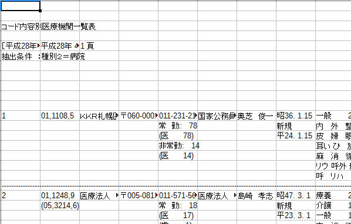

# Groovyを使用して施設情報をいじった話

社内勉強会（2016/04/22）
yamap_55

---

以下でスライドを公開しています。
https://slideck.io/github.com/yamap55/Slide/20160422/site_groovy.md

---

本日は、Groovyを使って厚生局が公開している施設情報をいじった話をします。
少しでもGroovyって便利！使ってみよう！っと思って頂ければ幸いです。


---

## アジェンダ
1. Groovyとは
2. 施設情報いじった話
3. まとめ

---

## 1. Groovyとは

>Groovyは、Java VM(*1)上で動作する動的なスクリプト言語です。 他のスクリプト言語と比較すると、Javaとの親和性が高いことが大きな特長です。たとえば、Groovyの構文はJavaと上位互換であり、Javaでの開発経験やスキルをそのまま生かすことができます。GroovyはJavaの欠点を補い、併用することで最大の効果を発揮する言語です。
>https://www.ntts.co.jp/products/grails/feature.html

Groovy の処理系はオープンソースソフトウェアであり、2015年4月よりApacheソフトウェア財団が管理しています。

---

## Groovyの7つの導入パターン
1. 万能接着剤 (Super Glue)
2. やわらかな心臓 (Liguied Hert)
3. リップスティック (Lipstick)
4. スマート設定 (Smart Configuration)
5. 無制限の解放 (Unlimited Openness)
6. ゴーストライター (Ghost Writer)
7. 小人さんスクリプト (House-Elf Scripts)

---

1. 万能接着剤 (Super Glue)
    - Javaのコンポーネントやフレームワークを、Groovyを糊(glue)としてつなぐ
2. やわらかな心臓 (Liguied Hert)
    - 中核となるロジックだけをGroovy/DSLで書けるようにする
3. リップスティック (Lipstick)
    - Groovyの機能・プロダクトを使ってコードを読みやすくする。（特に「DSL」）
4. スマート設定 (Smart Configuration)
    - 設定ファイルとしてGroovyスクリプトを使う

---

5. 無制限の解放 (Unlimited Openness)
    - 全部Groovyで書いちゃう :)
6. ゴーストライター (Ghost Writer)
    - アノテーションを使用したAST変換によるコード生成を利用する。
    - コードを書いていないのに、バイトコードレベルで機能が盛り込まれる
7. 小人さんスクリプト (House-Elf Scripts)
    - 周辺の各種支援スクリプトをGroovyで書く

---

Javaを置き換えるのは狙っていない？（「5. 無制限の解放があるけど。」）

個人的には、別にGroovy最強だからみんな使えよ！っと思っている訳ではなく、スクリプト言語に習熟していないJavaエンジニアが覚えるには最適な言語かなと思っています。

---

## 2. 施設情報いじった話
ここから本題。

---

## 今回行った手順
1. 厚生局作成の施設情報パース。
2. 独自ID付与。
3. 社内で持っている施設情報に独自ID付与。
4. 厚生局情報と社内情報をマージ。
5. SFインポート形式に変換。

---

## 1. 厚生局作成の施設情報パース。
- [厚生局データ](https://kouseikyoku.mhlw.go.jp/hokkaido/gyomu/gyomu/hoken_kikan/code_ichiran.html)
    - 都道府県毎に別ページ。
    - ファイル名の統一感0。
    - 各項目の説明資料はない。
    - 文字化け多数。（後で判明）
    - データの誤り多数。（後で判明）
        - 施設名が空の施設すらあり。（後で判明）

---

### 厚生局施設情報のフォーマット


---

### Excelを読みこんで適当にパース

```groovy
@GrabResolver( name='kobo-maven-repo', root='https://github.com/kobo/maven-repo/raw/master/snapshot' )
@Grab("org.jggug.kobo:gexcelapi:0.3-SNAPSHOT")
import org.jggug.kobo.gexcelapi.GExcel

println "start ${new Date()}"

def inputPath = $/D:\work\20160422\doc\北海道　医療機関　医科1.xlsx/$
def outputPath = $/D:\work\20160422\doc\output.csv/$

def book = GExcel.open(inputFile)
def sheet = book["Sheet1"]

sheet.rows.each {
  def siteName = it[2]
  if(siteName && !(siteName =~/[0-9]+ ?頁/) && !(siteName =~/^[0-9]+$/)) {
    println siteName
  }
}

println "end ${new Date()}"
```

---

## まとめ
- 国がまとめたデータなんてろくなものじゃない。
- ロジカルチェックは重要。
- Script言語は便利。

---
ご清聴ありがとうございました。