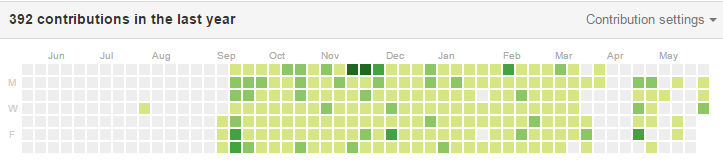
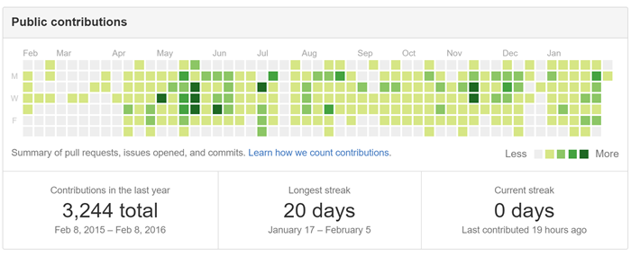

# 草生やし駆動勉強法のすゝめ

社内勉強会（2016/06/03）
yamap_55

---

以下でスライドを公開しています。
https://slideck.io/github.com/yamap55/Slide/20160527/grow_turf_driven.md

---

## 突然ですが、毎日勉強していますか？

---

残業、ゲーム、趣味、飲み会、子育てなどなど色々ありますが、エンジニアたるもの、「毎日勉強しなければ！」という思いはありますよね。

---

そこでオススメするのが。

---

## **草生やし駆動勉強法**

---

## アジェンダ
1. 草生やし駆動勉強法とは
2. 草生えるタイミング
3. 毎日コミットするために
4. issues
5. まとめ

---

## 草生やし駆動勉強法とは
GitHubのContributionsを緑色にしていく（=草を生やす）こと。

---

こういう奴。

---

ちなみに、ちょっと前は連続記録なども表示されてました。（[5/20以前](https://github.com/blog/2173-more-contributions-on-your-profile)）

---

## 草が生えると
- 嬉しい
- テンション↑↑
- 見栄えがいい
- 凄い人に見える

---

## 草生えるタイミングｗｗｗ
- Commits
- Issues
- Pull Request
    - が、マージされた時。

詳細は[こちら](https://help.github.com/articles/why-are-my-contributions-not-showing-up-on-my-profile/)

---

## 毎日コミットするために。
- ちょっとしたもの作ってみる。
- 本のサンプルを写経。
- ちょっとした問題を解く。

---

## 私がしたコミット
- [ちょっとしたもの作ってみる](https://github.com/yamap55/guild-story2-search)
- [「はじめての Spring Boot」を写経](https://github.com/yamap55/hajiboot)
- [色んなSortを実装してみる](https://github.com/yamap55/SortSample)
- [コードのスニペットをまとめてみる](https://github.com/yamap55/example)
- [ちょっとした問題を解いてみる](https://github.com/yamap55/hackerrank)

---

## サイクル
とりあえず7日続ける。  
↓  
続けたくなる  
↓  
やめられない  
↓  
頑張って続ける

---

## どうしてもコミットできない
- issueを立てる。
- issueを立てる。
- issueを立てる。

---
## 私が立てたissue
- 2015年中にリリース
- 検索機能強化。
- アイテムのドロップ情報がおかしい

---

## Q. issue立てるだけにならない？

---

## Q. issue立てるだけにならない？
- A. なる。だけど、問題ない。

---

毎日何かをやるという「習慣をつける」事が大事。  
何かを少しでもやればそれは身になっていきます。

---

どうでもいいcommit or issueでも、何かを変更（追加）、改善案やバグの記載等を行うことで、意識付けがされます。

---

ぶっちゃけ、どうでもいいcommit or issueを毎日行うのも限界がある。    
個人的な感覚だと3日が限界。ネタがなくなります。  
その結果、消化のために時間作ったり、土日に活動をせざるを得なくなる！

---

## あれ？さっきの画像、草途切れてなかった？

---

---

こういう時もあります！（github外で活動してました←言い訳）

---

## まとめ
- GitHubに草を生やすことで自分のテンション↑↑
- 一見凄い人に見える！！
- やる気↑↑
- 良い習慣Get！！

---

小さな積み重ねが大きな差になっていきます。  
一緒に頑張りましょう！

---

## ご清聴ありがとうございました。
