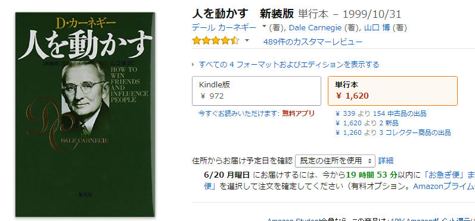
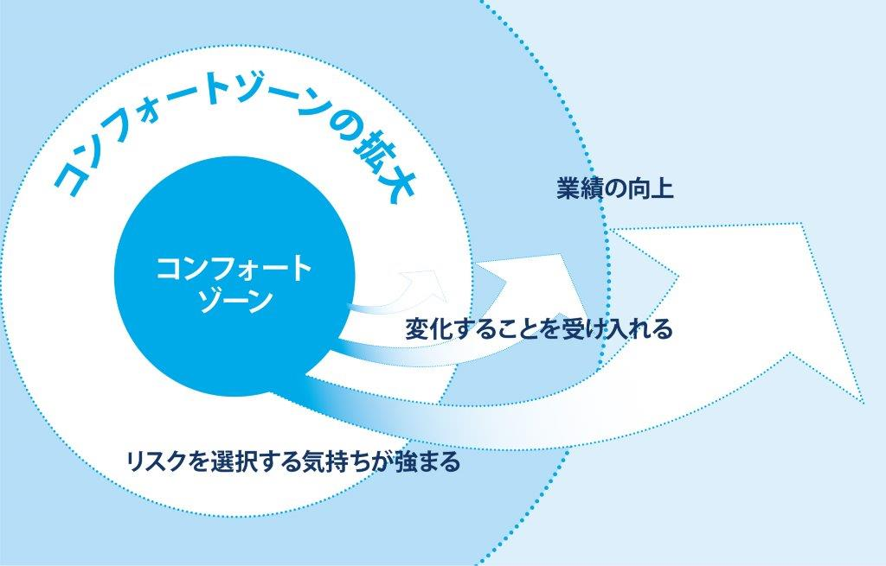

# デール・カーネギー・トレーニングに参加して
社内勉強会（2016/06/24）
yamap_55

---

以下でスライドを公開しています。
https://slideck.io/github.com/yamap55/Slide/20160624/dale_carnegie.md

---

## はじめに
2016/03/12 ～ 2016/06/11まで、12回に渡りデール・カーネギー・コースに参加してきました。  
約半額を会社に負担してもらったこともあり、自分が学んだこと、感じたことを展開します。

※週1ですがGWを挟んだため期間的には長くなっています。

---

## デール・カーネギー・コースとは
一言でいうと、自己啓発セミナーです。  
こういうと怪しいイメージがありますが、100年以上続く実績あるプログラムで、プログラム内で参考書籍？として使用される、デール・カーネギーさんの著作は累計で1,500万部売れているらしいです。

---

※プログラム内でもらえました。

---

## 5つのドライバー
「5つのドライバー」をレベルアップすることにより、「ビジネス/プライベート」の成功を勝ち取ります。

1. 自身の構築
2. コミュニケーションスキル
3. ピープル・スキル（人間関係）
4. 悩み・ストレスのコントロール
5. リーダーシップ・スキル

---

## コンフォートゾーンの拡大
- 自分のスタイルや行動パターンから抜け出して、相手にあわせて自分のスタイルを変えていくことは難しい。
- 我々は同じことを日々繰り返しながら、よりよい結果や成功を求めてしまっている。
- アインシュタインは、「愚かさは"同じことを毎回行いながら、違う結果を期待すること"だと定義できる」と言っています。

---
## コンフォートゾーンの拡大

---

## コンフォートゾーンの拡大
- 簡単に言うと、同じことやってても何も変わらない。
- 一度その枠から飛び出してしまえば、飛び出た先が枠になり、その枠内の行動は体験済みなのでやりやすいよね。ってこと。

---

## 具体的にやったこと。（人数）
- 受講者（15～25人位、曜日時間によりけり）
- トレーナー（先生）
- コーチ（2～3人位、同プログラムの卒業生、ボランティア）

---

## 感想とか

ぶっちゃけ新しいことはほとんど教わっていません。
当たり前のことばかり。
それをセッション内で実感し、実生活で実践するキッカケを作る。
