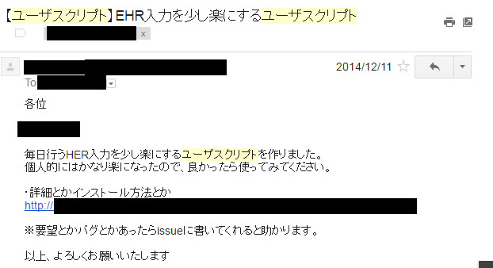
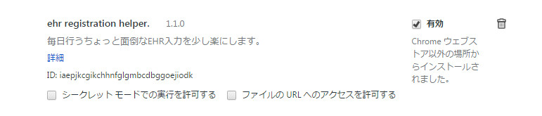

# EHR入力を楽にするChrome拡張作った！
社内勉強会 #7 （2016/08/05）
yamap_55

---

以下でスライドを公開しています。
https://slideck.io/github.com/yamap55/Slide/20160805/ehr_helper.md

---

## EHRの入力はめんどくさい
- 細かく入力する必要あるし。
- コメント入力必須だったり。
- コメント忘れると怒られるし。

---

## プログラマの三大美徳
1. **怠慢**(Laziness)
2. 短気(Impatience)
3. 傲慢(Hubris)

---

## 怠慢
>全体の労力を減らすために手間を惜しまない気質。
>この気質の持ち主は、役立つプログラムを書いてみんなの苦労を減らしたり、
>同じ質問に何度も答えなくてもいいように文書を書いたりする。
>よって、プログラマーの第一の美徳である。

---

## ユーザスクリプト作った！

---

## Chrome拡張にしました。

---

## しかもGitHubで公開

[https://github.com/yamap55/ehr_helper](https://github.com/yamap55/ehr_helper)

---

## 機能
- よく使うタスクのワンクリック入力
- 打刻漏れの通知
- プロジェクトを全て閉じるボタンの追加
- 各タスクに時間追加のボタンを追加
- その他細かい機能

---

## こだわりポイント
- よく使うタスクの設定の入力補完。

---

## issues
- 各種機能の有効無効切り替え。
- 設定値変更。
  - 5分いらないから2時間が欲しいとか。
- 詳細設定
  - 色とか変更可能に。

---

## ユーザスクリプトからの移行で困った事
- Chrome拡張は基本的に画面のDOMしか触れない。
  - 既存のClickイベントとかを取得できない。
  - 残り時間計算とか自前でやりたくない。
  - → 強引にScriptを追加して回避。

---

## Chrome拡張のすゝめ
- JavaScriptだけで簡単！
- アイコン出たり、ポップアップさせたりすると嬉しい。
- Chrome（ブラウザ）の事がほんの少しわかる。
- みんな拡張機能は使ってるのに作ってる話はあまり聞かないから自慢できる？

---

## まとめ
- 良かったらEHR Helper使ってみてください。
- issues書いてください。
- プルリクエストください。
- Chrome拡張作ってみてください。

---

## ご静聴ありがとうございました！
