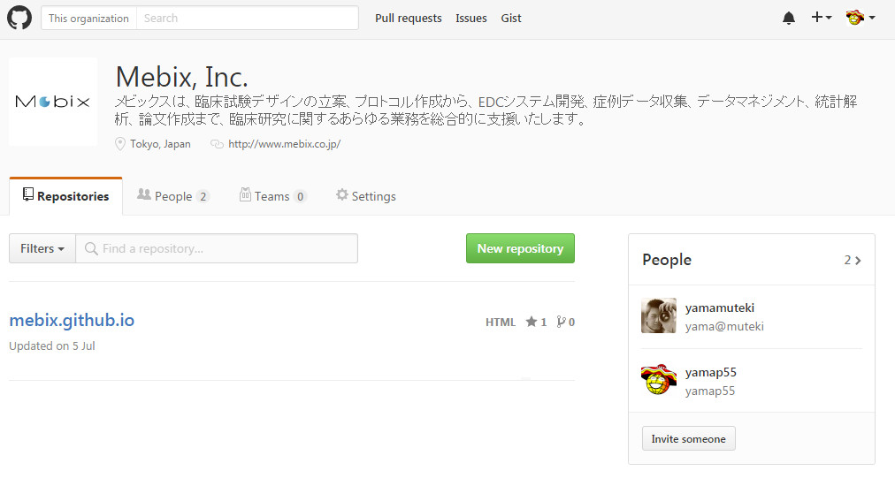
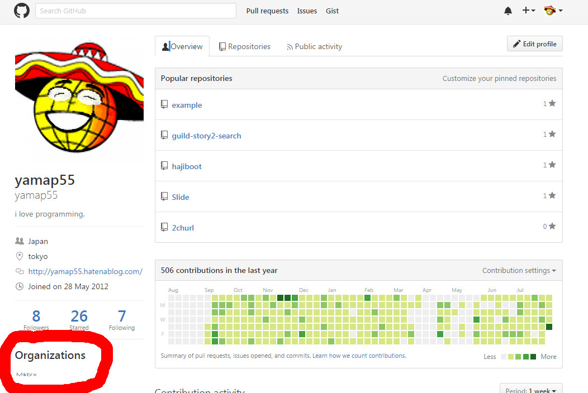

# MebixとしてGithubとQiitaはじめてます。
社内勉強会（2016/08/05）
yamap_55

---

以下でスライドを公開しています。
https://slideck.io/github.com/yamap55/Slide/20160805/qiita_github.md

---

## MebixとしてGithubのOrganizationアカウントを取得しました！

---

## Github Organization

https://github.com/mebix

---

## Github Organization

---

## Github Organization

ちょっとうれしい。

---

## QiitaのOrganizationアカウントは申請中。

↓予定地
http://qiita.com/organizations/mebix

---

## Githubとは

> GitHub（ギットハブ）はソフトウェア開発プロジェクトのための共有ウェブサービスであり、Gitバージョン管理システムを使用する。

---

## Githubの人気リポジトリ

現在では多くの有名プロダクトがGithubを使用しています。

https://github.com/search?utf8=%E2%9C%93&q=stars%3A%3E1

---

## Qiitaとは

> Qiitaは、プログラミングに関する知識を記録・共有するためのサービスです。

---

## Qiitaの人気記事

有用な記事が数多く投稿されています。

http://qrank.wbsrv.net/entries?days=3650&orderby=stock_count

- ちなみに私が一番気に入っているのが、編集リクエスト機能。

---

## Organizationアカウントとは
その名の通り企業のアカウント。Github、Qiita共にOrganizationアカウントに一般ユーザが所属する形になる。

---

## Github Organization
Organizationアカウントにリポジトリを作れるため、そこに各自がコミットが可能。

https://github.com/mebix

※現在はとりあえず[空のGithubページ](https://mebix.github.io/)だけ作ってます。。。

---

## Qiita Organization
組織に属している人が書いた記事が一覧で表示される。

http://qiita.com/organizations/m3dev

---

## Organization
Github、Qiita共に目的としては主に求人です。
会社の技術力を世の中に見せびらかして、この人達と仕事をしたい！と思わせる事を狙っています。

---

## アウトプットのメリット（社内）
- 他者への情報の共有
- フィードバックを得られる
- 技術情報の精度向上
- テキストや口頭での伝達力向上
- 組織文化によっては活動が評価に繋がる

[引用元](http://blog.father.gedow.net/2014/07/23/engineers-output/)

---

## アウトプットのメリット（社外）
- 外部とのコミュニケーション機会を得られる
- 個人知名度の向上
- 企業レピュテーションの向上
- 自社製品のアピール
- 人事採用力の強化

[引用元](http://blog.father.gedow.net/2014/07/23/engineers-output/)

---

## アウトプットのデメリット
- 発信する場の確保
- 発信内容の作成に時間が掛かる
- 明確な効果を短期的に感じることが難しい
- 継続する意志が必要
- 炎上リスクを回避するための精査
- フィードバック・マサカリの対応
- ウケたウケなかったによる精神状態の起伏
- 発信方法によっては退職すると成果が本人に帰属しない

[引用元](http://blog.father.gedow.net/2014/07/23/engineers-output/)

---

## アウトプットを行わない理由
- めんどくさい
- 恥ずかしい
- 自分がアウトプットしても意味が無い

---

## アウトプットはめんどくさい
- 誰かのアウトプットに助けられているのでその恩返し。
- 恩返しされるのは他人ではなく自分も含む。
- アウトプットする事で、よりその事に対する知見が深まる。

---

## アウトプットは恥ずかしい
- 誰も見てません。
- コメント、プルリクエストはおろか、はてブ、スター、いいねなんて滅多に付きません。

---

## 自分がアウトプットしても意味が無い
- あなたが困った経験、知った事はどこかの誰かが知りたがっている事です！

---

## まとめ
- せっかく会社としてGithubとQiitaのアカウント取ったといういい機会なので、アウトプットしましょー！

---

## おまけ

- http://qiita.com/yamap_55
- https://github.com/yamap55
- http://yamap55.hatenablog.com/

---

## ご静聴ありがとうございました。
