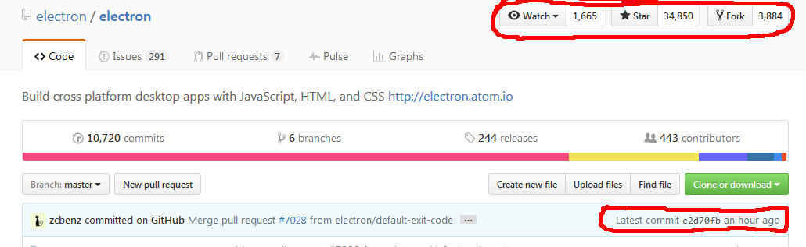

# Electronのすゝめ
社内勉強会（2016/09/02）
yamap_55

---

- スライド
  - https://slideck.io/github.com/yamap55/Slide/20160902/electron.md
- デモ用リポジトリ
  - https://github.com/yamap55/electron_example

---

## Electron概要
- デスクトップアプリケーションの開発/実行フレームワーク
- マルチプラットフォーム
- Web技術を使用して開発
  - HTML5、Node.js、JavaScript、CSS

---

## 開発元
- GitHub
- エディタ「Atom」を開発するために開発
  - 旧名は「Atom-Shell」
- 現在も継続的に開発中
  - https://github.com/electron/electron

---

---

## 事例
- Visual Studio Code
- Atom
- Slack（デスクトップ版）
- ChatWork（デスクトップ版）
- Kobito for Windows

---

## デスクトップアプリケーション
- メインプロセスはNode.js
- レンダリングプロセスはChromium
- Webアプリケーションとブラウザを1つのパッケージとして、デスクトップアプリケーションを動作させる。

---

## マルチプラットフォーム
- Node.js、Chromiumが共にマルチプラットフォーム

---

## Web技術を使用して開発
- HTML5、Node.js、JavaScript、CSS
- 既存の技術がそのまま利用可能
- 一番のメリットはここ！

---

## 既存の技術がそのまま利用可能
- 新しく覚えることが少ない
- Chromiumなので、**最新の仕様で動作**
- Webと違ってブラウザ毎の動作確認不要

---

## 最新の仕様（HTML5）
- 勧告されたのは「2014年10月28日」
- canvas、video、LocalStorage、form周り、metaタグ...
- 非推奨になったタグなど

---

## 最新の仕様（JavaScript）
- ECMAScript2015（ES6）は「2015年6月17日」に公開
  - Class、アロー関数、let、const、Promise...
- 2016（ES7）も策定中です。

---

## 最新の仕様（CSS）
- CSS3は徐々に勧告中
- border-radius、opacity、box-shadow...

---

## デモ
1. Hello World
2. react + babel
3. bulpでビルド

---

## まとめ
- Web技術を使用してデスクトップアプリケーションが開発可能
- 最新の仕様で開発可能
- Nodeのライブラリで色々便利

## ご静聴ありがとうございました。
