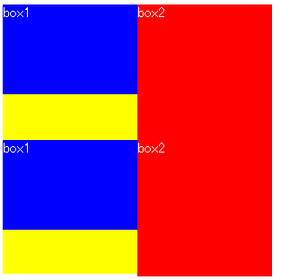
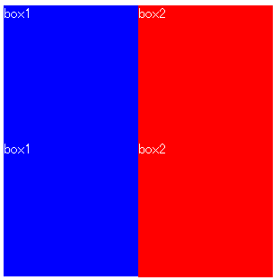
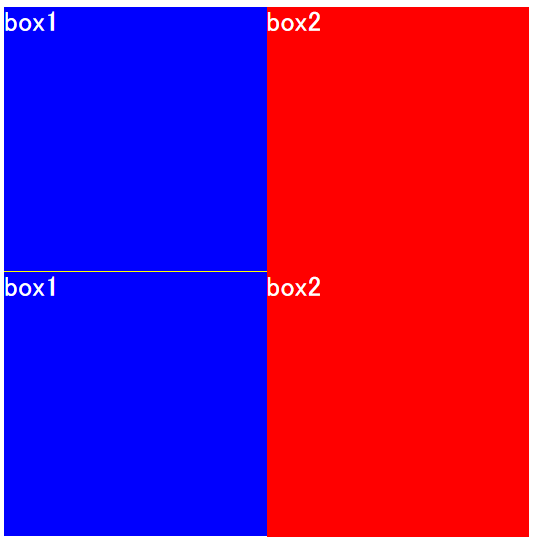

# jQueryのheight(), width()は小数点以下の値を正しく扱わない
社内勉強会（2016/10/14）
yamap_55

---

- スライド
  - https://slideck.io/github.com/yamap55/Slide/20161014/jquery_height_width.md

---

jQuery3未満のheight()、width()メソッドは小数点以下の値を正しく扱いません。

---

## 終わり

---

## 再開

---

## 発端
### 以下の処理中に発生。
1. divが横に並んでいて、高さを大きい方に合わせる。
2. 1のdivが縦に並んでいる。
3. 1のdivは背景色がついている。

---

## box1の高さをbox2の高さに合わせたい


---

## height()で高さを合わせる


---

## よく見ると隙間


---

## コード
http://jsbin.com/zedohoxuvo/1/edit?html,css,js,output

---

## 原因
jQuery3未満のheightメソッドは小数点をいい感じに返してくれないため。

---

## コード

```html
<div id="box99" style="height:10.49999px;width:15.49999px"/>
<script src="https://code.jquery.com/jquery-2.2.4.js"></script>
<script>
console.log($("#box99").height()); // 10
console.log($("#box99").width()); // 15
</script>
```

---

## jQueryの中身

1. height() and width()
2. jQuery.css("height") // 一部省略
3. domのoffsetHeightからpaddingとborderを引いている

---

## domのoffsetHeightとは？

>「width」「padding」「border」を足したピクセル単位の数値

[参考](http://stackoverflow.com/questions/21064101/understanding-offsetwidth-clientwidth-scrollwidth-and-height-respectively)

---

## offsetHeightは小数点を丸める

>This property will round the value to an integer. If you need a fractional value, use element.getBoundingClientRect().

[MDN](https://developer.mozilla.org/ja/docs/Web/API/HTMLElement/offsetHeight)


---

## 小数点を利用する場合にはgetBoundingClientRectを使う

---

## V3以降のコード

```javascript
// Support: IE <=11 only
// Running getBoundingClientRect on a disconnected node
// in IE throws an error.
if ( elem.getClientRects().length ) {
  val = elem.getBoundingClientRect()[ name ];
}
```

---

## まとめ
- jQueryのheight()とwidth()は注意
- 小数点が欲しい時はgetBoundingClientRectを使う
- よく使うメソッドでも穴はある

---

## 学んだこと
- ライブラリのコードは読める
- ライブリのコードを読むと楽しい

---

## 参考URL
- [jquery.jsを読み解く](http://gihyo.jp/dev/feature/01/jquery)
- [jQuery公式](https://code.jquery.com)
  - [V2最新](https://code.jquery.com/jquery-2.2.4.js)
  - [V3最新](https://code.jquery.com/jquery-3.1.1.js)
- [jQueryのissues](https://github.com/jquery/jquery/issues/1724)

---

## ご静聴ありがとうございました
