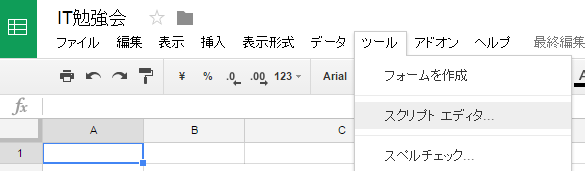

# Google Apps Scriptのすゝめ
社内勉強会 #13（2016/10/28）
yamap_55

---

## スライドとか
- スライドは[ここ](https://slideck.io/github.com/yamap55/Slide/20161028/gas.md)で公開しています。
  - タイトルが大文字に強制変換。。。
- 間違えやツッコミがありましたら口頭、[Twitter](https://twitter.com/yamap_55)、[pull request](https://github.com/yamap55/Slide/edit/master/20161028/gas.md)などお気軽にどうぞ。

---

## Google Apps Script(GAS)とは
- Googleの各種サービスをJavaScriptで操作するものです。
- Microsoft OfficeのVisual Basic for Applications（VBA）と似たようなものです。

---

## VBAとの違い
- Googleの各種サービスは基本的にはクラウド上にあるので、連携が楽。
- JavaScriptなので構文を覚える必要がない。
- 定期実行や、外部からの実行が簡単。

---

## スプレッドシートの場合
- メニュー → ツール → スクリプトエディタ



---

## セルの値の取得

```javascript
function myFunction() {
  var ss = SpreadsheetApp.openById(SpreadsheetApp.getActiveSpreadsheet().getId());
  var sheet = ss.getSheetByName("IT勉強会");
  var value = sheet.getRange("B2").getValue();

  Logger.log(value);
}
```

---

## メール送信

```javascript
function myFunction() {
  var ss = SpreadsheetApp.openById(SpreadsheetApp.getActiveSpreadsheet().getId());
  var sheet = ss.getSheetByName("IT勉強会");
  var value = sheet.getRange("B2").getValue();

  Logger.log(value);

  // 1行！
  GmailApp.sendEmail("example@example.com", "メールタイトル", "value");
}
```

---

## 定期実行
- メニュー → リソース → すべてのトリガー
- コードを書く必要すらない

---

## おすすめショートカット
- コード実行
    - Ctrl + r
- ログ表示
    - Ctrl + Enter
- コードフォーマット
    - Tab

---

## 参考URL
- [公式リファレンス](https://developers.google.com/apps-script/reference/spreadsheet/)
- [Google Apps Script（GAS）のメモ](http://yamap55.hatenablog.com/entry/2015/07/22/232333)
- [GASのScriptEditorオレオレチートシート](http://qiita.com/soundTricker/items/c9091a63de5401f2d49e)

---

## ご清聴ありがとうございました
