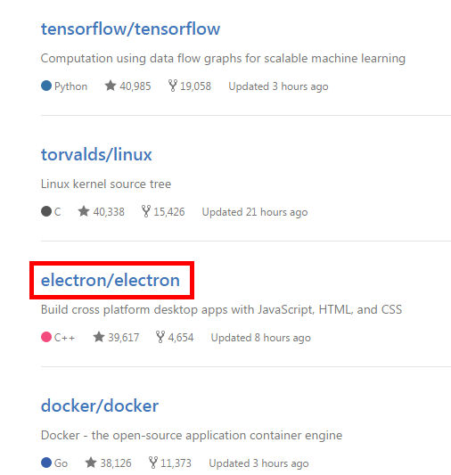

# Electronを触ってみた
[We Are JavaScripters! @2nd](https://wajs.connpass.com/event/46636/) （2016/12/26）
yamap_55

---

## スライドとか
- スライドは[ここ](https://slideck.io/github.com/yamap55/Slide/20161226/electron.md)で公開しています。
- 間違えやツッコミがありましたら口頭、[Twitter](https://twitter.com/yamap_55)、[pull request](https://github.com/yamap55/Slide/edit/master/20161226/electron.md)などお気軽にどうぞ。

---

## 自己紹介

- twitter : yamap_55
- Javaっ子。
- Groovy好き
- 最近JavaScriptが好き

---

## Electron概要
- デスクトップアプリケーションの開発/実行フレームワーク
- マルチプラットフォーム
- Web技術を使用して開発
  - HTML5、Node.js、JavaScript、CSS

---

## 開発元
- GitHub
- エディタ「Atom」を開発するために開発
  - 旧名は「Atom-Shell」
- 現在も継続的に開発中
  - https://github.com/electron/electron

---

## Repository

---

## 3ヶ月前

---

## GitHubのリポジトリスター数ランキング
## 17位！（2016/12/26 1:46時点）

- https://github.com/search?q=stars:%3E1&s=stars&type=Repositories

---

---

## 事例
- Visual Studio Code
- Atom
- Slack（デスクトップ版）
- ChatWork（デスクトップ版）
- Kobito for Windows

---

## デスクトップアプリケーション
- メインプロセスはNode.js
- レンダリングプロセスはChromium
- Webアプリケーションとブラウザを1つのパッケージとして、デスクトップアプリケーションを動作させる。

---

## マルチプラットフォーム
- Node.js、Chromiumが共にマルチプラットフォーム
- 基本的にはWindows、Mac、Linuxでそのまま動く
  - メニューとか一部動かない部分もあるらしい

---

## Web技術を使用して開発
- HTML5、Node.js、JavaScript、CSS
- 既存の技術がそのまま利用可能
- 一番のメリットはここ！

---

## 既存の技術がそのまま利用可能
- 新しく覚えることが少ない
- Chromiumなので、**最新の仕様で動作**
  - HTML5、ES2015、2016、CSS3、WebComponents（[参考](http://sourcechord.hatenablog.com/entry/2016/12/25/131247)）など
- Webと違ってブラウザ毎の動作確認不要

---

## デモ
1. Hello World
2. react + babel
3. bulpでビルド

---

## まとめ
- Web技術を使用してデスクトップアプリケーションが開発可能
- 最新の仕様で開発可能
- Nodeのライブラリで色々便利

---

## ご静聴ありがとうございました。
