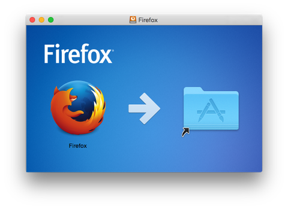

# はじめてのMac
社内勉強会 #19？ （2017/01/13）

yamap_55

---

## スライドとか
- スライドは[ここ](https://slideck.io/github.com/yamap55/Slide/20170113/first_mac.md)で公開しています。
- 間違えやツッコミがありましたら口頭、[Twitter](https://twitter.com/yamap_55)、[pull request](https://github.com/yamap55/Slide/edit/master/20170113/first_mac.md)などお気軽にどうぞ。

---

## 【祝】MacBook Pro購入！！

---

## 困ったことを紹介
- 知ってる人は昔困ったと懐かしんで。
- 知らない人はいつか役に立つかも。

---

## 超重要
- <kbd>ctrl + space</kbd> 日本語切り替え
  - 英字キーボードは英数、かなキーがない
- <kbd>ctrl + クリック</kbd> 右クリックメニュー
- 2本指でスクロール
- アプリケーションのメニューバーは最上部
  - 画面の最上部
- FinderがWindowsでいうExplorer
  - メニュー → 移動 → フォルダへ移動

---

## キーの見方
- command ⌘
- shift ⇧
- option ⌥
- control ⌃
- caps lock ⇪

---

## ショートカット
- <kbd>command + c</kbd> コピー
- <kbd>command + v</kbd> 貼り付け

---

## 修飾キー
- Windowsとの比較
- Ctrlは大体CommandたまにCtrl
- ALTはOption

---

## Spotlite検索
- <kbd>command + space</kbd> Spotlite検索
  - これさえ覚えておけばアプリケーション名入れれば呼び出せる

---

## インストール
- ↓のようなのが出た場合、アイコンをドラッグする。
  - アプリケーションフォルダにバイナリを移動している？

---

## エスケープ文字
- `Option + ¥`
- Macでは円マーク（¥）とバックスラッシュ（\）はちゃんと区別される。

---

## 英字キーボードで英数、かなキー
- [⌘英かな](https://ei-kana.appspot.com/)
- [Karabiner-Elements](https://github.com/tekezo/Karabiner-Elements)

---

## Karabiner-Elements
- どこでもかしこでも勧められている。
- 以下の事前インストールが必要
  - XCode
  - Boost
    - 調べても入れ方出てこない。
    - `brew install boost`

---

## Git
- Homebrewインストール時に必要となるXCodeのCommandLine Toolsでインストールされる
- が、バージョン低かったりと使いにくいのでHomebrewで別途インストールがオススメ
  - `brew install git`

---

## 今の課題
- トラックパッドの使い方
- Windowsで言うHOME、END的なショートカット
  - アプリによってfn、Commandと違う？
- Optionキー
- Dockの整理

---

## まとめ
- OSを変更すると基本操作がわからない
- 基本操作がわからないとやりたいことができない
- 最低限の操作は調べておきましょう

---

## ご静聴ありがとうございました。
