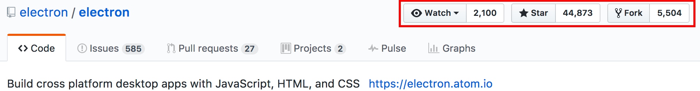
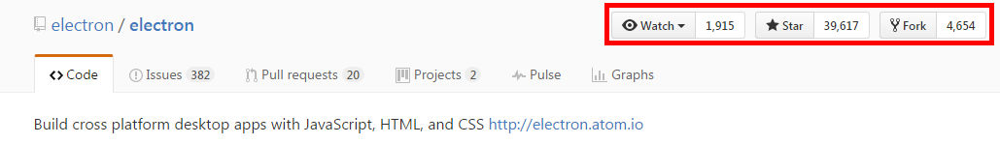
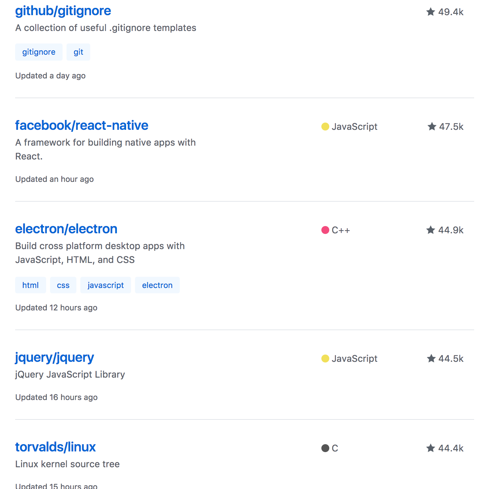

# Electronについて

---

## Electron概要
- デスクトップアプリケーションの開発/実行フレームワーク
- マルチプラットフォーム
- Web技術を使用して開発
  - HTML5、Node.js、JavaScript、CSS

---

## 開発元
- GitHub
- エディタ「Atom」を開発するために開発
  - 旧名は「Atom-Shell」
- 現在も継続的に開発中
  - https://github.com/electron/electron

---

## Repository

---

## 4ヶ月前

---

## 7ヶ月前

---

## GitHubのリポジトリスター数ランキング
## 16位（2017/4/26 21:25時点）

- https://github.com/search?q=stars:%3E1&s=stars&type=Repositories

---

---

## 事例
- Visual Studio Code
- Atom
- Slack（デスクトップ版）
- ChatWork（デスクトップ版）
- Kobito for Windows

---

## デスクトップアプリケーション
- メインプロセスはNode.js
- レンダリングプロセスはChromium
- Webアプリケーションとブラウザを1つのパッケージとして、デスクトップアプリケーションを動作させる。

---

## マルチプラットフォーム
- Node.js、Chromiumが共にマルチプラットフォーム
- 基本的にはWindows、Mac、Linuxでそのまま動く
  - メニューとか一部動かない部分もある

---

## Web技術を使用して開発
- HTML5、Node.js、JavaScript、CSS
- 既存の技術がそのまま利用可能
- 一番のメリットはここ！

---

## 既存の技術がそのまま利用可能
- 新しく覚えることが少ない
- Chromiumなので、**最新の仕様で動作**
  - HTML5、ES2015、2016、CSS3、WebComponents（[参考](http://sourcechord.hatenablog.com/entry/2016/12/25/131247)）など
- Webと違ってブラウザ毎の動作確認不要

---

## まとめ
- Web技術を使用してデスクトップアプリケーションが開発可能
- 最新の仕様で開発可能
- Nodeのライブラリで色々便利
