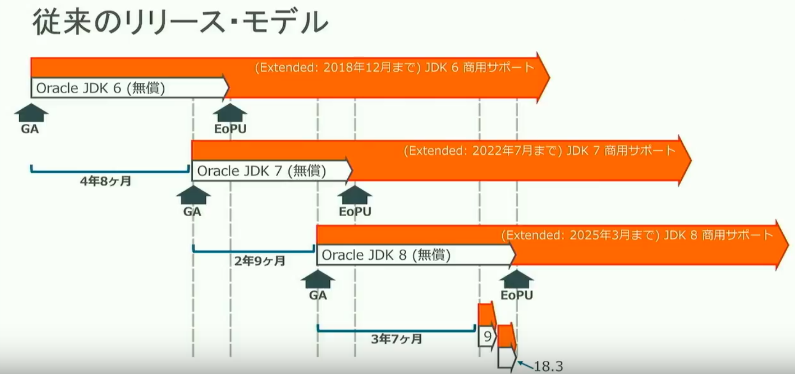
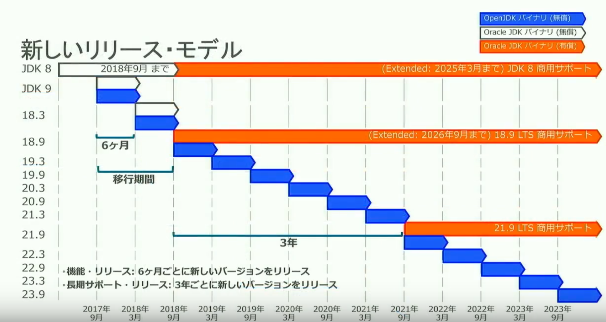
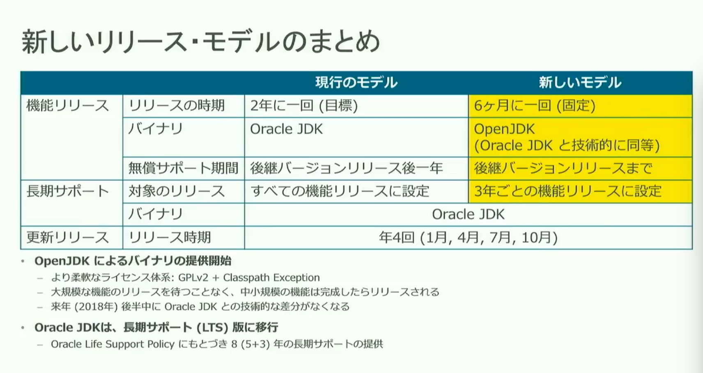
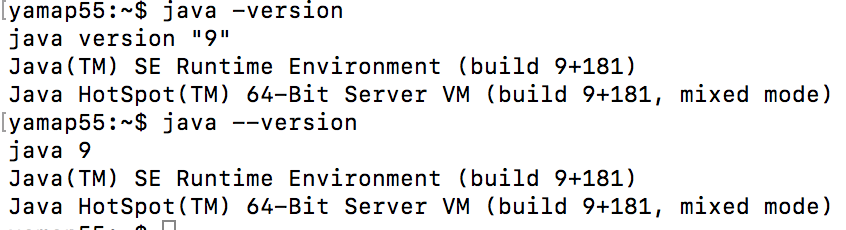

文字コード自動変換されないためのダミー文字列
ああああああテストテストテストああああああテストテストテストああああああテストテストテストああああああテストテストテストああああああテストテストテストああああああテストテストテストああああああテストテストテスト


# Java9について
エンジニア勉強会 （2017/10/24）

---

## アジェンダ
- はじめに
- リリースモデル
- Java9での機能追加
- 余談

---

## アジェンダ
- **☆はじめに**
- リリースモデル
- Java9での機能追加
- 余談

---

## 祝 Java SE 9 リリース
2017/09/21にJava SE 9がリリースされました。
Java SE 8が2014/03/18なので3年半ぶり。

---

## 過去のリリース日

| version |    date    |
|:-------:|:----------:|
|    5    | 2004/09/30 |
|    6    | 2006/12/11 |
|    7    | 2011/07/28 |
|    8    | 2014/03/18 |
|    9    | 2017/09/21 |

---

## 過去最多の追加機能
- 7 : 24
- 8 : 55
- 9 : 91

---

## 元々7で入る機能予定
- Project Coin
- Project Lambda
- Project Jigsaw

---

## Javaの方針
- Javaの進化を加速していこう

---

## アジェンダ
- はじめに
- **☆リリースモデル**
- Java9での機能追加
- 余談

---

## リリースモデル
- OpenJDK
- 機能リリース
- サポート
- 更新リリース

---

## Open JDK
- 今まで
  - 仕様のリファレンス実装
  - ソース公開
  - Oracke JDKと技術的な差
- これから
  - Open JDKと技術的な差がなくなる
  - 2018年後半目安

---

## 機能リリース
- 今まで
  - 2年に1度
  - 守れたことない
  - Oracle JDK
- これから
  - 6ヶ月に1度
  - 固定
  - Open JDK

---

## サポート
- 今まで
  - 無償 : 後継バージョンリリース後1年
  - 有償 : 全ての機能リリース
- これから
  - 無償 : 後継バージョンリリース後半年
  - 有償 : 3年毎の機能リリース

---

## 更新リリース
- 今まで
  - 3ヶ月毎
  - メンテナンス用 + 限定的機能アップデート
- これから
  - 3ヶ月毎
  - メンテナンス用

---



---



---

## Oracle JDK
- Oracle JDKはOracle DBのような位置づけになる予定
- 評価、開発では無料で使用できるが、無償で使いたい、今までと同じようにJDKを使いたいならばOpenJDK。
- **ただし、サポートは短い。**

---

## 18.3
- 初の機能リリース版
- 2018/03/20予定

---



---

## サポートの注意
- JDK8のサポートは2018/9まで
- JDK9は2018/3まで
- 18.3は2018/9まで

---

## アジェンダ
- はじめに
- リリースモデル
- **☆Java9での機能追加**
- 余談

---

## リリースモデル
- 6ヶ月毎に機能リリース
- 3ヶ月毎にメンテナンス/セキュリティリリース
- サポート期間は次の機能リリースまで
- 3年毎に長期サポート付きのLTSリリース

---

## リリースモデル
- LTSリリースはOracle JDKのみ
- Oracle JDKは商用及びサポート顧客向け

---

##

---

## REPL導入
- JShell
- 「Hello World」が簡単に。

---

##

---

## 余談
```java --version``` でもバージョンが表示されるようになりました。

---

## ちょっと違う




---

## 参考
- [Java 9 and Future #jjug](https://www.slideshare.net/YujiKubota/java9-and-future-jjug)
- [Java SE 9/EE 8リリースイベント 兼 JavaOne 2017 報告会 @ 東京 #jjug #j1jp](https://togetter.com/li/1163158)

- [新しいリリースモデルはJavaを使う人 全員要注目だった](http://d.hatena.ne.jp/nowokay/20171007#1507284356)
- [Oracle Java SEサポート・ロードマップ](http://www.oracle.com/technetwork/jp/java/eol-135779-ja.html)
- [Faster and Easier Use and Redistribution of Java SE](https://orablogs-jp.blogspot.jp/2017/09/faster-and-easier-use-and.html)

---

## ご清聴ありがとうございました。🙇
