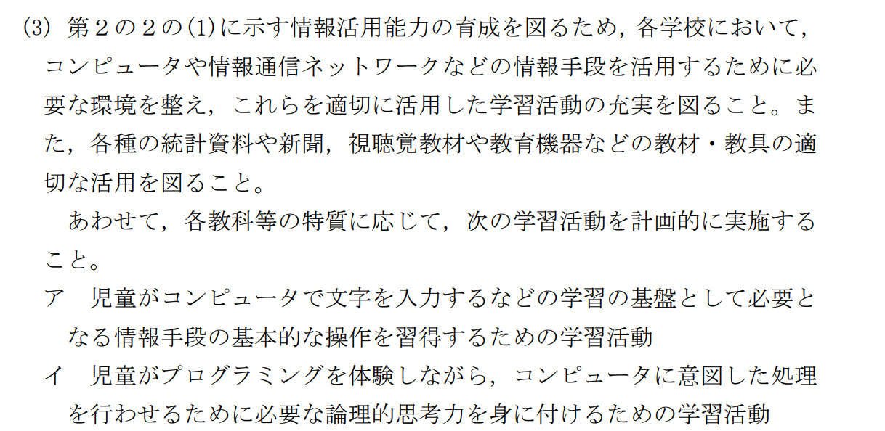
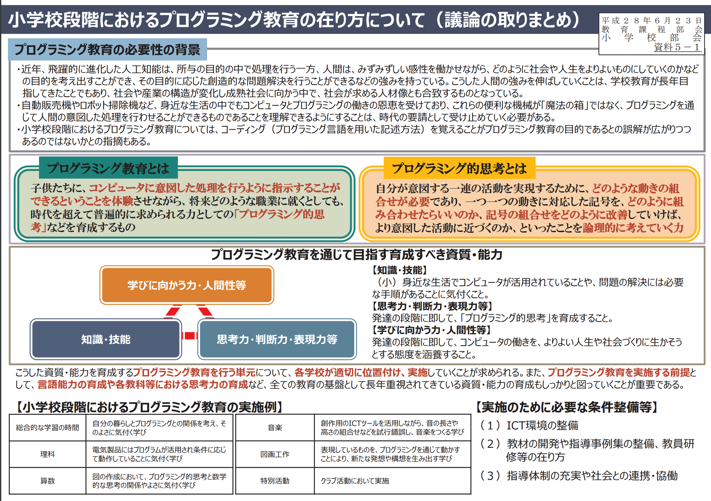
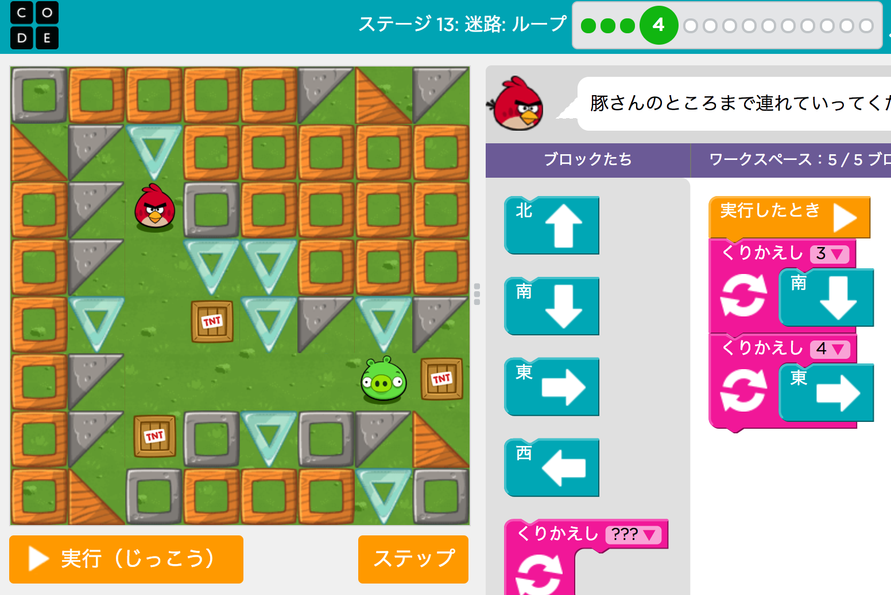
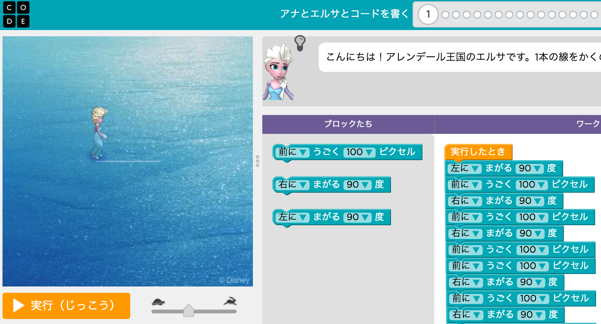
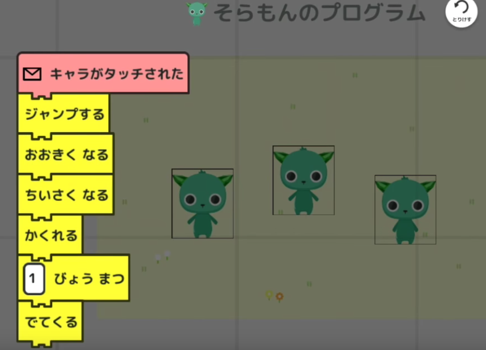
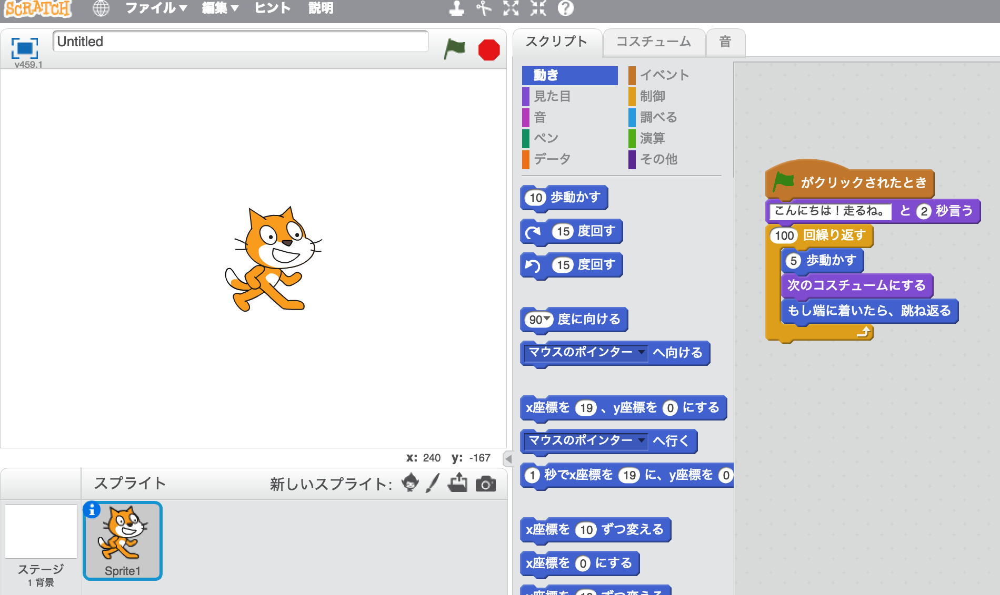
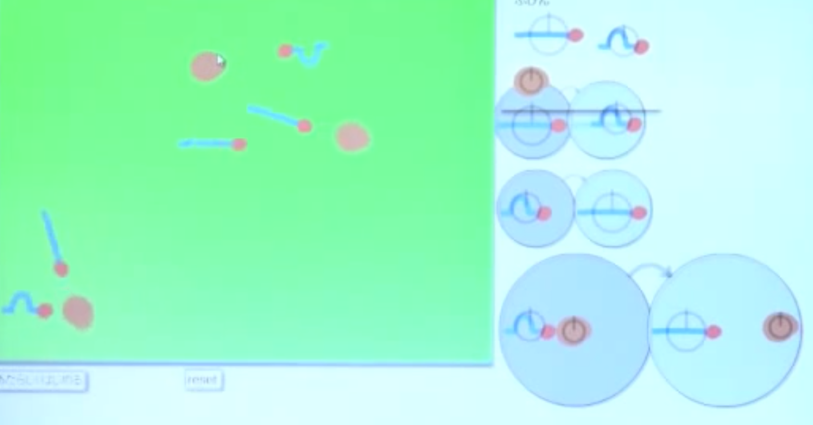

# 小学生のプログラミング教育必修化
エンジニア勉強会 （2018/02/27）

---

## アジェンダ
- はじめに
- 「プログラミング的思考」って何？
- 実践事例
- 学習サイト
- 教育用プログラミング言語
- 余談

---

## アジェンダ
- **☆はじめに**
- 「プログラミング的思考」って何？
- 実践事例
- 学習サイト
- 教育用プログラミング言語
- 余談

---

## 小学生のプログラミング教育が話題

---

## こんなキーワードと共によく聞く
- [CoderDojo](https://coderdojo.jp/)
- [Minecraft Education Edition](https://education.minecraft.net/)
- [Hour of Code](http://hourofcode.jp/)（[Code.org](https://studio.code.org/)）
- [プログラミングゼミ](https://programmingzemi.com/)
- [Scratch](https://scratch.mit.edu/)
- [Viscuit](https://www.viscuit.com/)

---

## 2020年度から小学校でプログラミング教育が必修化されます
- 学習指導要領が改定

---

## 小学校学習指導要領
- 第3の1の(3)



---

## 小学校学習指導要領
- 第2の2の(1)


---

## 「プログラミング」という教科が作られる訳ではない

---

## 既存の国語、算数、理科、社会などの教科の中に組み込まれます

---

## どういう事を学ぶの？

```
・身近な生活でコンピュータが活用されていることや、問題の解決には必要な手順があることに気付くこと
・各教科等で育まれる思考力を基盤としながら基礎的な「プログラミング的思考」を身に付けること
・コンピュータの働きを自分の生活に生かそうとする態度を身に付けること
```

- [小学校段階におけるプログラミング教育の在り方について](http://www.mext.go.jp/b_menu/shingi/chousa/shotou/122/attach/1372525.htm)
- [議論の取りまとめ](http://www.mext.go.jp/b_menu/shingi/chukyo/chukyo3/074/siryo/__icsFiles/afieldfile/2016/07/07/1373891_5_1_1.pdf)

---



---

## プログラムを学ぶわけではなく、「プログラミング的思考」なので、PCやタブレットなどが必ず使われるという訳ではない
（アンプラグドなプログラミング教育）

---

## アジェンダ
- はじめに
- **☆「プログラミング的思考」って何？**
- 実践事例
- 学習サイト
- 教育用プログラミング言語
- 余談

---

## 「プログラミング的思考」って何？🤔

---

> 自分が意図する一連の活動を実現するために、どのような動きの組合せが必要であり、一つ一つの動きに対応した記号を、どのように組み合わせたらいいのか、記号の組合せをどのように改善していけば、より意図した活動に近づくのか、といったことを論理的に考えていく力

[小学校段階におけるプログラミング教育の在り方について](http://www.mext.go.jp/b_menu/shingi/chousa/shotou/122/attach/1372525.htm)

---

## つまり、「論理的考察力」とか「問題解決能力」とかそういったことを指していると思われる。

---

## アジェンダ
- はじめに
- 「プログラミング的思考」って何？
- **☆実践事例**
- 学習サイト
- 教育用プログラミング言語
- 余談

---

## 具体的にどうやるの？
文部科学省が公開している[プログラミング教育実践ガイド](http://jouhouka.mext.go.jp/school/programming_zirei/)を紹介

---

## [しゃくとり虫を動かそう](http://jouhouka.mext.go.jp/school/pdf/shogaku_01.pdf)
- 1年生
- 生活科、特別活動
- しゃくとり虫の絵を書いて、Viscuitを使用して動かす。

---

## [めざせ！行列のできるおすし屋さん！](http://jouhouka.mext.go.jp/school/pdf/shogaku_02.pdf)
- 4年生
- 図画工作
- プロロボUSBプラス、プロロボUSBエディタを使用して、回転寿司のように皿が乗ったロボットを動かす。

---

## [プログラムロボット学習](http://jouhouka.mext.go.jp/school/pdf/shogaku_03.pdf)
- 4,5,6年生
- 総合的な学習の時間
- レゴマインドストームのEV3ソフトウェアプログラミングのLabViewを使用してロボットを動かす。

---

現状は、環境も先生たちの教育も全然足りておらず、現場はかなり厳しいとの事。

---

## アジェンダ
- はじめに
- 「プログラミング的思考」って何？
- 実践事例
- **☆学習サイト**
- 教育用プログラミング言語
- 余談

---

## [Hour of Code](http://hourofcode.jp/)（[Code.org](https://studio.code.org/)） 1



---

## [Hour of Code](http://hourofcode.jp/)（[Code.org](https://studio.code.org/)） 2



---

## [プログラミングゼミ](https://programmingzemi.com/)


---

## アジェンダ
- はじめに
- 「プログラミング的思考」って何？
- 実践事例
- 学習サイト
- **☆教育用プログラミング言語**
- 余談

---

## [Scratch](https://scratch.mit.edu/)


--

- [触ってみたa](https://scratch.mit.edu/projects/204748305/)

---

## [Viscuit](https://www.viscuit.com/)


---

## アジェンダ
- はじめに
- 「プログラミング的思考」って何？
- 学習サイト
- 教育用プログラミング言語
- **☆余談**

---

ちなみに中学校は「技術・家庭」、高校は「情報」で学ぶ

---

## 中学校は「技術・家庭」

```
生活や社会における問題を，計測・制御のプログラミングによって解決する活動を通して，次の事項を身に付けることができるよう指導する

ア 計測・制御システムの仕組みを理解し，安全・適切なプログラムの制作，動作の確認及びデバッグ等ができること。
イ 問題を見いだして課題を設定し，入出力されるデータの流れを元に計測・制御システムを構想して情報処理の手順を具体化するとともに，制作の過程や結果の評価，改善及び修正について考えること。
```

---

## 高校は「情報」

```
問題解決との関わりの中で，情報機器や情報通信技術を効果的に活用するための知識と技能を習得させるが，ただ単に問題解決の作業を行わせるというだけではなく，そこで利用されるコンピュータによる処理手順の自動実行，論理的な考え方，統計的なデータの扱い方などを様々な場面で生かせる応用力を習得させる。
```

---

そんな熱い小学生のプログラミング教育なので、ビジネスとしてもかなり熱い

---

- [ベネッセ](https://beneprog.com/)
- [学研](http://gakken-tech.jp/camp/)
- [富士通](https://www.knowledgewing.com/oc/kids/)
- [ヒューマンアカデミー](http://kids.athuman.com/robo/programming/)

---


---

## まとめ
- プログラミングという教科はない
- IT業界に人が増えそう
- ビジネスチャンスがそこにあるかも

---

## 参考URL
- [学習指導要領等、小学校学習指導要領](http://www.mext.go.jp/a_menu/shotou/new-cs/1384661.htm)
- [小学校段階におけるプログラミング教育の在り方について（議論の取りまとめ）](http://www.mext.go.jp/b_menu/shingi/chousa/shotou/122/attach/1372525.htm)
- [「プログラミング」と「プログラミング的思考」の違いを、分かったつもりになれるヒント](http://senseicode.club/2-cs-vs-programming)
- [【コラム】プログラミング的思考とは何か？再び。](http://dig-learning.hatenablog.com/entry/2017/11/29/165803)
- [EdTechZine（エドテックジン）](https://edtechzine.jp/)

---

## ご清聴ありがとうございました。🙇
