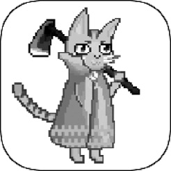
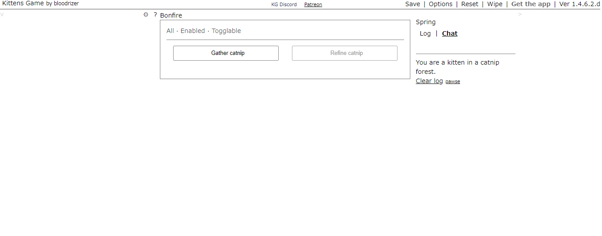
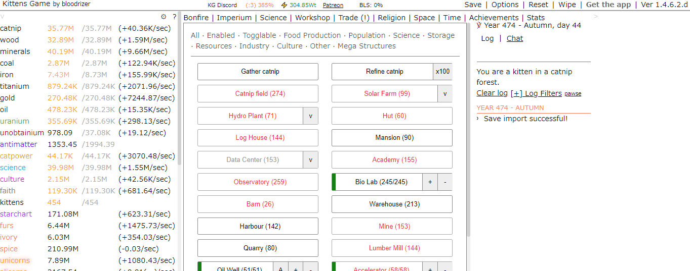
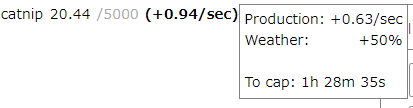
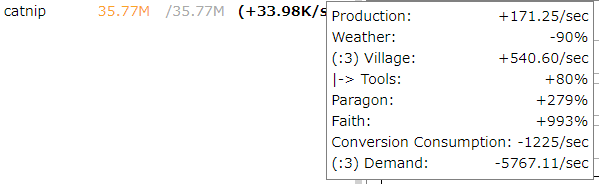
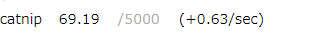
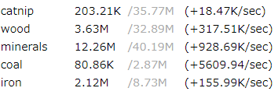
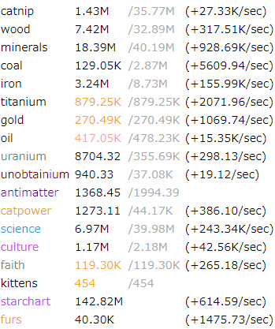
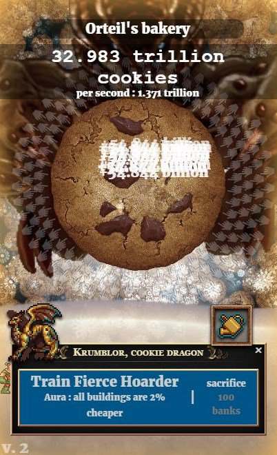

# 絵も動画も音すらないゲームが好き
## "kittens game"

---

---

TODO いる？
## アジェンダ
1. LTとは？
2. 発表内容
3. メリット
4. デメリット
5. 伝えたかったこと
6. 最後に

---

## はじめに

--

### 「kittens game」知ってる人🙋

---

## 「kittens game」って何？

--

### 子猫達を宇宙に連れて行くゲーム
https://bloodrizer.ru/games/kittens/  
※スマホアプリ版もあります

--

### ジャンル : 放置ゲーム、リソース管理ゲーム

--

### クッキークリッカーとよく比較されるけど、全然別物
※「リソース管理ゲーム」辺り

--

### 文字、数値のみ
※アプリ版だと初期化時に冒頭の子猫の画像が表示される😊

---

## 画面とか

--

### 開始直後

--

### 結構進んだ所

---

## 楽しさ
※ここから本題

--

### これが

--

### こうなる

--

### 🤔

--

### 1秒毎に私（子猫）の資産が増えていく！

--

### 増えていく！！

--

### 増えていく！！！

---

## 詳細

--

## 基本
1. 素材Aで素材Bを作る施設を作る
2. 素材Bで素材Cを作る施設を作る
3. 素材Cで素材Dを作る施設を作る
4. 素材ABCで素材Eを作る

---

## 放置ゲームのよくある展開

--

### 1. インフレ

※32.983 trillion = 329830000000000000

--

### 確かにインフレはするが比較的ゆっくり

※35.77M = 35770000

--

### 2. 初期の施設がほぼ不要
  
※ババア除く

--

### 3. 初期の施設も重要

