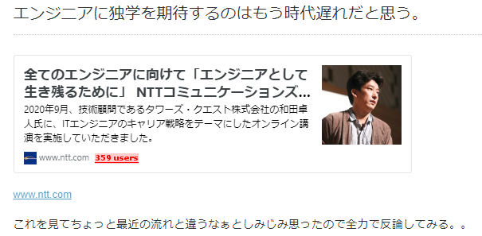

## エンジニアは独学が必要か？そしてそれは可能か。

## 人生のイベントでどう変わるか

---

## アジェンダ

- はじめに
- 最近話題になった記事
- 私の意見
- 人生のイベントが発生した時（後）
- まとめ

---

## はじめに

--

- 個人の意見です
- すべての人が当てはまらない
- 特殊な事例の可能性は高いです
- 1 つの事例としてみてください

---

## 最近話題になった記事

https://cloverstudioceo.hatenablog.com/entry/2020/10/13/065658

--

### 概要

- ［t-wada］NTT コミュニケーションズで講演
  - 独学で学ばないと辛いよ
- ［blogの人］今は違うんじゃね？

--

### t-wada さんの資料 1

- 四半期毎に技術書を読む
- 手を動かして学ぶ
- 毎年少なくても 1 つの言語を学習する
- 身の回りをプログラミング対象にする
- アウトプットを行う

--

### t-wada さんの資料 2

- 毎日コードを書く
- 年下から学ぶ
- 過去から未来を見る
- 人の作る渦を見る
- 大事なことに集中する

--

### blog の内容

- 今はスクール通って大学で授業、インターンでメンター
- IT エンジニアは引き抜き合戦、会社が手取り足取り面倒見てくれる
- 独学しろ！みたいな所には来てくれない
- 最近はプライベートが第 1（別記事）

--

> 業務時間内でエンジニア達が自然とスキルアップしていくような環境を整えるのが大切だと思いますねぇ、今の時代。

---

## 私の意見

--

### 両者ともあっていると思う

--

- 独学 0 の人でもすごい人はいる
- 必ずしもする必要はない
- 食って生きて

--

- 現実にはストイックに高めている人の方がすごい人の割合は高い
- そもそも独学と思っていない（趣味）

--

- 業務時間内にそのような時間を作るのが大事

--

## ブコメ

https://b.hatena.ne.jp/entry/s/cloverstudioceo.hatenablog.com/entry/2020/10/13/065658

---

## 人生のイベントが発生した時（後）

--

そもそも、人生のイベント発生時（後）には独学の時間はあるのか

--

### イベント

- パートナーができる
- 結婚
- 出産
- 育児
- 介護

--

### 注意

- 人によります
- 環境によります
- 自分以外の要因が大きい

--

### 独学する時間がとれたか

- 〇　パートナーができる
- 〇　結婚
- ×　出産
- △　育児
- ？　介護

--

### 〇 パートナーができる

--

### 〇 結婚

--

### × 出産

--

### △ 育児

--

### ？ 介護

---

## まとめ
