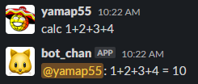

<style type="text/css">
  .reveal h1,
  .reveal h2,
  .reveal h3,
  .reveal h4,
  .reveal h5,
  .reveal h6 {
    text-transform: none;
  }
</style>

# slackbot ライブラリの中身を見てみた

### yamap55

---

## アジェンダ

- はじめに
- slackbot とは？
- 動かすの簡単
- どうなってるの？
- まとめ

---

## はじめに

--

```
某Slackチャンネルで動いているの見た
↓
楽しそう
↓
コード見たいー
↓
権限くれた
↓
見てみる
↓
超シンプル
↓
なんでこんなんで動くの？
```

---

## slackbot とは？

--

- Slack の bot を簡単に作れる Python のライブラリ
- ☆1113

https://pypi.org/project/slackbot/
https://github.com/lins05/slackbot

---

## 動かすの超簡単

--

### 設定

```python
# slackbot_settings.py
API_TOKEN = 'xoxb-xxxx' # Slackのトークン
DEFAULT_REPLY = 'その言葉の意味は知りません'
PLUGINS = ['plugins',] # ここに動かしたいコードを書く
```

--

### main

```python
# main.py
from slackbot.bot import Bot
Bot().run()
```

--

### 処理

```python
# plugins/calc.py
from slackbot.bot import listen_to
@listen_to(r'^calc\s(\S*)')
def command_calc(message, word):
    message.reply(f'{word} = {eval(word)}')
```

--

### 実行

```
python main.py
```

--

### Slack



---

## どうなってるの？

ここからは VSCode で。

---

## まとめ

--

- 意外とシンプル
- 意外と読める
- 意外と楽しい
- 意外と発見がある

--

普段使っているライブラリも読んでみては？

---

## ご清聴ありがとうございました
