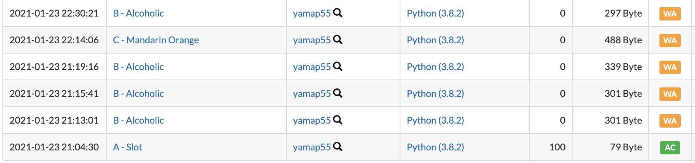

# 競プロはじめました

### yamap55

---

## アジェンダ

- この LT で言いたいこと
- 競プロとは
- デモ
- あるコンテストの結果
- 環境
- まとめ

---

## この LT で言いたいこと

--

- 簡単
- でも難しい
- できなくても恥ずかしくない
- 楽しいからやろう

---

## 競プロとは

--

> 競技プログラミング（略称: 競プロ）とは、プログラミングコンテストで行われる競技の一種である。

--

> 競技プログラミングでは、参加者全員に同一の課題が出題され、より早く与えられた要求を満足するプログラムを正確に記述することを競う

--

詳細は Google 先生に聞いてください

---

## デモ

説明とか見飽きている気がするので。

--

### [A - Welcome to AtCoder](https://atcoder.jp/contests/practice/tasks/practice_1)

--

ね？簡単でしょ？

--

簡単なの見せてるだけで、難しいでしょ？

---

## あるコンテストの結果

--

## 私の成績

https://atcoder.jp/users/yamap55/history

--

[AtCoder Beginner Contest 189](https://atcoder.jp/contests/abc189)

--

### 100 分かけて 1 問正解

--

### 解けた問題

> 3 文字の文字列が与えられるのでそれが全て等しいか確認せよ

例: 「SSS」とか

---

## 環境

--

- Web で入力して回答はしんどい
- テストケース試すのも面倒
- 補完、インデントとか

--

## 環境つくりました！！

https://github.com/yamap55/atcoder_python_env

--

デモ

---

## まとめ

--

- 簡単
- でも難しい
- できなくても恥ずかしくない
- 楽しいからやろう
- 環境もあるよ！

---

## 参考

--

- https://atcoder.jp/?lang=ja
- https://github.com/yamap55/atcoder_python_env

---

## ご清聴ありがとうございました
