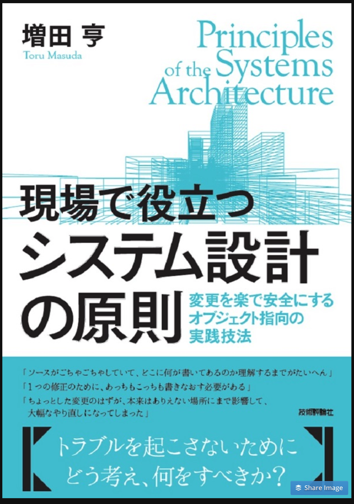

# システム設計勉強会第1回

---

## アジェンダ

- はじめに
- なぜソフトウェアの変更は大変なのか
- プログラムの変更が楽になる書き方
- 参考

---

## はじめに

---

https://www.amazon.co.jp/dp/B073GSDBGT/

--

TODO:
- 何か思いでも書く？
- 内容としては↓と同じ感じになるから不要か？

---

## なぜソフトウェアの変更は大変なのか

--

- どこに何が書いてあるのかわからない
- 複数箇所の変更が必要
- 1箇所修正したら別の箇所に影響がでる

--

## 設計に問題がある

-- 

### 直接関係はない

- ドキュメントはしっかり整備されている
- コーディング規約に沿っている
- ユニットテスが書かれている

--

### 変更が大変なプログラムの特徴

- メソッド（関数）が長い
- クラスが大きい
- 引数が多い

--

## 変更するたびに変更が大変になる

--

### 作成時
- メソッドは短い
- クラスは小さい
- 引数も少ない

--

### ちょっとした変更
- if文1つと数行
- 変数1つとメソッド1つ
- 引数に1つ追加

--

### 結果

- 見通しが悪くなる
- 構造が入り組んでくる
- どこに何がかいてあるかわからなくなる

--

## 変更が大変になる

- ちょっとした変更を繰り返したコード

--

## システム設計とは

変更に強いシステムを作る

--

変更するたびに変更が大変になるシステム変更の負のスパイラルから抜け出すにはどうしたら良いのかを学んでいきます

---

## プログラムの変更が楽になる書き方

---

## 参考

- 現場で役立つシステム設計の原則
  - https://www.amazon.co.jp/dp/B073GSDBGT/

