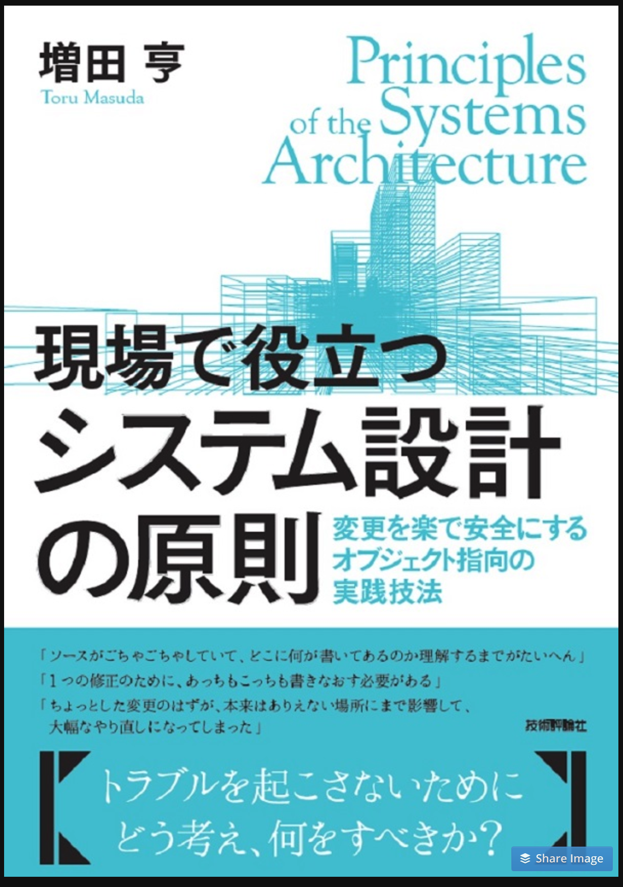

<style type="text/css">
  .reveal h1,
  .reveal h2,
  .reveal h3,
  .reveal h4,
  .reveal h5,
  .reveal h6 {
    text-transform: none;
  }
</style>

# システム設計勉強会第 4 回

---

## アジェンダ

- はじめに
- なぜソフトウェアの変更は大変なのか
- プログラムの変更が楽になる書き方
- 参考

---

## はじめに

--



https://www.amazon.co.jp/dp/B073GSDBGT/

--

## 第 3 章 業務ロジックをわかりやすく整理する

- データとロジックを別のクラスに分けることがわかりにくさを生む
- データとロジックを一体にして業務ロジックを整理する
- 三層の関心毎と業務ロジックの分離を徹底する

--

- 本の内容ほぼそのまま沿って進めます
- 今までの勉強会でドメインオブジェクトについてはなんとなくわかったと思う
- が、実際に使う事はないと思う
- 利点であったり、どうやって使っていくかその辺りの内容が中心

---

## 第 3 章 業務ロジックをわかりやすく整理する

- → **データとロジックを別のクラスに分けることがわかりにくさを生む**
- データとロジックを一体にして業務ロジックを整理する
- 三層の関心毎と業務ロジックの分離を徹底する

---

## 業務アプリケーションのコードの見通しが悪くなる原因

--

### 昔からよくあるクラス設計

- 機能クラス
  - 注文登録クラス
    - 注文内容の確認
    - 注文内容の記録
    - 受注の通知
- データクラス
  - 注文データ
    - 商品
    - 数量
    - 届け先

--

### 良くある呼び方

- Data Transfer Object（DTO）
- Entity クラス
- From クラス
- JavaBeans

※Java 界隈だと一般的

--

### Python だと？

- ちょっと考えてみる
- 注文登録をする機能を作る
- 引数である注文データはどういう型で渡される？

--

### dictionary

https://docs.python.org/ja/3/tutorial/datastructures.html

--

### よくある

- とりあえず dict に入れる
- 1 つの dict に色んなものが入っている
- 1 つの dict を使いまわす

--

### 困った事

- dict に何が入っているかわからない
- Key のタイポ
- 型がわからない

--

### なりがち

- 変更箇所を特定するために広い範囲を調べる
- 1 つの変更に対してあちこちの修正が必要
- 変更の副作用の確認が大変

--

### 理由

- 同じ業務ロジックがあちこちに重複して書かれる
- どこに業務ロジックが書いてあるか見通しが悪くなる

---

## データクラスを使うと同じロジックがあちこちに重複する

--

### これはそのまま

- データを同じように処理したい箇所が複数にあれば処理は重複する

※流石に詳細は割愛

---

## 共通ライブラリが失敗する理由

--

### 共通ロジックは 1 つに共通化すれば良いのでは？

- common や util

--

### 微妙に異なる事が多い

- 共通関数であっても完全に同じでない事はよくある
- フィルタリングしたい
- Key が異なる
- ユニークではない
- などなど

--

### 汎用的な共通関数パターン

- 引数にフラグやオプションを追加
- ↑ を理解するのが困難
- 結局どれを設定すれば良いかわからない
- 使われない
- 同じようなロジックがあちこちに書かれる

--

### 用途毎に細分化された共通化関数パターン

- 数が多すぎる
- 違いがわからない
- 使われない
- 同じようなロジックがあちこちに書かれる

--

### 個人的な思い

- util にある事を知らない
- 自分から util を見に行かない
- util だけ見ても良くわからないので頭に残らない

---

## 第 3 章 業務ロジックをわかりやすく整理する

- データとロジックを別のクラスに分けることがわかりにくさを生む
- → **データとロジックを一体にして業務ロジックを整理する**
- 三層の関心毎と業務ロジックの分離を徹底する

---

## 業務ロジックを重複させないためにはどう設計すれば良いか

--

- データとロジックを 1 つのクラスにまとめる
- データは何らかの処理で使用するためにある
- データと処理を同じ場所に置いておくことで処理の重複がなくなる
  - 使う側に処理を書く必要がなくなるため
- → 使う側のコードがシンプルになる

--

### クラス設計で大雪な事

- **データを使う側のコードがシンプルになるように設計する事**

### 気をつける事

- メソッドをロジックの置き場所にする
- ロジックをデータを持つクラスに移動する
- 使う側のクラスにロジックを書き始めたら設計を見直す
- メソッドを短くしてロジックの移動をやりやすくする
- メソッドでは必ずインスタンス変数を使う
- クラスが肥大化したら小さく分ける
- パッケージを使ってクラスを整理する

---

## メソッドをロジックの置き場所にする

--

### dict -> dataclass

```python
xxx_param = {
  data_type = 'user_attribute',
  ...
}
```

```python
from dataclasses import dataclass
@dataclass
class XxxParam:
  data_type: str
```

--

### 使う側のコード

```python
xxx_param = XxxParam(data_type='user_attribute')
user_attribute_path = f's3://backet/{xxx_param.data_type}/'
user_attribute_df = spark.read.parquet(user_attribute_path)
```

※結局あちこちで同じコードが書かれる

--

### ロジックを書く

```python
from dataclasses import dataclass
@dataclass
class XxxParam:
  data_type: str

  @property
  def dataframe(self):
      return spark.read.parquet(f's3://backet/{self.data_type}/')
```

### 使う側のコード

```python
xxx_param = XxxParam(data_type='user_attribute')
user_attribute_df = xxx_param.dataframe
```

--

## これがオブジェクト

- インスタンス変数を使って加工や計算を行う
- インスタンス変数を返すだけでは意味が薄い

---

## 業務ロジックをデータを持つクラスに移動する

--

### データを持つ dict をクラス化する

- まずは dataclass に移行
- dict から脱却

--

### クラスに移す

- データを取得するという事はそれを使って処理をする
- その処理をクラスに移動する

--

### 移動すると？

- データを持つ側にロジックが増える
- データを使っていた側からロジックが減る
- 使う側はデータを取得するのではなく、処理結果を受け取るようになる

--

## さらに言うと

- データを持つクラスに業務ロジックを集めることが、コード重複や散在を防ぐオブジェクト指向の基本
- 集める事で重複がなくなる
- 重複がなくなると変更の対象個所をそのクラスに限定できる

---

## 使う側に業務ロジックを書き始めたら設計を見直す

--

### 部品を作る

- 処理が正しく行われるのであれば、ロジックはどこに書いても良いわけではない
- ロジックが書かれる適切な場所を決めるのが設計
- データを持ち、データを使った判断/加工/計算ロジックを書くのがオブジェクト指向の設計の基本
- 結果的に便利な部品となる

--

### 設計の初期では逸脱は許される

- 問題はとりあえず動くようになった後
- データを持つ側にロジックを移動し設計改善を続けていく
  - 変更容易性を大きく左右する

### 設計を見直す

- データを取得してそのデータを使って判断/加工/計算ロジックを書き始めたら **何か変だ** と考える
- ロジックを書く場所が変だと思ったら TODO コメントを残す

### オブジェクト指向の設計は改善の繰り返し

- 最初から良い設計はみつからない
- ロジックの置き場所や、クラス名、関数名の改善を続ける必要がある

---

## メソッドを短く書くとロジックの移動がやりやすくなる

--

- 小さく分けて独立させる
- そのクラスにふさわしくないコード群を発見しやすくなる

---

## メソッドは必ずインスタンス変数を使う

--

### コード例

```python
class A:
  def total(unit_price: int, quantity: int):
    return unit_price * quantity
```

※引数だけを使用しているため class に属している意味がない

--

### 理由

- インスタンス変数を使っていない関数はそのクラスにある理由がない
- 後から見た時にこの関数がどこにあるかわからなくなる

--

### 対処

- 一旦、関数を使用する側に移動
- 引数で渡されるデータを持つ側に移動する事を検討

---

## クラスが肥大化したら小さく分ける

--

### クラスは肥大化する

- 特にインスタンス変数が多い場合
- 大きくなると見通しが悪くなる
- 変更時の副作用の検証範囲が広がる

--

### 手順

- インスタンス変数とメソッドの関係を調査
  - メソッドがどのインスタンス変数を使用しているか
- メソッドをグループ化
- グループ化した変数群を別クラスに切り出す

--

```python
from dataclasses import dataclass

@dataclass(frozen=True)
class Customer:
    first_name: str
    last_name: str
    postal_code :str
    city: str
    address: str
    telephone: str
    mail_address: str
    telephone_not_preferred: bool

    @property
    def full_name(self):
        return f'{self.first_name} {self.last_name}'
    ... # 色々なメソッド
```

--

```python
customer = Customer(
    first_name='yamada',
    last_name='taro',
    postal_code='1234567',
    city='tokyo',
    address='',
    telephone='123456789',
    mail_address='info@example.com',
    telephone_not_preferred=True,
)
customer.full_name
```

--

```python
from dataclasses import dataclass

@dataclass(frozen=True)
class PersonName:
    first_name: str
    last_name: str

    @property
    def full_name(self):
        return f'{self.first_name} {self.last_name}'
```

--

```python
person_name = PersonName(first_name='yamada', last_name='taro')
person_name.full_name
```

--

同じように Address と ContactMethod に分離する

--

```python
from dataclasses import dataclass

@dataclass(frozen=True)
class Customer:
    person_name: PersonName
    address: Address
    contact_method: ContactMethod
```

--

### 分けた結果

- データとロジックが密接に関係したオブジェクト
- 独立性が高く再利用しやすい
- 意図が明確で使いやすい
- クラス内部の変更が他のクラスに影響しにくい

※関連性が強いデータとロジックだけを集めたクラスを凝集度が高いと言う
※凝集度が高い=疎結合

---

## パッケージを使ってクラスを整理する

--

### 概要

- 変数とメソッドの関係に注目してクラスを作るとクラスが増える
- クラスが増えると見つけにくくなる
- パッケージを使用して整理する

--

### 手順

- 関連性の強いクラスを集める
- クラス数が少なくても長いパッケージになりそうであれば階層化する
  - 階層が深い、1 パッケージに 1 クラスとなっても問題ない

--

### 継続的に改善する

- 開発初期から適切な設計はできない
  - ドメイン知識が少ないため
- パッケージ単位でのコードの整理を地道に続ける必要がある

---

## 第 3 章 業務ロジックをわかりやすく整理する

- データとロジックを別のクラスに分けることがわかりにくさを生む
- データとロジックを一体にして業務ロジックを整理する
- → **三層の関心毎と業務ロジックの分離を徹底する**

---

## 三層の関心毎と業務ロジックの分離を徹底する

TODO: ここから

---

## 参考

- 現場で役立つシステム設計の原則
  - https://www.amazon.co.jp/dp/B073GSDBGT/
- 作者による本への質問や回答
  - https://www.slideshare.net/masuda220/ss-79304804
- 書評のまとめ
  - http://masuda220.jugem.jp/?eid=467
