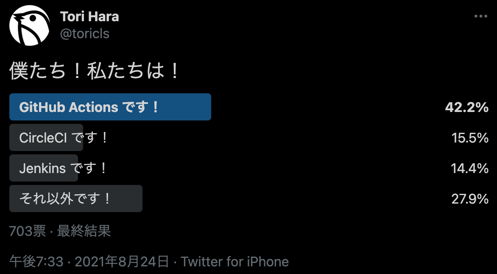
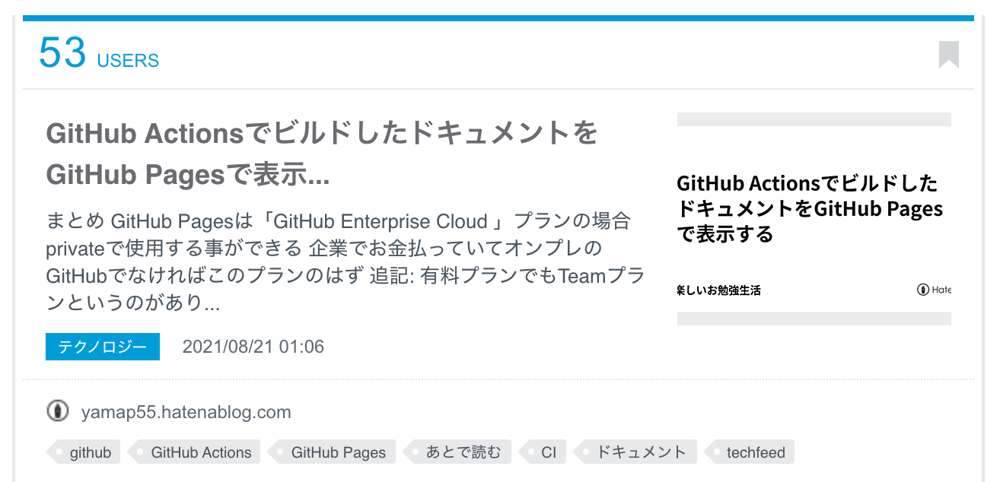

# GitHub ActionsとGitHub Pagesの連携がすごい

---

## アジェンダ

- はじめに
- GitHub Actionsとは
- GitHub Pagesとは
- GitHub ActionsとPagesの連携
- まとめ
- 参考

---

## はじめに

--

## 注意！！
- 弊社のリポジトリでは今回紹介する方法は使えません
- 詳細はのちほど

---

## GitHub Actionsとは

--

--

## 概要
- 「GitHub上で動作するサーバレス実行環境」
- 2019/11/13に正式サービス化
- Microsoftが後ろにいるので強い
- 同系のサービスでは後発

--

## 特徴
- [Marketplace](https://github.com/marketplace?type=actions)
  - コンポネントされていて簡単に実現可能
  - CircleCIにもOrbというのがあるが数が違う
- GitHubとの連携が容易
  - GitHub ActionsはGitHub内のサービス

--

## 競合

- [Jenkins](https://jenkins.io/)
- [CircleCI](https://circleci.jp/)
- [Travis CI](https://travis-ci.org/)
- [AWS CodeBuild](https://aws.amazon.com/jp/codebuild/)
- [GCP Cloud Build](https://cloud.google.com/build)
- [Azure DevOps](https://azure.microsoft.com/ja-jp/services/devops/)

--

## 一気にシェアを広げている

※調査会社の結果も見た記憶がありましたが発見できず（CircleCIに追いつきそうな状態だったと思う）

---

## GitHub Pagesとは

--

--

## 特徴

- GitHubと蜜な連携
  - 特定のブランチがそのままウェブサイトとして公開される
- **基本パブリックで公開される**
- 静的サイトジェネレーターを使ってblogなどとして使える
  - 最近また増えてきたイメージ

--

## 基本パブリックで公開

- サービス開始時から長らく公開ページのみの使用
- 2021/01/21から「**GitHub Enterprise Cloud**」プランであればprivateリポジトリで使用可能
  - 正確にはアクセス制御が可能になった
- [Access control for GitHub Pages](https://github.blog/changelog/2021-01-21-access-control-for-github-pages/)

--

## 競合？

AWS, Azure, GCPもそれぞれのストレージサービスで静的ファイルのホスティングが可能

--

## 実はこのスライドも
ちなみにこのスライドもGitHub Pagesで公開している

- https://github.com/yamap55/Slide
- https://github.com/yamap55/Slide/settings/pages

---

## ここから本題

---

## GitHub ActionsとPagesの連携

--

## よくある問題

- CIでドキュメントをビルドしているが有効活用されない
- ビルドしたドキュメントを置く場所がない
- ビルドしたドキュメントにアクセスするのが面倒

--

## 最近よくあるやつ

- 設計書Markdownで書きたい
- API仕様書自動生成したい
- docstringからHTMLを生成したい
- ER図、テーブル定義書を。。。
- などなど

--

## ドキュメントはあるだけでは意味がない

- Excel、PDF、Wiki、Markdown、HTMLすべて同じ

--

## 問題
- ビルドして出力できるようにした！
  - 確認に一手間かかる
- ホスティングすれば？
  - お金、別サービス、ファイル連携など

--

## 解決
###  GitHub ActionsとPages連携
- ビルド
- GitHub Pagesに配置

--

## メリット

- 設定、ビルド簡単
  - Marketplace
- 連携簡単
  - 共にGitHubのサービス
  - サービス、ユーザ登録、トークン発行など不要
- 無料
  - 制限はある

--

## 具体例
- [ビルドしたドキュメント](https://github.com/yamap55/doc_github_pages_deploy)
- [PyTestのカバレッジ](https://github.com/yamap55/pytest_cov_github_pages)

---

## おまけ

--

## blog書いたら結構はてブついた

[GitHub ActionsでビルドしたドキュメントをGitHub Pagesで表示する](https://yamap55.hatenablog.com/entry/2021/08/21/010529)

※blogでなくてもoutputするのオススメ

---

## まとめ

- GitHub Action, Pagesは便利
- Pagesは「GitHub Enterprise Cloud」プランの場合privateで使用する事ができる
- GitHub ActionsでbuildしたドキュメントをGitHub Pagesに簡単に反映可能
- [peaceiris/actions-gh-pages](https://github.com/marketplace/actions/github-pages-action)というGitHub Actionsが便利すぎる

---

## 参考
- 公式（かなりドキュメントが充実）
  - [GitHub Pages Documentation](https://docs.github.com/ja/pages)
  - [GitHub Actions](https://docs.github.com/ja/actions)
- [GitHub ActionsでビルドしたドキュメントをGitHub Pagesで表示する](https://yamap55.hatenablog.com/entry/2021/08/21/010529)
- 試したリポジトリ
  - [ビルドしたドキュメント](https://github.com/yamap55/doc_github_pages_deploy)
  - [PyTestのカバレッジ](https://github.com/yamap55/pytest_cov_github_pages)
