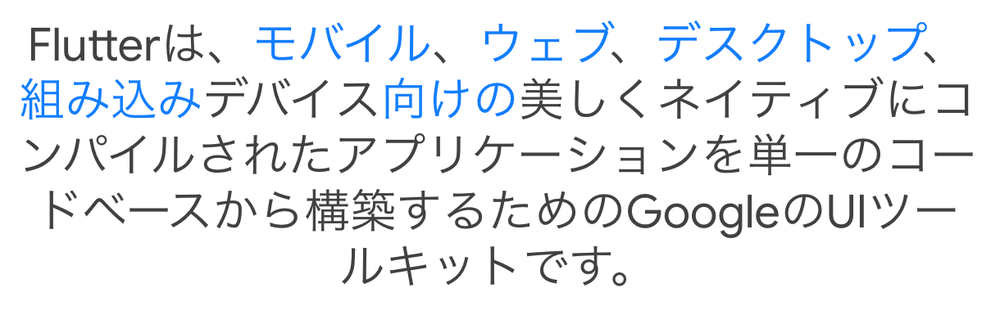

# Flutterはじめました（パート1）

---

## アジェンダ

- はじめに
- Flutterとは
- Dartとは
- 現在の進捗
- 参考

---

## はじめに

--

## **注意**
- 本スライドの内容は間違っている可能性高いです！
- ツッコミ大歓迎！

--

## きっかけ

- Flutterで作成されている
- かっこいい
- 手伝いたい

---

## Flutterとは

--

--

> Flutter（フラッター）は、Googleによって開発されたフリーかつオープンソースのUIのSDKである。単一のコードベース[4]から、Android、iOS、Linux、macOS、Windows、Google Fuchsia[5][6]向けのクロスプラットフォームアプリケーションを開発するために利用される。

[Wikipedia](https://ja.wikipedia.org/wiki/Flutter)より

--

## 概要
- 「モバイルアプリフレームワーク」
  - 単一コードからAndroid、iOS、Web向けにアプリケーションを開発可能
- Googleが中心となって開発
- 2018年12月04日 1.0 のリリース
- 2021年03月03日 2.0 のリリース
  - Webアプリケーションのサポート
- Dart言語

--

## 競合
- React Native
  - JavaScript
- Xamarin
  - .Net
  - .Netに統合？
  - 最近あまり聞かない

---

## Dartとは

--

--

> Dartは、ウェブアプリやモバイルアプリのクライアント開発向けに設計されたプログラミング言語である。Googleによって開発された言語で、サーバーやデスクトップ向けアプリケーションの開発にも使用できる。

[Wikipedia](https://ja.wikipedia.org/wiki/Dart)より

--

## サンプルとか

公式ページに動かせるページあり

https://dart.dev/

---

## 現在の進捗

- [開発環境](https://github.com/yamap55/flutter_sample) の作成
- [チュートリアル](https://flutter.dev/docs/reference/tutorials) を少しずつ進めている
- 「ビルドしてサンプル環境にデプロイする」タスクを割り当てられた！

---

## 参考

- 公式
  - [Flutter](https://flutter.dev/)
  - [Dart](https://dart.dev/)
