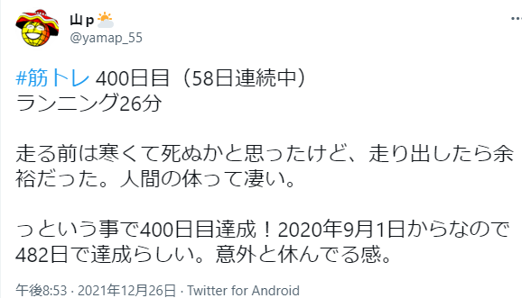
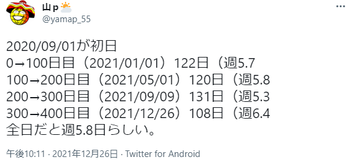
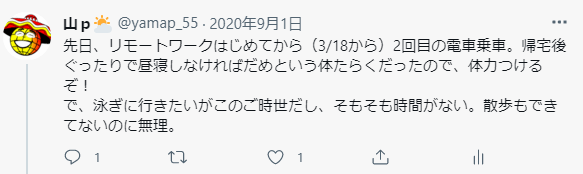
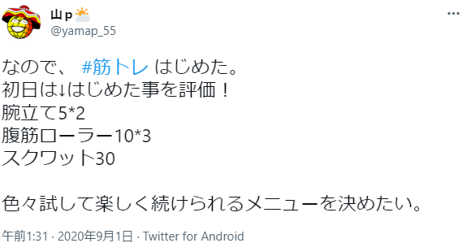
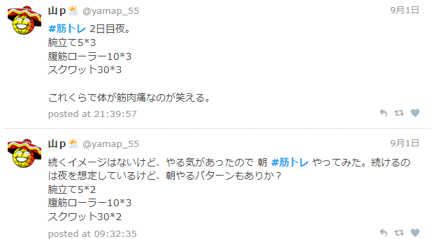
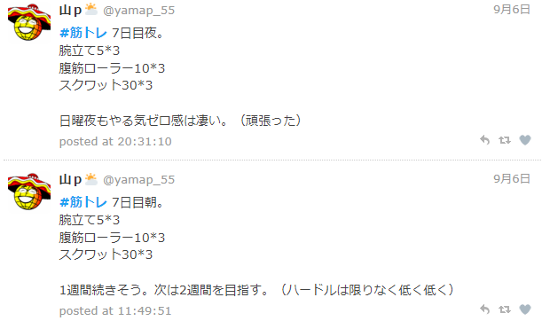
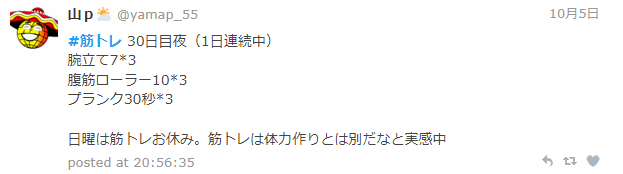

# 筋トレ（？）を 400 日行った話

---

## アジェンダ

- はじめに
- はじまり
- 続いた理由
- FAQ
- まとめ

---

## はじめに

--

[2021/12/26 に筋トレ 400 日を達成しました](https://twitter.com/yamap_55/status/1475072214655713285)

--

### 集計

※100 日目辺りからは週 6 目標

--

- 1 つの事を続けることができたのは人生初！
  - 親にも驚かれた
- 参考になるかは不明

--

記録

https://twilog.org/yamap_55/search?word=%23%E7%AD%8B%E3%83%88%E3%83%AC&ao=a

---

## はじまり

--

--

## 朝もやる

--

## 1 週間続いた

--

## 1 か月続いた

※この辺りから夜だけ

--

キリがないので。。。

https://twilog.org/yamap_55/search?word=%23%E7%AD%8B%E3%83%88%E3%83%AC&ao=a

---

## 続いた理由

--

- ハードルは低く
- 人に言う
- 面白くないことはやらない

--

### ハードルは低く

- 筋トレ 5 回とかｗｗｗ
- 続けることが大事
- 続けられない事はやらない
- 1 回の意味とか考えない

--

### 人に言う

- アピール！
- サボってないか聞いてもらう
- 言うと褒めてくれる！

--

### 面白くないことはやらない

- おもしろいかどうかが最優先
- 鍛えたいポイント、効率とか気にしない

--

## けど、よくわかってない

- ↑ の事は今までもやっていた
- 筋トレも何度もやりはじめた

--

## すぐはじめた

- すぐはじめたのは良かったかも
- 道具？ジム？不要
- 数年前に買った腹筋ローラーだけ
- ランニングもシューズもなかった

---

## よくある質問

--

## Q. しんどくないの？

--

## A. しんどい

- 記録を見るとしんどいしか言ってない

--

## Q. なんで続くの？

--

## A. 色んな所でやると言っているから

- PJ での定期報告
- 友人と話すたびに
- 家族、親戚

※聞かれる、問い詰められる

--

## Q. すごいですね

--

## A. すごいし、えらい

※誰も褒めてくれないので自分で褒める

--

## Q. いつやってるの？

--

## A. 夕飯食べた後

--

## Q. 何か変わった？

--

## A. 何も変わらない

- 見た目 → 変わらず
- お腹 → でてる
- 体力 → 落ちてはいない？
- 肩とか腰 → 痛い
- 精神力 → 変わらない

--

## Q. なんでやるの？

--

## A. よくわからない

- 健康？
- 自己肯定感？
- 褒められポイント？

--

## Q. もうちょっと何かないの？

--

## A. [SNS でいいね 👍 もらえる](https://twitter.com/notifications)

※ムキムキの人 💪 が褒めてくれる

※普段反応もらえないので嬉しい

---

## まとめ

- とりあえずやってみると良いかも
- 人に言うのは良いかも
- 褒めてもらうのも良いかも
