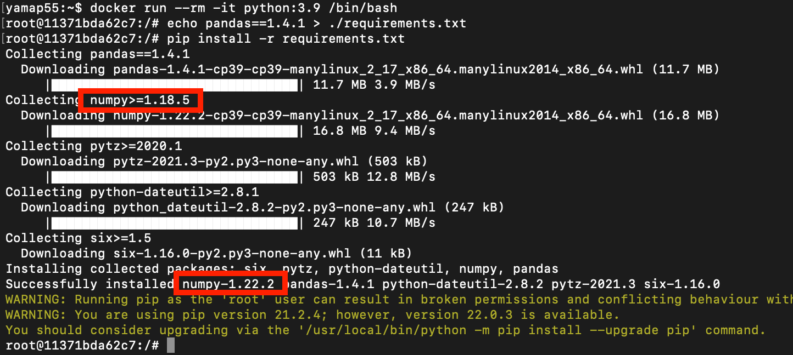

<style type="text/css">
  .reveal h1,
  .reveal h2,
  .reveal h3,
  .reveal h4,
  .reveal h5,
  .reveal h6 {
    text-transform: none;
  }
  .reveal blockquote p {
    font-size: 32px;
  }
</style>

# pipからPoetryに移行した話

---

## アジェンダ

- Poetryとは
- 使い方
- なんで移行したの？
- その他
- 感想とか

---

## Poetryとは

--


[](https://python-poetry.org/)

--

## できること

- 依存ライブラリ管理
- パッケージ作成
- パッケージ公開
- 仮想環境管理

--

## いままで

- 依存ライブラリ管理
  - `pip`
- パッケージ作成
  - `setup.py`, `setup.cfg`
- パッケージ公開
  - `twine` とか
- 仮想環境管理
  - `venv`

---

## 使い方

--

```
curl -sSL https://install.python-poetry.org | python3 -
```

※pipでもOK

--

## 注意

※これだけは頭の片隅にメモお願いします
[↓の手順は古い](https://python-poetry.org/docs/master/#installing-with-the-official-installer)

```
curl -sSL https://raw.githubusercontent.com/python-poetry/poetry/master/get-poetry.py | python -
```

--

## 使い方

- 何もないところから使う
  - `poetry new`
- 何かしらファイルがある
  - `poetry init`
- 依存ライブラリインストール
  - `poetry install`
- 依存ライブラリ追加
  - `poetry add hoge`

---

## なんで移行したの？
※ここを話したい

--

### pip では依存ライブラリの依存ライブラリの管理ができないため

--

# 🤔

--

## 例: pandasを使っている場合

--



 `1.18.5`以上という指定で最新版の`1.22.2`がインストールされた

--

- 100年後、numpy100.2.3が最新版の時に、同様のコマンドを実行したらどうなる？
- そして、それは動作するだろうか？
- 依存の依存の依存ライブラリはどうだろうか？
- リポジトリを乗っ取られて変なコードが入ったりはしない？

--

- 依存ライブラリの依存ライブラリのバージョンアップで壊れる場合、開発者的には **何もしてないのに壊れた** という事。
- こういうことはリリース直前に発生する。
- ここ1年位で3,4回は発生。

--

- poetryは依存の依存ライブラリのバージョンも管理してくれる
- 依存ライブラリを指定するのは `pyproject.toml`
- 依存の依存についてpoetryが書くのは `poetry.lock`
  - 人が手で記載したりはしない

---

## その他

--

- `pyproject.toml` は[pep 621](https://www.python.org/dev/peps/pep-0621/)で決まっている設定ファイル
  - pytestなど主要な周辺ツールの設定もここに書ける
- pip -> poetry だけなら移行は簡単
- requirements.txtに依存していると結構大変
  - Dockerfile, CI/CDなど
- 開発環境を個別に作っているとメンバーの教育が必要かも
- ネットワーク回線かOS（Windows）の問題か、たまにライブラリのinstall失敗がある
  - 私だけ？

---

## 感想とか

- イケてるアプリはPoetryに移行しているので知っておいたほうが良い
- 癖が少しあるが結構便利
- ローカルで開発している場合には仮想環境も便利
- そろそろ移行しても良いかも
