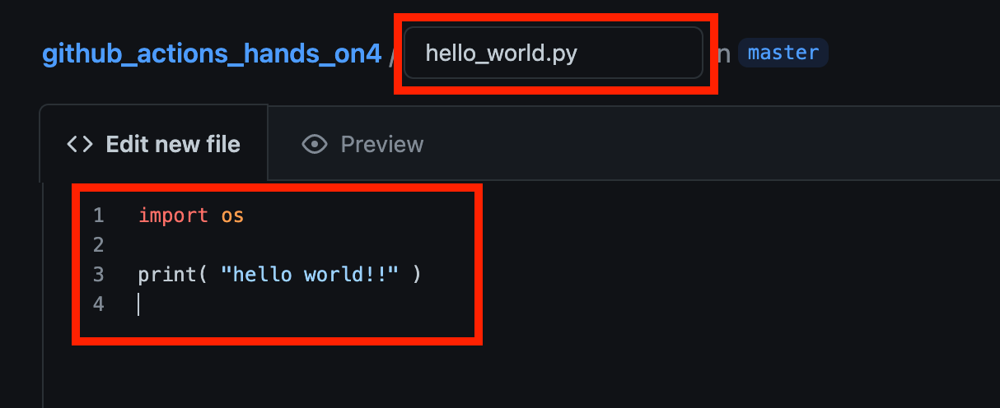
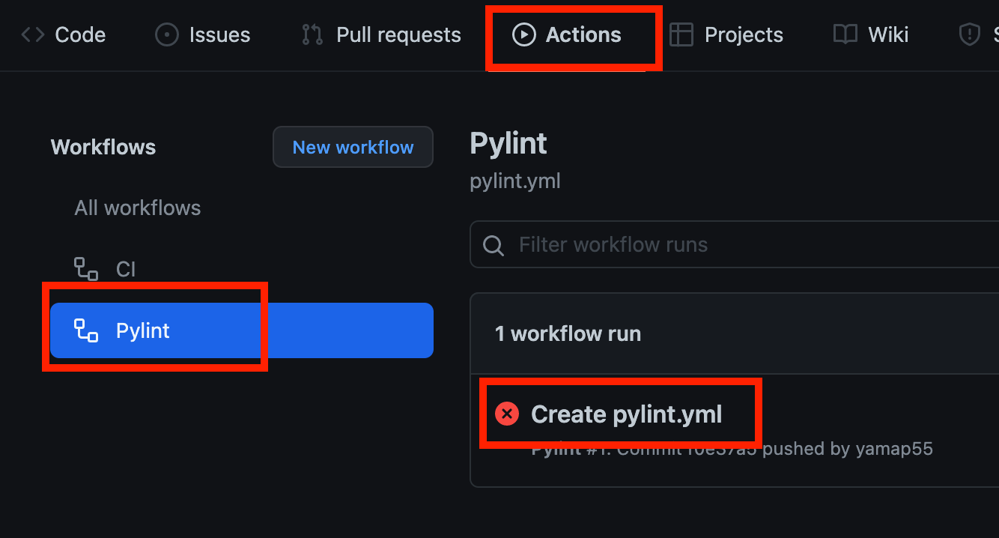

<style type="text/css">
  .reveal h1,
  .reveal h2,
  .reveal h3,
  .reveal h4,
  .reveal h5,
  .reveal h6 {
    text-transform: none;
  }
  .reveal blockquote p {
    font-size: 32px;
  }
</style>

# CI/CDとGitHub Actions

---

## アジェンダ

- CI/CDとは
- ツールの紹介
- GitHub Actions概要
- ハンズオン
- まとめ
- おまけ

---

## CI/CDとは

--

> 継続的インテグレーション、CI（continuous integration）とは、すべての開発者の作業コピーを定期的に共有されたメインラインにマージすることである。

> 継続的デリバリー（continuous delivery、CD）とは、チームが短いサイクルでソフトウェアを生産し、いつでも確実にソフトウェアをリリースできるようにし、ソフトウェアをリリースする際には、手動で行うソフトウェアエンジニアリングのアプローチである。

※[継続的インテグレーション](https://ja.wikipedia.org/wiki/%E7%B6%99%E7%B6%9A%E7%9A%84%E3%82%A4%E3%83%B3%E3%83%86%E3%82%B0%E3%83%AC%E3%83%BC%E3%82%B7%E3%83%A7%E3%83%B3)、[継続的デリバリー](https://ja.wikipedia.org/wiki/%E7%B6%99%E7%B6%9A%E7%9A%84%E3%83%87%E3%83%AA%E3%83%90%E3%83%AA%E3%83%BC)

--

- ソフトウエア開発において、


---

## ツールの紹介

---

## GitHub Actions概要

---

## ハンズオン

--

## 事前準備
- GitHubのアカウント作成

--

## やること

- リポジトリ作成
- GitHub Actionsを使ってみる
- pylintでPythonコードをチェック
- flake8でPythonコードをチェック
- 指摘内容をPRにコメントさせる

---

## リポジトリ新規作成

--

## リポジトリ新規作成


https://github.com/new

--

## READMEは作成しておく


---

## GitHub Actionsを使ってみる

--

## Actionsクリック


--

## 画面から設定ファイルを追加


--

## 画面が少し違う場合


※`simple`で検索→`Simple workflow`→`Configure`

--

## 画面から設定ファイルを追加


※中身をサラッと見てechoなどが書かれている事を確認

--

## Actions からコミットメッセージをクリック


--

## buildをクリック


--

## 結果を確認


※ymlに書かれていたコマンドが実行されている

---

## pylintでPythonコードをチェック

--

## Add file


※リポジトリトップに戻ってから。

--

## .py を追加



- 使用しないimportとか

--

## fileをコミット


--

## Actionsから New workflow


--

## pylintのworkflowを選択


※pylintで検索してConfigure

--

## コミット


- 中身をサラッと見て以下を確認  
- Pythonのセットアップ、複数のバージョン、依存ライブラリ、pylint実行

--

## コミット


--

## Actionsから結果を確認



※Actions→Pylint→コミットメッセージ

--

## Jobを選択


※複数のバージョンで実行されている事を確認

--

## pylintの結果を確認


---

## flake8でPythonコードをチェック

--

## 先ほどと同じようにpylintのworkflowを選択


※`Actions`→`New Workflow`→`Pylint`

--

## pylint→flake8に変更


※ファイル名、pip、実行コマンドは必須

--

## コピペ用

```
name: flake8

on: [push]

jobs:
  build:
    runs-on: ubuntu-latest
    strategy:
      matrix:
        python-version: ["3.8", "3.9", "3.10"]
    steps:
    - uses: actions/checkout@v2
    - name: Set up Python ${{ matrix.python-version }}
      uses: actions/setup-python@v2
      with:
        python-version: ${{ matrix.python-version }}
    - name: Install dependencies
      run: |
        python -m pip install --upgrade pip
        pip install flake8
    - name: Analysing the code with flake8
      run: |
        flake8 $(git ls-files '*.py')
```

--

## flake8の結果を確認


※コミットして結果を確認

---

## 指摘内容をPRにコメントさせる

--

## flake8の設定ファイルを変更


--

## Marketplaceでflake8を検索


※2ページ目くらいにある「Run flake8 with reviewdog」を選択

--

## 設定をコピー


--

## 設定を追加


- `on` を `pull_request` に変更
- `Set up Python` 以下に貼り付けて設定

--

## コピペ用

```
name: flake8

on: [pull_request]

jobs:
  build:
    runs-on: ubuntu-latest
    strategy:
      matrix:
        python-version: ["3.8", "3.9", "3.10"]
    steps:
    - uses: actions/checkout@v2
    - name: Set up Python ${{ matrix.python-version }}
      uses: actions/setup-python@v2
      with:
        python-version: ${{ matrix.python-version }}
    - name: Run flake8 with reviewdog
      uses: reviewdog/action-flake8@v3
      with:
        github_token: ${{ secrets.GITHUB_TOKEN }}
        fail_on_error: true
        reporter: github-pr-review
```

--

## コミット


※実行が `pull_request` のため動作しない

--

## 新しくファイルを追加


※リポジトリトップから `Add file`

--

## .pyを追加


※指摘されそうな内容

--

## PRを作成


※ `Create a new branch...` を選択

--

## PRを作成


--

## PRにコメントが付く


---

## まとめ

--

## まとめ

- 簡単
- 汎用性高い
- 効果抜群

---

## おまけ

--

- GitLabもCI機能を持っている
  - https://docs.gitlab.com/ee/ci/

--

- 例（SaaS版）
  - https://gitlab.com/yamap55/gitlab_ci_sample/-/jobs/2120153488
