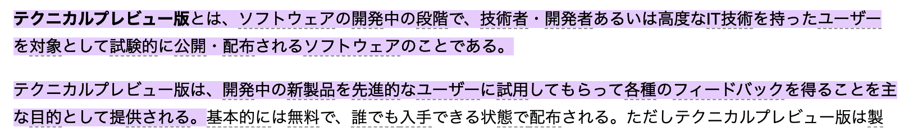

# GitHub Copilotに未来を感じた話

---

## アジェンダ

1. GitHub Copilotとは
2. ライセンス問題
3. 業務利用は可能？
4. まとめ

---

## GitHub Copilotとは

--

※https://copilot.github.com/

--

※Google翻訳

--

- GitHubが開発した、コードを補完してくれるツール
- 精度が半端ない
- 2021/06/29に公開
- 「Technical Preview」というステータス

--

## Technical Preview？

※[weblio](https://www.weblio.jp/content/%E3%83%86%E3%82%AF%E3%83%8B%E3%82%AB%E3%83%AB%E3%83%97%E3%83%AC%E3%83%93%E3%83%A5%E3%83%BC%E7%89%88#:~:text=%E3%83%86%E3%82%AF%E3%83%8B%E3%82%AB%E3%83%AB%E3%83%97%E3%83%AC%E3%83%93%E3%83%A5%E3%83%BC%E7%89%88%E3%81%A8%E3%81%AF%E3%80%81%E3%82%BD%E3%83%95%E3%83%88%E3%82%A6%E3%82%A7%E3%82%A2%E3%81%AE%E9%96%8B%E7%99%BA%E4%B8%AD%E3%81%AE,%E3%81%A8%E3%81%97%E3%81%A6%E6%8F%90%E4%BE%9B%E3%81%95%E3%82%8C%E3%82%8B%E3%80%82)

--

- テスト中なので事前の登録が必要。
- 登録始まったときは結構待ちましたが、今はそれほど待たないらしい。
- [公式サイト](https://copilot.github.com/) の `sign up` から順番待ちに登録！

--

## どこで使える？

> Visual Studio Code、Neovim、およびJetBrains IntelliJ IDEA、Android Studio、PyCharmなどのIntelliJベースのIDEをサポートしています。

https://copilot.github.com/#faq-what-development-environments-are-supported

---

## ライセンス問題

公開当初、精度がすごいことからかなり話題になったが、それと共にライセンス違反では？という懸念があがっていた。  
これによりGitHubからの移行したPJもある。

--

- [学習は公開コードが使用されている](https://copilot.github.com/#faq-what-data-has-github-copilot-been-trained-on)
  - GitHub上のpublicのコードを含む
  - コードの著作者に許可をとっていないのに学習に使用してよいのか？
- [補完されるコードに既存コードがそのまま含まれている場合がある](https://copilot.github.com/#faq-does-github-copilot-recite-code-from-the-training-set)
  - 既存コードのライセンスを守る必要があるのでは？

--

### コードの著作者に許可をとっていないのに学習に使用してよいのか？

--

- [少なくてもGitHub上にあるコードは利用規約で許可している](https://docs.github.com/ja/site-policy/github-terms/github-terms-of-service#g-intellectual-property-notice)
- その他の公開コードについては不明
  - だが、流石にこの辺りは考慮していると思われるが。。。

--

## 補完されるコードに既存コードがそのまま含まれている場合がある

--

- GitHubは0.1%程度で発生する場合があると報告している。
- その場合に

---

## 業務利用は可能？

---

## 参考

- https://fossa.com/blog/analyzing-legal-implications-github-copilot/
- https://ainow.ai/2021/09/03/257207/

---

### ご清聴ありがとうございました
