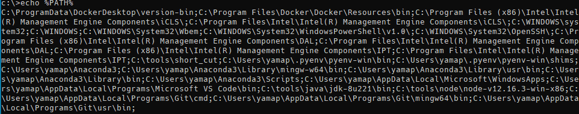

# 環境変数について少し調べた

---

## アジェンダ

1. はじめに
2. 環境変数とは
3. PATH とは
4. ユーザ環境変数の PATH
5. Linux の環境変数関連コマンド
6. 最後に

---

## はじめに

--

## なんで LT で環境変数？

- わかっているようでわかっていない
- 意外とわかっていない人がいる
- ちょっと調べたので LT で話そう

--

## 注意事項

- ざっくり調べた内容です
- 間違っている、微妙に違うとかあるかも
- ツッコミ大歓迎！

---

## 環境変数とは

--

> 環境変数（かんきょうへんすう、英語: environment variable）はオペレーティングシステム (OS) が提供するデータ共有機能の一つ。OS 上で動作するタスク（プロセス）がデータを共有するための仕組みである。特にタスクに対して外部からデータを与え、タスクの挙動・設定を変更するために用いる。

[https://ja.wikipedia.org/wiki/環境変数](https://ja.wikipedia.org/wiki/%E7%92%B0%E5%A2%83%E5%A4%89%E6%95%B0)

--

## もっと簡単に。

- OS の変数
- OS 上で動くプロセスは利用可能
- 各種プログラム内でも使われる

--

## 具体的には

- `PYTHONPATH`
- Windows
  - `%USERPROFILE%`
  - `%TEMP%`
- Mac, Linux
  - `$HOME`
  - `$LANG`

--

## どういうときに使う？

- 環境によって値が変わる場合
  - 設定ファイルの場所とか
- 秘密にしたい情報
  - パスワードとか

---

## PATH とは

--

## 概要

- ちょっと特別な環境変数
- PATH を通してーとかいう奴
  - `$PATH` に値を **追記** すること
- OS によって区切り文字が違う
  - Windows: `;`
  - Mac、Linux: `:`

--

## 例

--

## フルパスで指定しなくてもコマンド名だけで実行できるようになる

- `/hoge/huga/piyo.sh` があった時
- 実行する場合は `/hoge/huga/piyo.sh` と指定しなければいけない
  - どこにあるかわからないから当然
- PATH に設定すると `piyo.sh` だけで実行可能
  - `export PATH=$PATH:/hoge/huga`

--

## Windows の場合は一部の拡張子は省略可能

- `.exe`, `.bat`, `.cmd` などが有名
- 環境変数 `PATHEXT` に設定されている拡張子が省略可能

---

## ユーザ環境変数の PATH

※Windows の場合

--

## PATH 以外の環境変数

- システム環境変数とユーザ環境変数が重複しているとユーザ環境変数で上書きされる
- 例
  - システム: `HOGE=aaa`
  - ユーザ: `HOGE=bbb`
  - `echo %HOGE%` とすると `bbb` となる

--

## PATH の場合

- システム環境変数の後ろにユーザ環境変数が設定される
- 例
  - システム: `PATH=c:\aaa`
  - ユーザ: `PATH=c:\bbb`
  - `echo %PATH%` とすると `c:\aaa;c:\bbb` となる

--

## つまり

- システム環境変数の PATH に対象のコマンドが存在する場合、ユーザ環境変数で上書きすることができない
- 例
  - システム: `PATH=c:\aaa`
  - ユーザ: `PATH=c:\bbb`
  - `python.exe` が `c:\aaa\python.exe` と `c:\bbb\python.exe` に存在する場合、 `python` とコマンド実行した場合に、 `c:\aaa\python.exe` が呼ばれる

--

## それが何？

- システム環境変数の変更には管理者権限が必要
- 管理者権限がないかつ、システム環境変数上に存在しているコマンドはユーザ側では変更することができない

--

## 元ネタ

- [Windows のシステム環境変数とユーザ環境変数](https://qiita.com/yamap_55/items/9a3f7af47dc879104e71)

※よく見られているっぽい

---

## Linux の環境変数関連コマンド

--

- `env`
  - 引数なしで環境変数表示
  - 一時的に環境変数設定してコマンドを実行
- `printenv`
  - 引数なしで環境変数表示
  - 特定の環境変数のみ表示
- `set`
  - 引数なしで環境変数、シェル変数表示
  - シェル変数の設定
- `export`
  - 引数なし（`-p`）で環境変数表示
  - 環境変数の設定

---

## 最後に

- 地味にわかっていなかった事がある
- 改めて調べてみるというのは良い
- システム保守で結構引っかかるポイント

---

### ご清聴ありがとうございました
