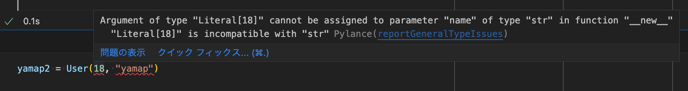
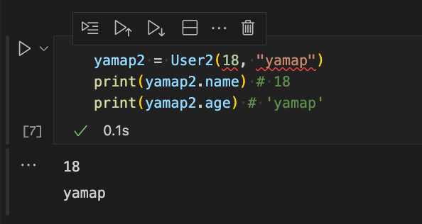

<style type="text/css">
  .reveal h1,
  .reveal h2,
  .reveal h3,
  .reveal h4,
  .reveal h5,
  .reveal h6 {
    text-transform: none;
  }
</style>

# namedtuple使ってみた

---

## アジェンダ

1. namedtupleとは？
2. typing.NamedTuple
3. dataclassとの使い分け
4. 言いたいこと

---

## namedtupleとは？

--

- `collections.namedtuple`
  - https://docs.python.org/ja/3/library/collections.html#collections.namedtuple
- tupleに名前をつけることができる
- tupleの中身に名前をつけることができる

--

## sample

```python
from collections import namedtuple
User = namedtuple("User", ["name", "age"])
yamap = User("yamap", "18")
print(yamap) # User(name='yamap', age='18')
print(yamap.name, yamap.age) # yamap 18
```

--

## tupleの性質も引き継ぐ

```python
name, age = yamap # アンパック
print(*yamap)
print(yamap[0]) # indexでアクセス
```

--

## どういうときに使うの？

- 関数から3つ以上値を返したい時
- Dictionaryでデータを使い回す時
- 値を変更されたくない
- とか

---

## typing.NamedTuple

https://docs.python.org/ja/3/library/typing.html#typing.NamedTuple

※今までのやつは `collections.namedtuple`

--

## collections.namedtupleには型がない

```python
yamap2 = User(18, "yamap")
print(yamap2.name) # 18
print(yamap2.age) # 'yamap'
```

※明らかに間違っているが通ってしまう

--

## 型指定が可能

```python
from typing import NamedTuple
User2 = NamedTuple("User", (("name", str), ("age", int)))
yamap3 = User2(18, "yamap")
```

--

## 警告してくれる



--

## Pythonなので実行は可能



---

## dataclassとの使い分け

--

## dataclassというのもある

- [dataclasses.dataclass](https://docs.python.org/ja/3.10/library/dataclasses.html)

--

## コード例

```python
from dataclasses import dataclass

@dataclass(frozen=True)
class User3:
    name: str
    age: int

yamap3 = User3("yamap", 18)
```

※型が違っても実行可能

--

## 使い分け

- スコープがそのモジュールファイルだけならNamedTuple
- モジュール外に出るならdataclass
- **よくわからないならdataclass使っとけ**

---

## 言いたいこと
- Dictionaryでデータを使い回さないでほしい
- Tupleでデータを使い回さないでほしい
  - 変更ができないのでまだまし
- 複数のデータを使い回すならdataclass使おうぜ
- NamedTupleはdataclassの下位互換

---

### ご清聴ありがとうございました
