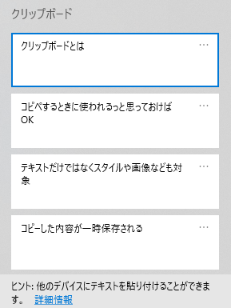

<style type="text/css">
  .reveal h1,
  .reveal h2,
  .reveal h3,
  .reveal h4,
  .reveal h5,
  .reveal h6 {
    text-transform: none;
  }
</style>

# Windowsユーザ必須Cliborの紹介

※クリップボード拡張 + α

---

## アジェンダ

1. はじめに
2. Cliborとは
3. クリップボード履歴
4. 定型文
5. FIFO/LIFOモード
6. インストール方法
7. まとめ


---

## はじめに

--

## クリップボードとは
- コピーした内容が一時保存される
- テキストだけではなくスタイルや画像なども対象
- コピペするときに使われるっと思っておけばOK

--

## Windowsでは拡張されている
- `Windows + V` で履歴を呼び出せる
- 「Windows 10 October 2018 Update」で追加



--

## DaaSでは使えない？
- `Windows + SHIFT + S` と同じく、使える場合とそうでない場合がある？

※この2つのショートカットキーだけは覚えて帰ってほしい

---

## Cliborとは

https://chigusa-web.com/clibor/

--

## クリップボード拡張アプリケーション

※Windows専用


--

## 特徴


---

## クリップボード履歴

https://chigusa-web.com/clibor/howto/basic2/

--

## クリップボードに保存された内容を履歴管理


--

## どこがよいの？
- 検索可能
- 履歴の量も調整可能
- ちょっとした編集も可能
  - 小文字、大文字、「"」で囲むとか

---

## 定型文

https://chigusa-web.com/clibor/howto/basic3/

--

## いつも使う文字列登録できます
- 別環境のメールアドレスとか
- URLとか

---

## FIFO/LIFOモード

https://chigusa-web.com/clibor/howto/fifo-lifo/

--

## 私の使い方

```
hoge
huga
piyo
```

↑をコピーして1行づつ貼り付けする時に使用

---

## インストール方法

--

- [窓の杜](https://forest.watch.impress.co.jp/library/software/clibor/)からダウンロード
- 解凍して適当な場所に配置
  - `d:\tools` とか
- 起動
- 設定
  - タスクバーのアイコン右クリック → 設定
- スタートアップに追加
  - `Windows + R -> shell:sendto`
- Clibor.exeのショートカットを配置

---

## まとめ
- ちょっとした時にちょっと楽になる
- クリップボードは常日頃使うので是非拡張して使って楽してほしい
- `Windows + V`, `Windows + SHIFT + S` は覚えてほしい
