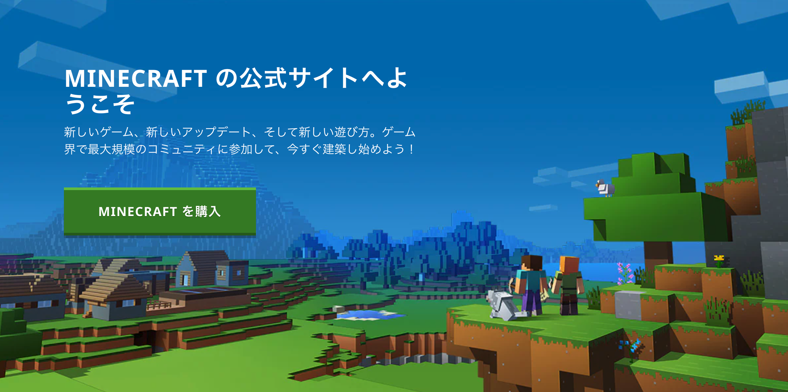
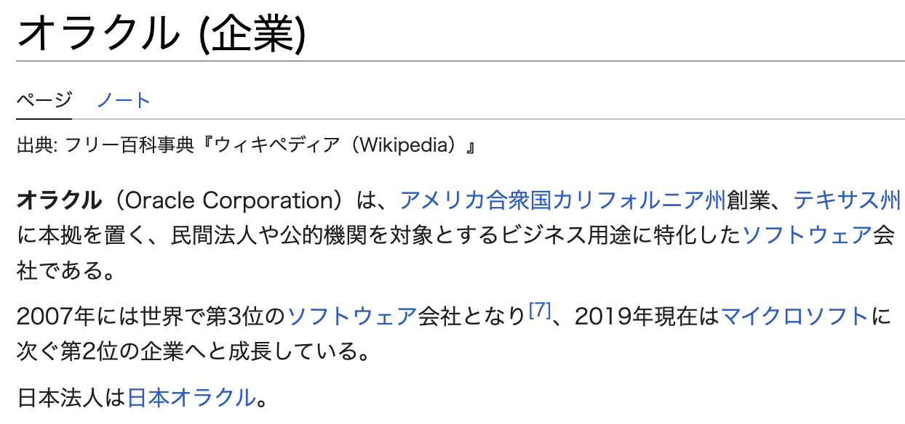
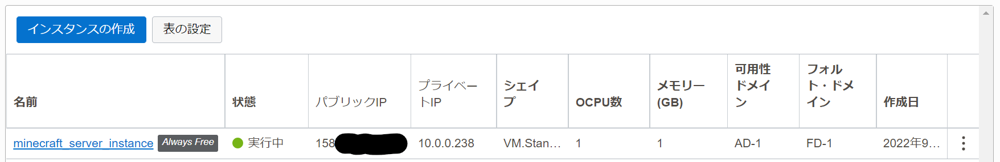
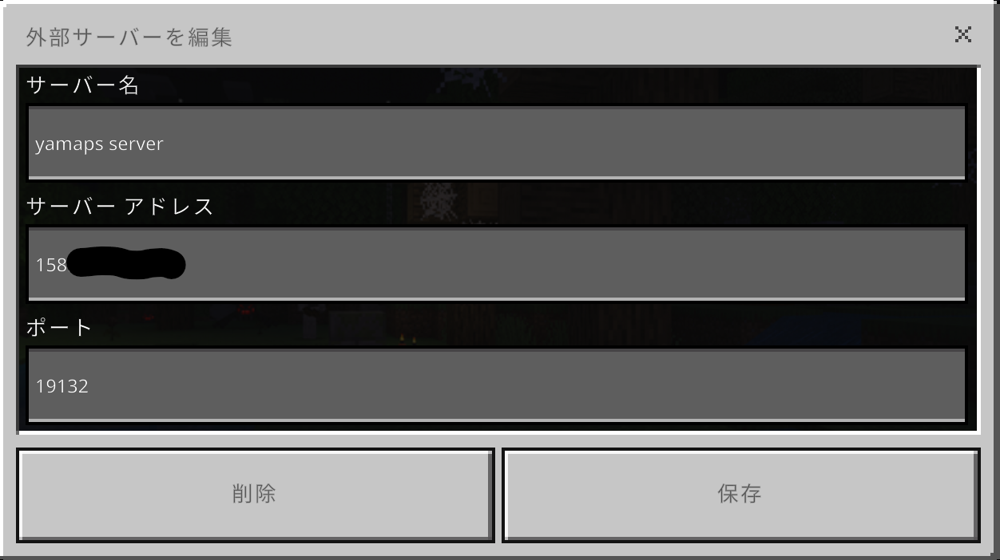

# Oracle CloudでMinecraftのサーバを構築した件

※統合版

---

## アジェンダ

1. Minecraftとは
2. Oracle Cloudとは
3. 本題
4. もうちょっと設定する
5. 感想

---

## Minecraftとは

--

- Mojang Studios社が開発
- 世界で一番売れたゲーム
- 2014年、Microsoftに買収された
- 教育用途でも使用されている
  - Education Editionというのがある

--

## こういうやつ

---

## Oracle Cloudとは

--

## Oracle社が運営するクラウドプラットフォーム

- AWS、GCP、Azureなどと同じ
- クラウドインフラ市場では2%のシェア
- パット見たところ基本的なサービスはあるように見える

--

## Oracle社とは

--

## 代表的な製品とか

- RDBのOracle Database、MySQL
- プログラム言語のJava

※MySQLはOSS、JavaもOSSのOpenJDKが元になっている

--

## 何が良いの？
シェアが低いので無料枠が大きい

- AMD CPUなら、メモリ1GBで2つ
- ARM CPUなら、メモリ24GBまで

--

## ARMどうなの？

- ほぼ取れない
- 日本のリージョンはそもそも受付停止中

※ホームリージョンが無料枠の対象なので、ユーザ登録時に日本以外を選ぶ必要がある

---

## 経緯とか

--

## なんでMinecraft？

- 妻と子がSwitchで遊んでいた
- 1つのSwitchでマルチプレイは大変
  - 画面分割なので狭い
  - 重すぎる

※流行り廃りがあるにせよ1年くらい前から

--

## なんで今？

- β時代には遊んでいたのでアカウントはある
  - が、MS買収などでアカウント移行ができない
- ゲーム気分ではなかった
- 家族もそこまで熱心にやっている訳でもない

--

## タブレット購入

- Switchとタブレットでマルチプレイが可能！
- マルチサーバにお金使いたくない
  - 熱心にやっている訳ではない

---

## 本題

※Oracle CloudでMinecraftを動かす

--

## 前提

- Oracle Cloudへのユーザ登録
  - とくに難しいことはない
- 遊ぶ端末用のMinecraftの購入
  - PC版だと[Java版、統合版セットで3960円](https://www.minecraft.net/ja-jp/store/minecraft-java-bedrock-edition-pc)
- 本スライドは統合版の手順

--

## サーバを作成
- コンピュート -> インスタンス -> インスタンスの作成
- シェイプが「**VM.Standard.E2.1.Micro**」となっていることを確認
  - シェイプはインスタンスタイプと考えてOK
  - Oracle CloudではCPUコア数、メモリを変更できるフレキシブルシェイプもある
- SSHキーを保存
- 19132ポートを開ける

※何も難しいことはない（[参考](https://zenn.dev/fuyutsuki/articles/mcbe-adventcalendar-1221_fbe27c857a043c)）

--

## サーバ内作業
- SSHで接続
- ファイアーウォールを設定
- wgetでminecraftを取得
- 解凍
- `./bedrock-server` で起動

--

## Minecraftから接続
- サーバのパブリックIPを指定することで接続可能
- Switchだと外部のマルチサーバに接続するには本体設定の変更が必要なので注意

--

## こんな感じ

---

## もうちょっと設定する

--

## パブリックIPの固定
- 予約済みパブリックIPを使用する
  - [ドキュメント](https://docs.oracle.com/ja-jp/iaas/Content/Network/Tasks/managingpublicIPs.htm)

--

## 自動起動
- `/etc/rc.local` に起動コマンド書く
  - 本来は `systemd` などを使用すべき
- `sudo -iu opc bash -c "cd ./minecraft; /usr/bin/screen -dmS minecraft bash -c 'LD_LIBRARY_PATH=. ./bedrock_server; exec bash'"`

--

## Minecraftの設定
- `server.properties`
- `allowlist-json`
  - 古い記事だとwhitelist.jsonとなっているので注意
- `permissions.json`

--

## マルチプレイを許可
- プレイヤーが未成年の場合はMicrosoftアカウント自体でマルチプレイを許可する必要がある

---

## 感想

--

## 良かったこと
- 思ったより超簡単
  - Linuxと仲良くなれる
  - 最低限のLinux知識は必要
    - ファイル編集とか
- Oracle Cloud触れた
  - GUIはそんなに悪くない
  - 普通に最低限使うなら問題なさそう
- 無料💰
- 家族評価↑↑

--

## 悪かったこと
- 酷い記事が多すぎてハマる
- Minecraftの公式ドキュメントがよくわからない
- Oracle CLoudのAPIがまじでわからない
  - サーバの再起動すら実現できていない
- とりあえずで適当な記事参考に作ったら修正が大変だった
  - 自動起動コマンドとか

--

## その他
- 今はAWSやGCPもメモリ1GBのインスタンス無料で使えるっぽい
- LineやSlackからサーバ再起動とかしたい
  - 型はあるのだけどOracle CloudのAPIが。。。
- 自動起動コマンドが酷すぎる

--

## ご清聴ありがとうございました
