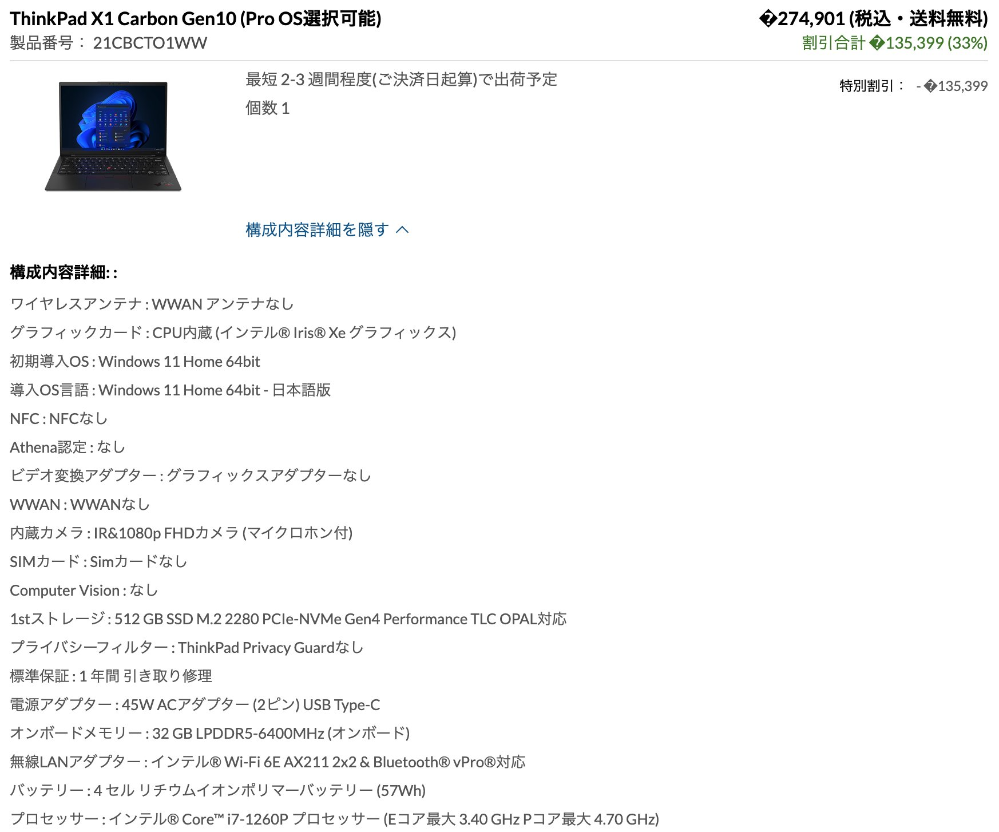
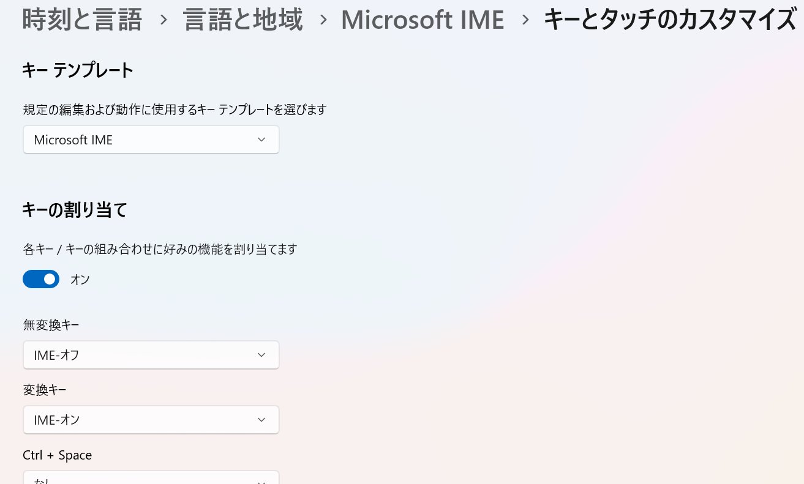

<style type="text/css">
  .reveal h1,
  .reveal h2,
  .reveal h3,
  .reveal h4,
  .reveal h5,
  .reveal h6 {
    text-transform: none;
  }
</style>

# 新PCを購入した話

---

## アジェンダ

1. はじめに
2. Mac？Windows？
3. セットアップ
4. インストール
5. WSLの設定
6. スクリプトを配置
7. その他
8. 思ったこととか

---

## はじめに

--

## 新しいPC買ったよ！

※9/27にぽちって、10/22に届いた

--

[](https://twitter.com/yamap_55/status/1574624141386600448)


--

## 今までのPC

[](https://twitter.com/yamap_55/status/792730249192611840)

※2016/10/30ポチって12/03届いた

--

## 今日のLTは

- なんでこのPCにしたのか
- Windows PCの初期設定の話
- 次回Windows PCセットアップ時の個人的なメモ

--

## 用途
- Web開発
- インターネット
- not ゲーム
- not 動画編集
- not 機械学習

---

## Mac？Windows？

--

## 結論

好みと慣れ。

--

## 現代のWeb開発

- ちょっと前まではMac一択
  - 前PCはMac
- 開発環境がMac前提
- WSL、DockerのおかげでWindowsでも大差ない

--

## 値段

- 同スペックの場合Windowsの方が安い
- 今回のスペックで雑に比較して6万位の差
  - MacBook Pro14インチ、メモリのみ32GBに変更すると33万

--

## やりたいことで変わる場合も
- Mac
  - iPhoneアプリ
- Windows
  - MS Office
  - ゲーム

---

## セットアップ

--

## セキュリティアップデート
- Windowsアップデート
- BIOSとか各種ドライバとか
- Lenovoの場合、ツールが入っていて全部やってくれた

--

## Chromeインストール

- Microsoft Edgeの最後の出番
- Googleアカウントで同期
  - ブックマーク、拡張機能も含めて全部入る

--

## 日本語変換ショートカット

[](https://twitter.com/yamap_55/status/1584004210013503488)

※タスクバーのIME右クリック → 設定 → キーとタッチのカスタマイズ

--

## 拡張子、隠しファイル表示

1. `Windows + S` → フォルダオプション
2. 表示タブ
3. 隠しファイル、隠しフォルダを表示にチェック
4. 登録されている拡張子は表示しないのチェックを外す

---

## インストール

--

## wingetでインストール

- wingetは[MS製のパッケージマネージャ](https://learn.microsoft.com/ja-jp/windows/package-manager/winget/)
- Windows11からはデフォルトでインストールされている
- `winget search hoge`
- `winget install hoge`

--

## 入れたもの

```
Microsoft.VisualStudioCode
Docker.DockerDesktop
Git.Git
Python.Python.3.10
```

--

## wingetで入らないもの

- [サクラエディタ](https://sakura-editor.github.io/)
  - テキストエディタ（軽量）
- [Clibor](https://chigusa-web.com/clibor/)
  - クリップボード拡張
- [白源](https://github.com/yuru7/HackGen)
  - プログラミングフォント

--

## 多分そのうち入れる

- [Everything](https://www.voidtools.com/)
  - 新PCなのでファイル探すことがない
  - 代替ツールを探してない
- ランチャー
  - `Windows + S` が優秀なので不要？

---

## WSLの設定

--

## WSL自体の設定

- power shellで実行すること
  - cmdはPATHが通っていない
- `wsl --update`
- `wsl --set-default-version 2`
  - デフォルトでWSL2を使用するように変更

--

## Ubuntu
- `wsl --install -d Ubuntu-20.04`
  - 最新のLTSである22.04はGUIが付属しているらしい
- Ubuntuにログイン後
- `sudo apt update`
- `sudo apt upgrade`
- `sudo dpkg-reconfigure locales`
  - ロケールを変更

---

## スクリプトを配置

--

## 自作スクリプト
- [downloadフォルダをキレイにするやつ](https://gist.github.com/yamap55/621b4596226c81a736650c5cc0e33d80)
- [workフォルダを毎日作るやつ](https://gist.github.com/yamap55/7f50a5594b1acbf2635ca169e457af7e)

---

## その他

--

- VS Codeのユーザ設定
- サクラエディタのマクロ
- 各種鍵の設定

---

## 思ったこととか

--

- メモリ32GBにするだけで値段上がりすぎ
  - 次買うときは64GBにできるのだろうか
- 最初ウキウキしたけどセットアップ面倒
- Windows Homeの場合にユーザ名決められないのは最悪
- クラウドサービスのおかげであまり作業がなくて良い
- インストールスクリプト作りたい
- 私は意外と初期設定で使っている
  - [dotfileとか憧れる](https://github.com/search?q=dotfiles&type=repositories)

---

## ご清聴ありがとうございました
