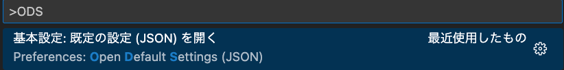

# VS Codeのオススメ設定

※言語特有ではない共通設定

---

## アジェンダ

1. はじめに
2. Mac？Windows？
3. セットアップ
4. インストール
5. WSLの設定
6. スクリプトを配置
7. その他
8. 思ったこととか

---

## はじめに

--

## 経緯

- VS Code便利
- が、使いこなせている気がしない
- 言語問わない共通設定を公開
- こんな設定あるよとか教えてほしい

--

## 私のユーザ設定ファイル

https://github.com/yamap55/dotfiles/blob/master/settings.json

--

## LTではいくつか紹介します

---

## オススメ設定

--

## 保存時にフォーマット整形

- `"editor.formatOnSave": true`
- ※フォーマッターは必要

--

## 見えない文字表示系
- `"editor.renderControlCharacters": true`
  - 制御文字表示（「⁦」とか）
- `"editor.renderWhitespace": "all"`
  - スペース表示

--

## コメント内の紛らわしい全角文字を強調
- `"editor.unicodeHighlight.includeComments": true`
- 全角英語や全角スペースなどを強調表示

--

## 縦線
- `"editor.rulers": [80, 100]`
- 任意の文字数で縦線表示

--

## ファイル末尾の改行追加
- `"files.insertFinalNewline": true`

> テキストファイルが行の集まりであり、行とは最後に改行コードを含むもの

- https://twitter.com/yamap_55/status/1585869899225628673

--

## リモートリポジトリから自動でfetch
- `"git.autofetch": true`
- fetch忘れてて、あーってよくあるよね

--

## カッコの対応を色付け
- `"editor.bracketPairColorization.enabled": true`
- ちょっと前まで拡張機能で対応してましたが、本体に設定追加されました

---

## 便利機能

--

## 初期設定ファイル
- default値がわからない
  - 昔はデフォルト値も表示された気がするのだけど。。。
- `Ctrl + Shift + P` -> `ODS` 入力
  - `Preferences: Open Default Settings(JSON)`

---

## オススメの設定を教えてね！
