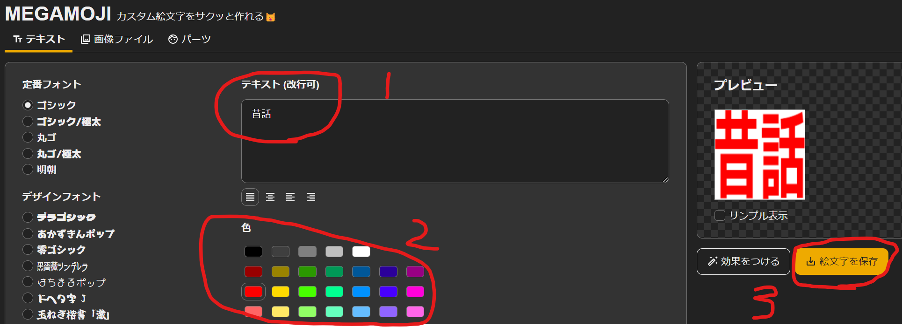
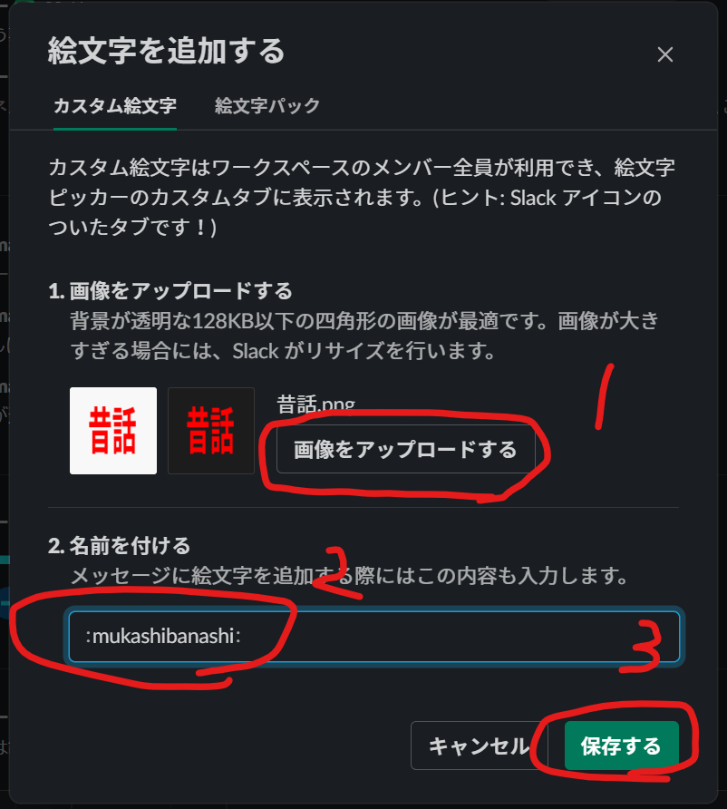

# Slack絵文字追加のすゝめ

---

## アジェンダ

1. Slackの絵文字
2. LT とは？
3. コンセプト
4. メリット
5. デメリット
6. 伝えたかったこと
7. 最後に

---

## はじめに

--

### Slackで絵文字使ってますかー？

--

## こういうやつね

--

## こんなこともできる

--

## 絵文字最高🎉

--

## 使い方は割愛

みんな知ってるよね？

---

## どういうときに使うの？

--

## あらゆること
- 既読
- 感謝
- 突っ込み
- 同意
- ダジャレ

--

## なんでもいい

---

## 絵文字使うとよいこと

--

## 絵文字使うとよいこと

- 喜んでくれる
- 文字打つより楽
- 文字打つより早い

---

## 使いたい絵文字がない

--

## 絵文字を作る

- 大変そう

--

## 文字なら簡単

- 絵文字だけど絵よりも文字が多い
- 作るのが簡単だから

---

## 絵文字の作り方

--

## Slackを見る

「🐰」、「🐢」、「昔話」  
↑としたい

※例が良くない

--

## Googleで検索！！

この2つがあれば用が足りる

--

## [絵文字ジェネレーター](https://emoji-gen.ninja/)

--

## [MEGAMOJI](https://zk-phi.github.io/MEGAMOJI/)

※透過で作れなかったりするので今回の場合は絵文字ジェネレーターの方がよい  

--

## 超簡単

--

## 追加1

--

## 追加2

--

## できた！

---

## 動きが欲しい

--

## [MEGAMOJI](https://zk-phi.github.io/MEGAMOJI/) を使う

※「効果をつける」

--

### [実際にやってみる](https://zk-phi.github.io/MEGAMOJI/)

---

## 伝えたかったこと

--

## 伝えたかったこと
- 絵文字付けると喜ばれる
- 絵文字作るの簡単
- 絵文字は楽しく作れる

---

### ご清聴ありがとうございました
