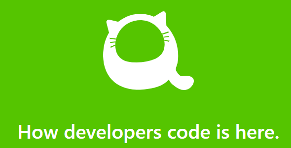
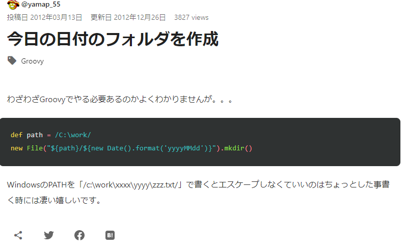
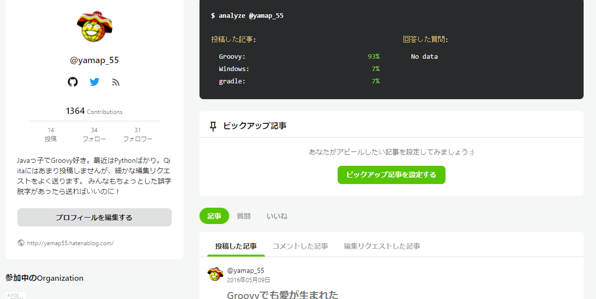

# Qiitaの編集リクエストのはなし

---

## アジェンダ

1. はじめに
2. どういうときに使うの？
3. 絵文字使うと良いこと
4. 絵文字の作り方
5. 動きが欲しい
6. 伝えたかったこと

---

## はじめに

--

## Qiita知ってますか？

> Qiita (キータ) は、エンジニアに関する知識を記録・共有するためのサービスです。

--

## エンジニア的なblogみたいなイメージ

--

## 

--

## 編集リクエスト機能

- 編集リクエスト
- https://help.qiita.com/ja/articles/qiita-edit-request

--

## マイページ

--

## 1364Contributions

※記事はほぼ書いていない

--

## 

--

## ちょっとした間違え

気になります

--

## こんなこともできる

---

### ご清聴ありがとうございました
