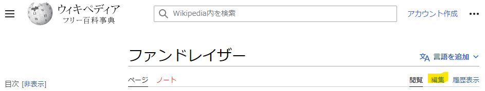
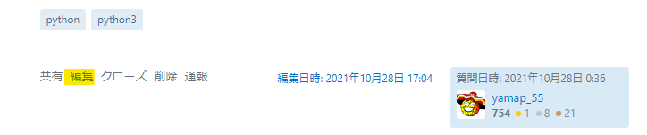
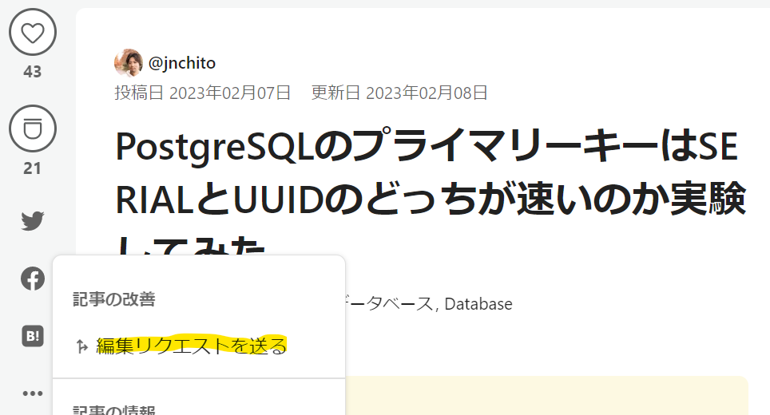

## ドキュメント
## メンテナンスのはなし

---

## アジェンダ

1. はじめに
2. 読者の力を借りる
3. 実例
4. 伝えたかったこと

---

## はじめに

--

## ドキュメントで困っていませんか？

- 内容に間違いがある
- 内容が現状とあっていない

→ 誰も見てくれない

--

## メンテナンスが必要

- 間違いを直す
- 最新に更新

- 結果: 見てくれる

---

## 読者の力を借りる

--

## メンテナンスは大変

- 作成者がずっとメンテナンスするのは無理

--

## 読者に助けてもらう

- 内容に間違いがある
- 内容が現状とあっていない

- → **見てくれたことで気づいた**

--

## 助ける方法

- 報告してもらう
- 修正してもらう

--

## 報告してもらう

- コメントやSNS経由で連絡
- 作成者が考えて修正する必要があるので負荷が高い

--

## 修正してもらう

- 作成者の負荷が低い
- 今回はこちらに注目

---

## 実例

--

## Wikipedia

※編集できないページもある  
※基本即時反映

--

## Stack Overflow

※一定の評価が必要  

※評価が低いうちはレビュー後反映

--

## Qiita

※作成者が許可することで反映

--

## 貢献したことになる

1. 各サービスでポイント的なものがもらえる
2. うれしい
3. もっとやろう
4. 1に戻る

※Wikipediaはちょっと違う

---

## 言いたいこと

--

## 気づいたら更新しよう

- 間違いがあったら修正する
  - 正しい内容がわからない場合はその旨を追記
  - ※取り消し線ではなく消す
- 古かったら修正する
  - 修正できないならば現状に合っていない旨を追記
  - 不要であればページ削除なりoldとする

--

## ドキュメントは腐る

- 書き終えた瞬間から最新ではない
- 誰もが書き換えていけるようにする
- 質問の回答にドキュメントのリンクを送る
  - 間違えがあったら修正してもらう

--

## 対応したら褒める

1. ドキュメント修正
2. 報告する
3. 褒められる
4. 嬉しい
5. もっと褒められたい
6. 1に戻る

※**褒められて嫌な人はいない**

--

## まとめ

- ドキュメントは腐る
- 腐ると読まない
- 更新は大変
- 気づいた人が修正
- 修正した人を褒める

---

### ご清聴ありがとうございました
