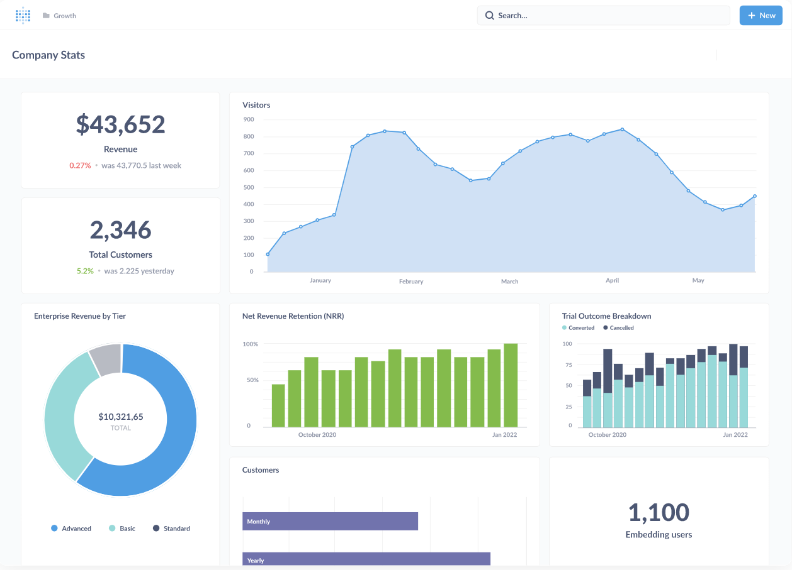

# データ可視化ツールMetabase

---

## アジェンダ

1. はじめに
2. MetaBaseとは
3. 社内にもある
4. 注意点
5. まとめ

---

## はじめに

--

## OKR

社内で大流行中の「OKR」決めましたか？

--

## KR（Key Results）

- 定量的な指標
- 数値で表現する

--

## 数値目標

- 「常に」数値を意識する
- 今の数値
- 上がったのか下がったのか

--

## 可視化しよう

- チャート
- テーブル

--

## Metabase

---

## Metabaseとは

--

## データ可視化ツール

- 俗にいうBIツール
- ビジネスインテリジェンス
  - Business Intelligence
- 企業が持つさまざまなデータを分析・見える化して、経営や業務に役立てるソフトウェア

--

## 公式の説明

https://www.metabase.com/product/

---

## 社内にもある

--

## 社内のMetabaseを見る！

--

## すぐ使えるの？

- 気軽に依頼して！とは「まだ」言えない
- 展開していきたい思いはある
- 相談は受け付けます！

---

## 注意点

っというか言いたいこと

--

## Metabaseいいなと思った人

🙋‍♂

--

## ダッシュボードは見ない

- 作られたダッシュボードは見られない
- 工数かけたダッシュボード程見ない

--

## なぜ見ないのか

- ダッシュボード見ることは仕事ではない
- ダッシュボードを見ても仕事は進まない
- ダッシュボードを見てもタスクの進捗は0

--

## 見るための工夫が必要

- 会議で見る
- アジェンダに含む
- ダッシュボードを中心に会話

--

## それでも見ない

- 頑張って頑張って見る
- 仕事の中心が数値
- →数値を見るのがダッシュボード
- →→仕事の中心がダッシュボード

---

## まとめ

--

## まとめ

- データは可視化しよう
- Metabaseいいよ
- 社内にもあるよ
- 作るだけではだめ
- 仕事の中心がダッシュボード

---

### ご清聴ありがとうございました
