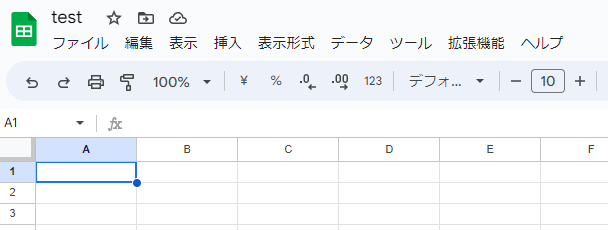
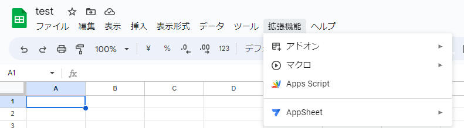
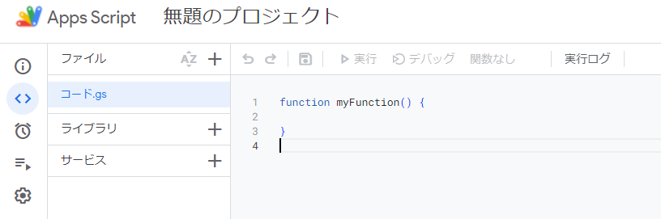
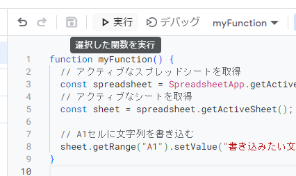
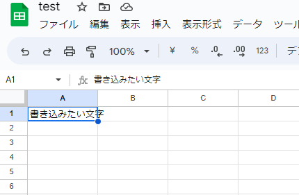
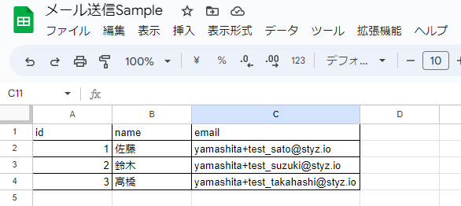
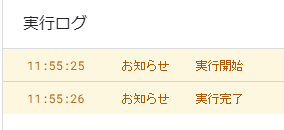
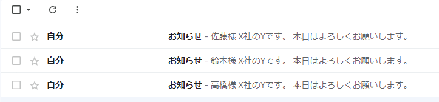
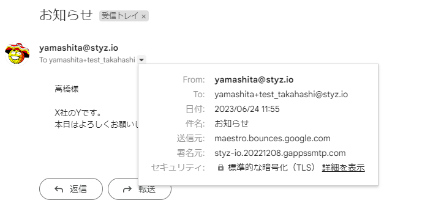

<style type="text/css">
  .reveal h1,
  .reveal h2,
  .reveal h3,
  .reveal h4,
  .reveal h5,
  .reveal h6 {
    text-transform: none;
  }
</style>

# GASの概要と利点

GAS = Google Apps Script

---

## アジェンダ

1. はじめに
2. a
3. a
4. 伝えたかったこと

---

## はじめに

--

## はじめに

- Google Apps Script、通称GAS
- GASの基本的な概念と利用方法を理解
- 日々の業務に役立てることができるようになる
- Googleのサービスをより効率的に活用するための1つの手段

--

## できる？

- すべてをできるようになる必要はない
- GASでできそうっという感覚を持ってほしい
- Excelの関数とかマクロとか
- 挑戦したくなったら相談を！

---

## Google Apps Scriptとは

- Googleが提供
- JavaScriptベースのプログラミングツール

--

## 特徴
- Googleサービス群との強力な連携
- シンプルな開発環境

--

## Googleサービス群との強力な連携
- GmailGoogleカレンダー、GoogleSheets、Googleドライブ、Google Mapsなど
- Googleサービスと簡単に連携ができる

--

## 具体例
- Gmailから特定条件のメールをSheetsにまとめる
- Formsに回答があったらカレンダーに反映する
- Sheetsのリスト通りにGmailで配信する

※他のサービスからGoogleサービスに連携可能な場合も多いので可能性は無限大

--

## シンプルな開発環境
- ツールのインストール、設定は不要
- ブラウザ上で即時作成が可能

---

## 試してみる

--

## SpreadSheetを開く



--

## Apps Scriptを開く



--

## 開いた



--

## プログラムを書く

```javascript
function myFunction() {
  // アクティブなスプレッドシートを取得
  const spreadsheet = SpreadsheetApp.getActiveSpreadsheet();
  // アクティブなシートを取得
  const sheet = spreadsheet.getActiveSheet();
  
  // A1セルに文字列を書き込む
  sheet.getRange("A1").setValue("書き込みたい文字");
}
```

--

## 実行



--

## 書き込まれた



---

## SpreadSheetからメール送る

--

## データ



※email列にメールを送信する

--

## GAS

```javascript
const sendEmails = () => {
  const spreadsheet = SpreadsheetApp.getActiveSpreadsheet();
  const sheet = spreadsheet.getActiveSheet();
  const data = sheet.getDataRange().getValues();
    // Slice to ignore the first row (headers)
  const rowsWithoutHeaders = data.slice(1);

  rowsWithoutHeaders.forEach(row => {
    const [id, name, email] = row;
    const subject = "お知らせ";
    const body = `
      ${name}様

      X社のYです。
      本日はよろしくお願いします。
    `;

    MailApp.sendEmail(email, subject, body);
  });
};
```

--

## 実行



--

## 実行結果



※エイリアスを使っているので全部自分に届く

--

## 詳細を見る



---

## その他

--

### その他
- 定期実行が標準機能
- botとか超簡単に作れる
  - Line botとか
- SpreadSheetをDBとして使える

---

## まとめ

--

## まとめ
- Googleサービスとの連携強化
- 業務効率化

--

## 伝えたいこと
- 意外とサクッとできたりする
- どういうことができるか
- できれば興味持ってほしい

--

## そして
- プログラミング楽しい🙂

--

## エンジニアいいかも？🤔

--

## 参考

- [公式ドキュメント](https://developers.google.com/apps-script/reference?hl=ja)

---

### ご清聴ありがとうございました
