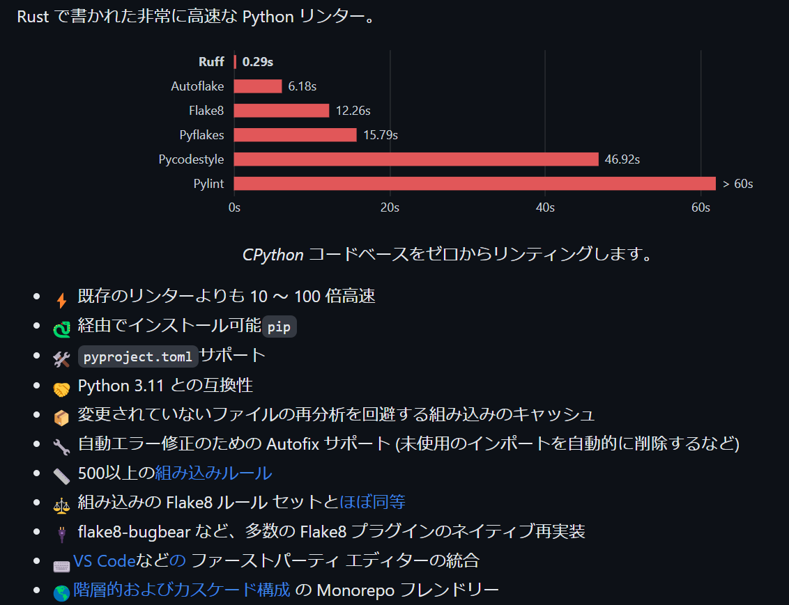

<style type="text/css">
  .reveal h1,
  .reveal h2,
  .reveal h3,
  .reveal h4,
  .reveal h5,
  .reveal h6 {
    text-transform: none;
  }
</style>

# Linterについて

### PythonのLinter「Ruff」

---

## アジェンダ

1. はじめに
2. Linterとは？
3. PythonのLinter「Ruff」
4. まとめ

---

## はじめに

--

## はじめに

- 今日はエンジニアっぽい話
- 不明点あったら気軽に実況スレッドへ

---

## Linterとは？

--

## Linterとは

- プログラムの品質を向上するためのツール
- プログラムは実行しない
  - 静的解析

--

## プログラムの品質？

- プログラムが要件に合っている
- 正しく動作する
- 拡張性が高い
- 安全である
- 信頼性が高い

--

## 検出例

- 潜在的なエラー
- コーディングルールの違反
- 一貫性のない書き方
- 命名規則違反

--

## 例: 潜在的なエラー

```python
a = 1
b = 2 # 使われていない
print(a + 2)
```

※使われていない変数がある

--

## 例: コーディングルールの違反

```python
def addNumber(a, b):
    return a + b
```

※Pythonでは関数はスネークケース（add_number）が推奨される

--

## 例: 一貫性のない書き方

```python
a = "aaa"
b = 'bbb'
```

※「"」と「'」が統一されていない

--

## 例: 命名規則違反

```python
class human:
    def Say():
        pass
```

※Classは先頭大文字、関数は先頭小文
--

## ちなみに

- textlintというテキストを対象とするLinterもある
- プロも使っている

--

[](https://ics.media/entry/220404/)

--

[](https://twitter.com/t_trace/status/1381227439536308227)

https://logmi.jp/tech/articles/325715

--

[](https://twitter.com/t_trace)

--


--


--

blogやメルマガ、メールでも使える。  
気になるでしょうがそれはまた今度。

---

## PythonのLinter「Ruff」

※これを話したかったのです

--

## Ruffって何？



--

## 良かった点
- pyproject.tomlサポート
- 各種ルールの標準サポート
  - flake8など増え続ける拡張を追わなくてよい
  - [ルール](https://beta.ruff.rs/docs/rules/)を眺めて必要なものを適用
- 動作
  - あまり実感はできていない
  - たまにflake8遅いときがあったので良さそう
- flake8から移行するためのツール付属

--

## 悪かった点
- 学習コスト
  - → Linterを学習？
- 移行コスト
  - → ツールがある
- CIでコンポネント化されていない
  - → 直接実行する

--

## 個人のPython環境は移行

https://github.com/yamap55/python_repository_simple/pull/216

※イマイチだったら後で戻す

--

## リンク
- [リポジトリ](https://github.com/charliermarsh/ruff)
- [紹介ページ](https://gihyo.jp/article/2023/03/monthly-python-2303)
- [公式Flake8との比較](https://beta.ruff.rs/docs/faq/#how-does-ruff-compare-to-flake8)

---

## まとめ

--

## まとめ

- Linterは品質を向上するためのツール
- PythonにはRuffというLinterがある
- Linter使ってみようぜ

---

### ご清聴ありがとうございました
