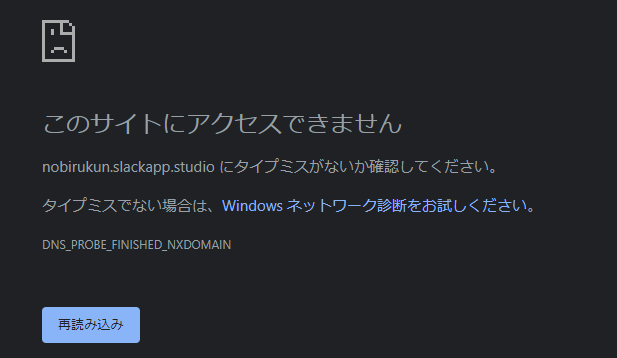
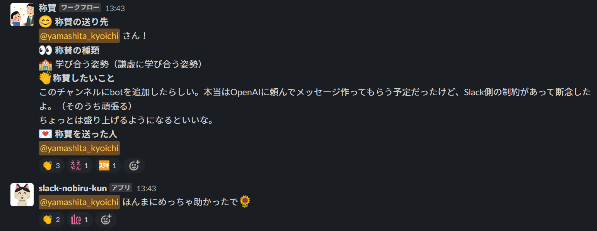

# ノビルくん作った話

### #styz-all-positive-feedback

---

## アジェンダ

1. はじめに
2. ノビルくん？
3. どういうやつ？
4. 最後に

---

## はじめに

--

## GW

- 遊んじゃう
- 何もしない
- えっ？もう終わり？
- 9連休？

--

## 何かやろう！

- ってことでノビルくん作った

--

## リポジトリ

https://github.com/yamap55/slack-nobiru-kun

---

## ノビルくん？

- ノビルくん知ってますか？

--

## ノビルくん

--

## Internet Archive

https://web.archive.org/web/20210421083942/https://nobirukun.slackapp.studio/

- 端的に言うと魚拓
- ページを保存してくれるWebサイト

--

## 跡地

--

## 前職でちょっと作った

https://github.com/yamazaki-seiya/nobiru_kun

※非エンジニアの方中心で、私はアドバイザーとして参加

--

## 作り直した！

- OpenAIでごにょごにょとかする予定だった

---

## どういうやつ？

--

## こういうやつ

--

## 一緒に褒めてくれる！
それだけ。

--

## 結構かわいい

※いらすとや

--

## 関西弁かわいい

※元ネタそのまま

---

## 最後に

--

## みんなほめてね！

#styz-all-positive-feedback

---

### ご清聴ありがとうございました
