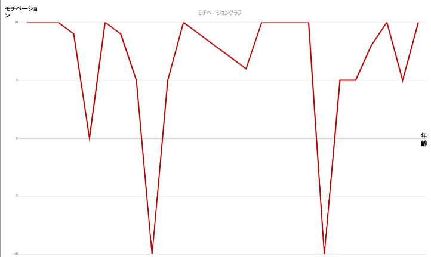

# なぜ私はSTYZにいるのか

---

## アジェンダ

1. モチベーショングラフ
2. ターニングポイント
3. なぜ私はSTYZにいるのか
4. 最後に

---

## モチベーショングラフ

1. 👉**モチベーショングラフ**
2. ターニングポイント
3. なぜ私はSTYZにいるのか
4. 最後に

--

## はじめに

- あまりモチベーションは変わらない
- ほぼ全部8-10位
- 割と常にやる気を持って生きてる
- 差分を拡大して作成

--

## モチベーショングラフ

--

## 抜粋1
- ↓友達いないことに気づく
- ↓保育業界に見切りをつける
- ↑フリーター、飲食業楽しい
- ↓飲食業で体壊す
- ↑IT業界転職
- ↓給料低いことに気づく、パートナーと警察、流血沙汰
- ↑結婚、転職

--

## 抜粋2
- ↓誘われて退職、内々定後に面接落ち、転職活動も超苦戦
- ↑常駐先で評価される
- ↓めっちゃ忙しい
- ↑誘われてSTYZ入社

---

## ターニングポイント

1. モチベーショングラフ
2. 👉**ターニングポイント**
3. なぜ私はSTYZにいるのか
4. 最後に

--

## （1）フリーター時代

- 仕事はじめて2カ月くらい
- 同年代の人とは時間が合わず仕事被らない
- 改修のため1カ月くらい店が休み
- 店全体で飲み会
- とくに誘われもしない
- ☆ほぼ接点がない人が誘ってくれた

--

## （2）IT1社目

- 適当にお仕事
- 1人で常駐
- 仕事を誰にも見てもらえない
- ☆上司が育ててくれた
- ☆外部勉強会に連れてってくれた
- ☆レビューしてくれた

--

## （3）IT3社目（前職）

- 常駐先で評価される
- やりたいこともできている
- 自社でも知名度上昇中
- ☆STYZに誘われる

---

## なぜ私はSTYZにいるのか

1. モチベーショングラフ
2. ターニングポイント
3. 👉**なぜ私はSTYZにいるのか**
4. 最後に

--

## 成長してきた

- 人に成長する機会をもらった
- 少しづつ成長した
- できることが増えた
- 評価されるようになった
- 自信がついてきた

--

## なぜ私はSTYZにいるのか

--

## 自分の力を発揮するため

---

## 最後に

--

## 多分みんなと方向性が違うはず

--

## 私は

- みんながやりたいことを実現したい
- みんなの力になりたい

--

## 私をうまく使ってください

---

### ご清聴ありがとうございました
