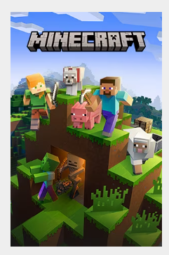
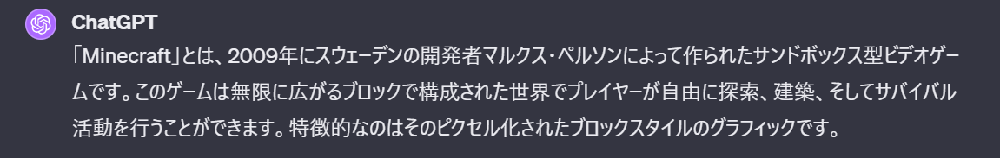
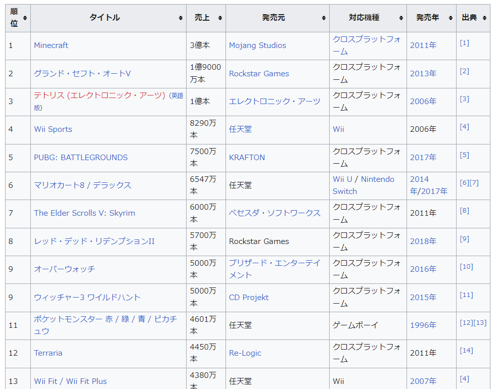
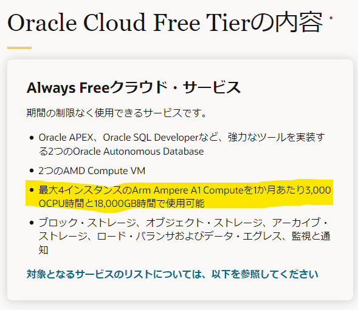
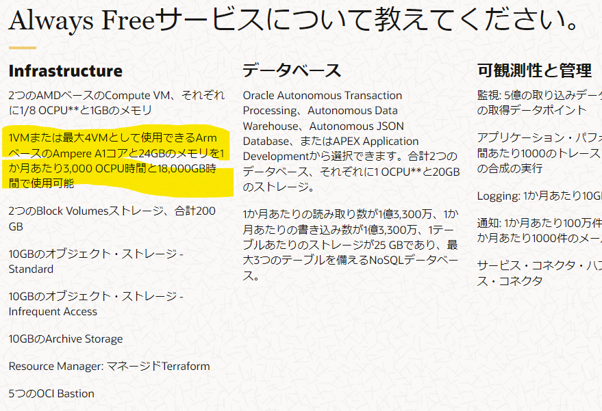
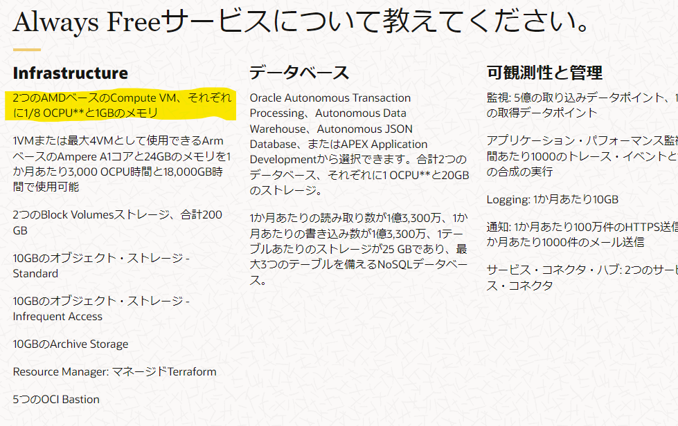

# Minecraft統合版のサーバーを構築した話

Oracle Cloudを使ってみた

---

## アジェンダ

1. Minecraftとは
2. 細かい話
3. Oracle Cloudとは
4. 本題

---

## Minecraftとは

--

## Minecraftとは

--

## 世界で一番売れたゲーム

--

## どんなゲーム？

- 目的はない
- 作ったり、戦ったり、掘ったり
- 協力したり、戦ったり
- Modも無限にある

--

## Microsoft傘下

- [2014年9月に約2680億円で買収](https://gigazine.net/news/20140916-microsoft-acquired-minecraft/)
- [Minecraft in education](https://education.minecraft.net/ja-jp)という教育用もある

---

## 細かい話

--

## 2つの種類がある

- Java Edition
  - Windows, Mac, Linux
- Bedrock Edition
  - 通称、統合版
  - Windows, Android, iOS, PlayStation, Nintendo Switch, Xboxとか

--

## マルチプレイ

- 自分の世界に遊びに来てもらう
  - 自分の世界 = 自分のPCやSwitch
  - 自分のPCやSwitchの電源を切ったら？
- どこかに世界を作ってみんなで遊びに行く
  - どこか = サーバー
  - サーバー起動していれば1人でも遊べる
- Java版と統合版はマルチプレイできない

--

## Minecraft Realms

- Minecraft側でサーバーを構築できる
- 最小構成で月3.99ドル

--

# 月3.99ドル！！

--

## つまり？

- 3.99ドルを削減するためにサーバー建てた話
- （勉強のためです）

---

## Oracle Cloudとは

--

## Oracle？

- ソフトウェア企業としてはMicrosoftに次ぐ世界第2位
- ITエンジニア以外ではあまり知られていない？
- データベースが有名
  - それ以外ではJava、MySQLとか

--

## Oracle Cloud

- AWS、Azure、GCPに続く主要なクラウドサービスプロバイダー
- 後発なので結構遅れを取ってる
- なので、無料枠がすごい

--

--

※無料で使えるスペックじゃない

--

※癖があるのでこっちを使う

---

## その後

--

blog書いた ← 言いたかった事

https://yamap55.hatenablog.com/entry/2023/11/04/135705

---

## blog書こうぜ！

---

### ご清聴ありがとうございました
