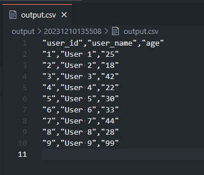

<style type="text/css">
  .reveal h1,
  .reveal h2,
  .reveal h3,
  .reveal h4,
  .reveal h5,
  .reveal h6 {
    text-transform: none;
  }
</style>

# スクレイピングでデータを集めてみた話

---

## アジェンダ

1. スクレイピングとは
2. スクレイピングで注意すること
3. デモの概要
4. 実演（静的ページ）
5. 実演（動的ページ）
6. 実演（本番）
7. まとめ

---

## スクレイピングとは


--

## スクレイピングとは


--

## つまり

- 「Webサイト等から手動でデータを集めるのは大変だからプログラムで一気に取得するための手段」

--

## プログラムなので

- Webサイトに負荷がかかる
- 人が見ることを想定しているので、想定外のアクセスが行われる
  - 1秒間に何百、何千とアクセスするとか

---

## スクレイピングで注意すること

--

## 岡崎市立中央図書館事件
- スクレイピングを行う上で必ず知っておく必要がある事件
- [Wikipedia](https://ja.wikipedia.org/wiki/%E5%B2%A1%E5%B4%8E%E5%B8%82%E7%AB%8B%E4%B8%AD%E5%A4%AE%E5%9B%B3%E6%9B%B8%E9%A4%A8%E4%BA%8B%E4%BB%B6)
- [Librahack](http://librahack.jp/)
  - 逮捕された人物の解説とか補足

--

## 概要

- 図書館の新着図書ページが使いにくい
- 図書館のWebサイトから新着図書ページのデータを取得する
- 図書館のWebサイトが重くなる
- 図書館が通報
- 開発者が逮捕

--

## ポイント

- スクレイピング自体は違法ではない
  - GoogleやYahoo！、国立国会図書館等でも行われている
- 常識的な範囲のアクセスを行っていた（1秒間に1回）
- 図書館のシステムに不具合があった
- 自宅、実家、強制捜査からの逮捕（同日）
- 20日間勾留と取り調べ後に起訴猶予処分

--

## 注意する点

- 利用規約を準拠すること
- 常識的な範囲でアクセスを行うこと
- データの使い方も検討すること
  - 著作権とか
  - 個人情報保護法とか
  - 不正競争防止法とか

---

## デモ

--

## デモの概要説明

--

## スクレイピングのターゲット

https://yamap55.github.io//python_scraping_template/users/1.html

--

## 一覧ページ


--

## 詳細ページ


--

## つまり

- 一覧ページから詳細ページのURLを取得
- 詳細ページの情報を取得
- 一覧のユーザーが終わったら次のページ

--

## 欲しいデータ

| user_id | user_name | age  |
| ------- | --------- | ---- |
| 1       | User 1    | 25   |
| 2       | User 2    | 18   |
| 中略    | 中略      | 中略 |
| 8       | User 8    | 28   |
| 9       | User 9    | 99   |

---

## 実演（静的ページ）

--


```python
import requests
from bs4 import BeautifulSoup
response = requests.get("https://yamap55.github.io/python_scraping_template/users/1.html")
soup = BeautifulSoup(response.text, "html.parser")
soup
```


--

```python
table = soup.find("table")
table
```


--

```python
users = [tr for tr in user_table.find_all("tr") if tr.find_all("td")]
users
```


--

```python
user_id_td, user_name_td = [td for td in users[0].find_all("td")]
user_id = user_id_td.text
user_name = user_name_td.text
url = user_name_td.find("a").get("href")

user_id, user_name, url
```


---

## 実演（動的ページ）

--

## 動的ページ？

- 表示時に動的にページを作る
- とりあえず仮の値を返しておいて、データを取得してから仮の値を入れ替える

--

## スケルトンスクリーンとか

- こういうの見たことない？


--

## ダミーデータは不要

- 先ほどのやり方だと最初の状態を取得するのでダミーデータを取得してしまう

--

## ブラウザを操作する

- Chromeで画面表示してほしいデータが表示されてから中身を取得する

--

```python
from selenium import webdriver
from selenium.webdriver.chrome.options import Options
options = Options()
# options.add_argument("--headless")  # ヘッドレスモードで実行
options.add_argument("--no-sandbox")  # サンドボックスモードを無効化
options.add_argument("--disable-gpu")  # GPUの使用を無効化
options.add_argument("--disable-extensions")  # 拡張機能を無効化
# ディスクキャッシュを無効化 コンテナ起動の場合は必須
options.add_argument("--disable-dev-shm-usage")
```


--

```python
driver = webdriver.Chrome(options=options)
driver
```


--


--

```python
detail_html = driver.get("https://yamap55.github.io/python_scraping_template/user/user1.html")
soup2 = BeautifulSoup(driver.page_source, "html.parser")
soup2
```


--


--

```python
user_details = soup2.find("div", class_="user-details")
user_data_list = user_details.find_all("span", class_="value")
[user_id, user_name, user_age] = [value.text for value in user_data_list]
user_id, user_name, user_age
```


--

## 出力



---

## 実演（本番）

--

コード等は割愛

※本スライドは公開されているため

--

## 言いたいこと

- 実際の画面は複雑な構造
- メンテナンスは大変
- 結構大変！

---

## まとめ

--

## まとめ

- 最初作るのは楽しい
- 結構愚直な作業が必要
- 作り切ったら後は作業
- ブラウザが実際に動くとかっこいい！

--

## 最後に

--

## レッツスクレイピング！

---

### ご清聴ありがとうございました
