<style type="text/css">
  .reveal h1,
  .reveal h2,
  .reveal h3,
  .reveal h4,
  .reveal h5,
  .reveal h6 {
    text-transform: none;
  }
</style>

# 2023年読んだ本のまとめ

---

## アジェンダ

1. 注意
2. はじめに
3. 全量紹介
4. 1冊づつ紹介
5. まとめ

---

## 注意

--

## 注意

- 本スライドは個人の主観に基づいています
- 個人の一意見として聞いてください
- 本LTはいつも以上に自分のために行うLTです
  - 何も得られないかもしれません
- 1冊30秒が目安

--

## 発表者のため？

- 2023年を振り返ることで再度読み直し知識定着
- 達成感、頑張った感を実感する
- 2024年も頑張るぞの意識向上

--

## blogから抜粋してます

[転職して1年経ったまとめと2023年の振り返り](https://yamap55.hatenablog.com/entry/2024/01/13/123455)

※SNSに本の感想メモするのオススメ

---

## はじめに

--

## 2023年は結構本読んだ！

--

# 12冊

--

## 快挙

- 個人的に12冊はかなり読んだ
- 技術書？中心で12冊は新記録

--

## なんで読んだの？

- 本読まないことを気にしていた
- 基礎、体系的だった知識が欠けている
- 最新情報を貪欲に追っていくことが難しくなる日も近いかもしれない
  - 本に慣れたい
- 積んでいる本が邪魔（処分目的）

--

## どうやって読んだの？

- 出社時の電車内では本を読む
  - 帰宅時は読まなくてよい
- 5分以上
  - 5分過ぎたらやめてよし
- 無理はしない

--

## 最初は

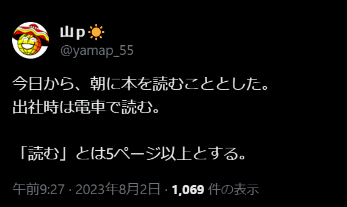

※朝活は2週間位で断念した気がする

---

## 全量紹介

--

### 超・箇条書き
[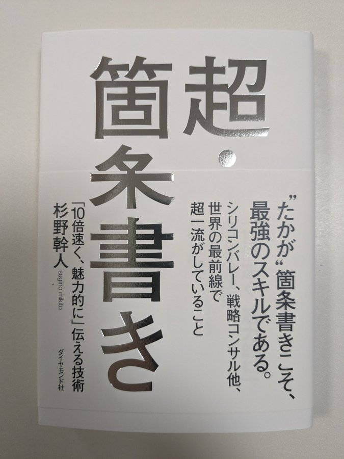](https://www.amazon.co.jp/dp/4478068674)

--

### OKR(オーケーアール) シリコンバレー式で大胆な目標を達成する方法
[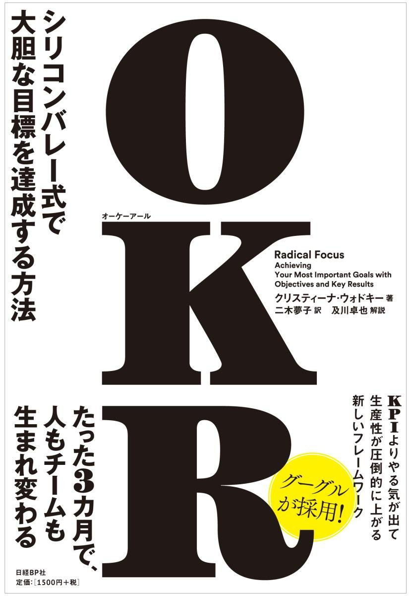](https://www.amazon.co.jp/dp/4822255646)

--

### スタッフエンジニア マネジメントを超えるリーダーシップ
[](https://www.amazon.co.jp/dp/429607055X)

--

## UIデザインの教科書［新版］ マルチデバイス時代のインターフェース設計
[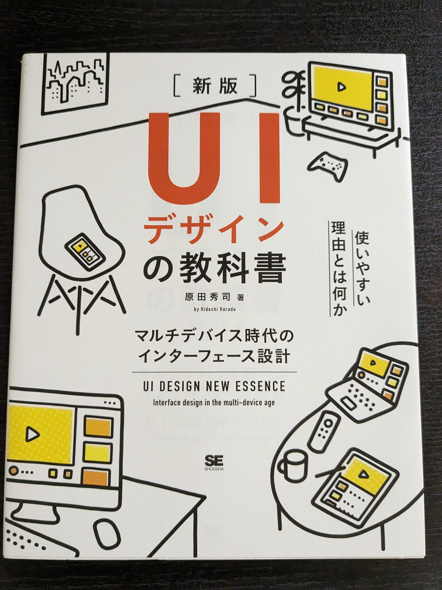](https://www.amazon.co.jp/dp/4798155454)

--

## システム設計の面接試験
[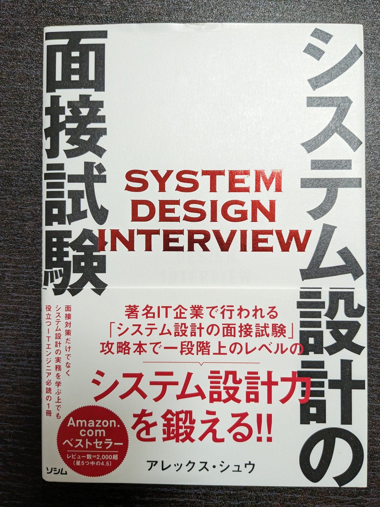](https://www.amazon.co.jp/dp/4802614063)

--

## 急成長を導くマネージャーの型 ~地位・権力が通用しない時代の“イーブン"なマネジメント
[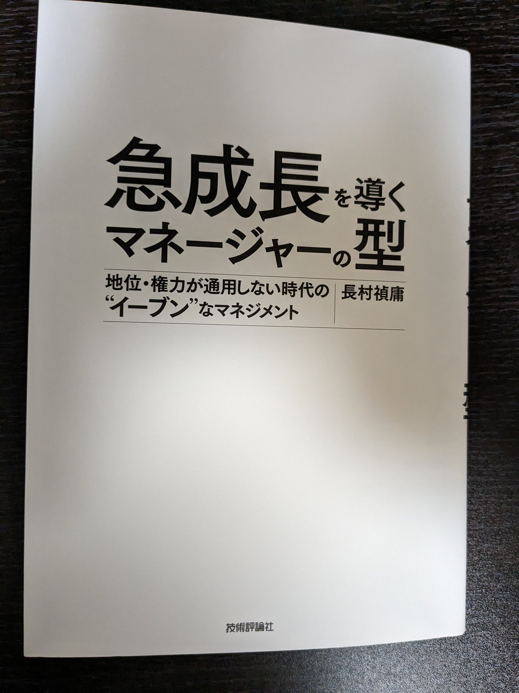](https://www.amazon.co.jp/dp/4297123851)

--

## 成果を生み出すテクニカルライティング ── トップエンジニア・研究者が実践する思考整理法
[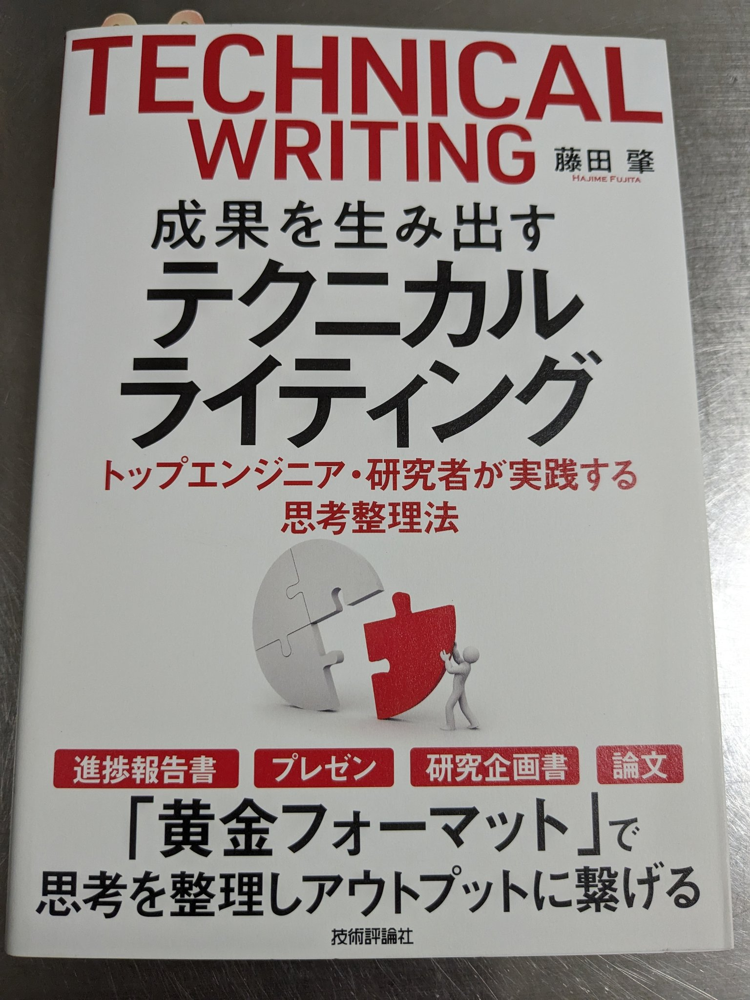](https://www.amazon.co.jp/dp/4297104067)

--

## 副業で世界を変える方法　週末でアフリカに学校や貯水タンクを建設した会社員の物語
[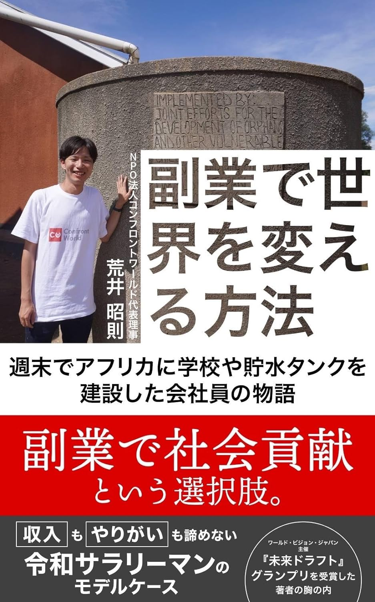](https://www.amazon.co.jp/dp/B0CKZBG8Q4)

--

## こころの対話 25のルール
[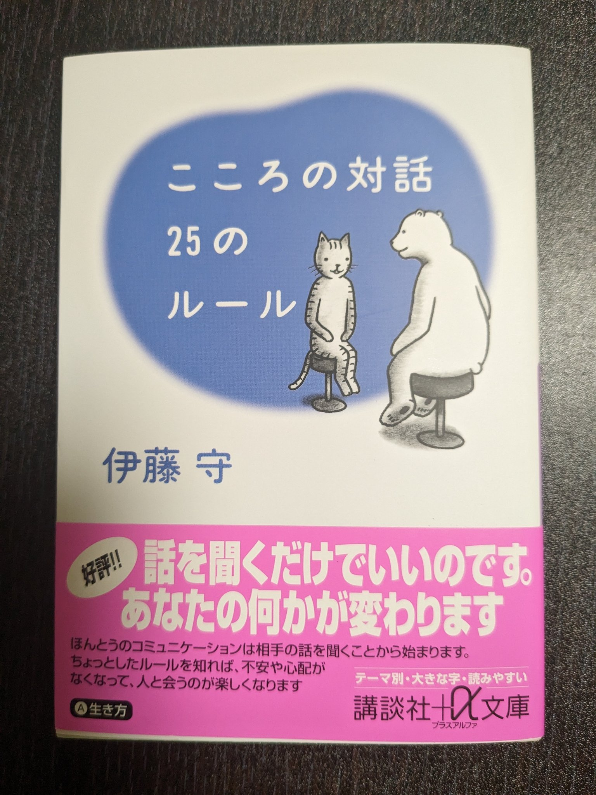](https://www.amazon.co.jp/dp/4062564599)

--

## データブリックス テックブック 〜2023年 秋〜
[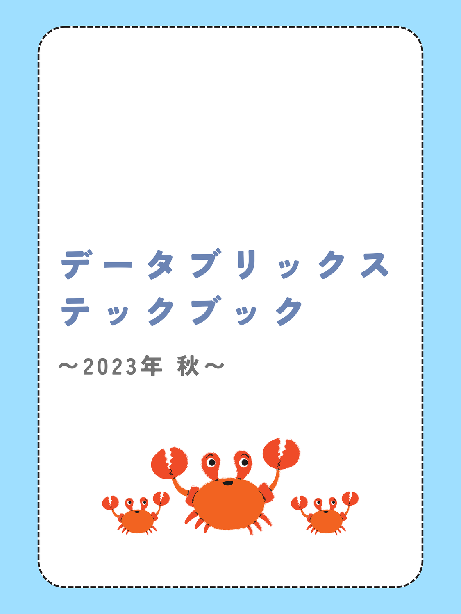](https://techbookfest.org/product/3CwPbf0CLinrdHPiGfcbnH)

--

## OAuth、OAuth認証、OpenID Connectの違いを整理して理解できる本
[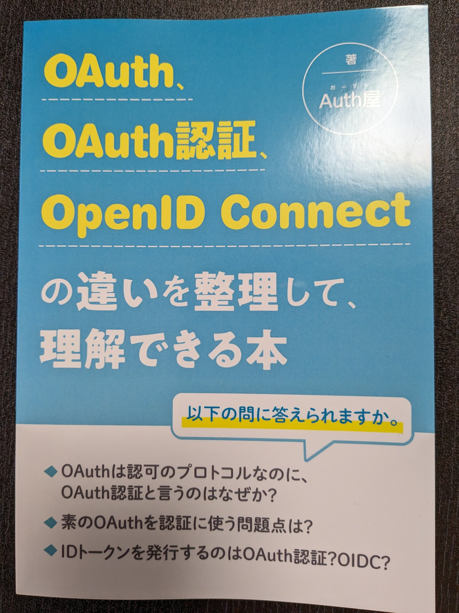](https://techbookfest.org/product/4885634867003392)

--

## 子連れキャリア旅行記
[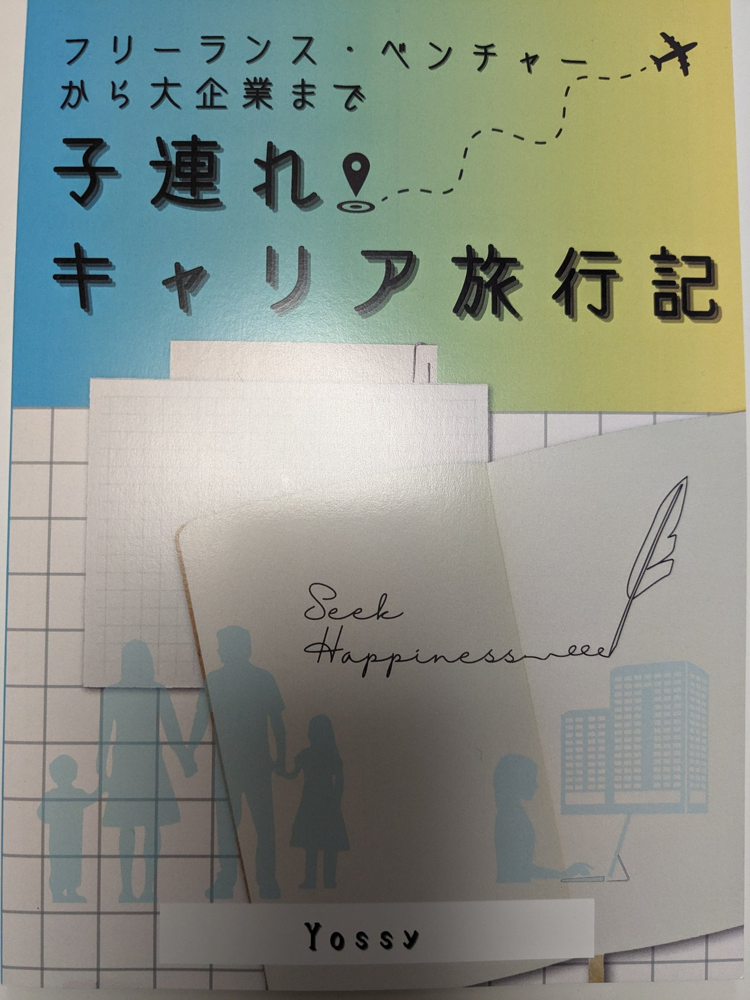](https://techbookfest.org/product/dAmAYJwyDjWX3juiSbhVdt)

--

### マイクリプトヒーローズ解体新書 虎の巻
[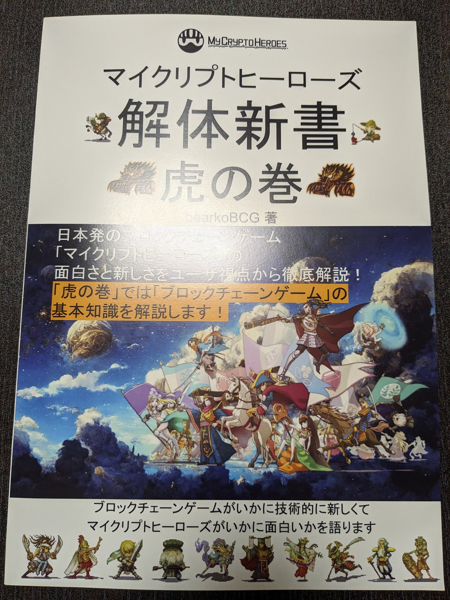](https://techbookfest.org/product/p4K5aVskhLCY3nh3dKe5sX)

--

### ChatGPTアプリを作って学ぶReact
[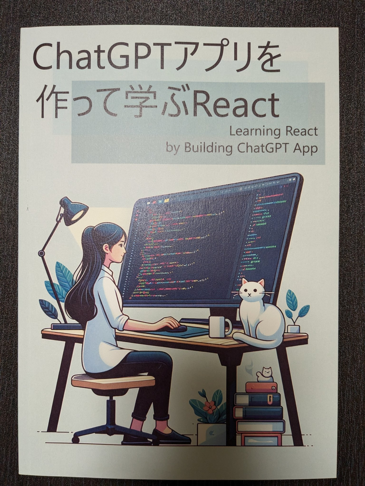](https://techbookfest.org/product/qJcZv2Lqr8nkjSsW3DxNrD)

---

## 1冊づつ紹介

---

## 超・箇条書き
[](https://www.amazon.co.jp/dp/4478068674)

--

## 弊社のhuntもオススメ！！

※Slackで検索

--

## 要点をまとめる

- 忙しい、時間がない相手に有効
- シンプルがゆえに読み手への負荷が少ない
- 10倍速く伝わる

--

## memo1

- 相手とのコンテキストをイメージする
- NGワード
  - 改善、見直す、推進する、最適化する、バランスをとる、徹底する、強化する等々
  - 当たり前のことであり具体的に書く

--

## memo2

### 動詞で終わる体言止めを避ける
- 例: 「コストの低下」
  - 現在の状態「コストが下がっている」
  - 過去の状態「コストが下がった」
  - 未来の状態「コストが下がる」
  - 現在の行為「コストを下げている」
  - 過去の行為「コストを下げた」
  - 未来の行為「コストを下げる」

---

### OKR(オーケーアール) シリコンバレー式で大胆な目標を達成する方法
[](https://www.amazon.co.jp/dp/4822255646)

--

## memo1

- チェックインは週次
- OKRを忘れないことが第一目的
- 重要なことを忘れない

--

## memo2

- 他のことをしない
- わき道にそれないで目標にコミット
- やらなければらないこと
- やるべきことを書く

--

## memo3

### OKRの最初はたいてい失敗する。

リスクを減らす3つのアプローチ。
1. 最初は全社のOKRをひとつだけ決める
2. 全社の前にひとつのチームで導入
3. プロジェクト単位で適用するところから始める

---

### スタッフエンジニア マネジメントを超えるリーダーシップ
[](https://www.amazon.co.jp/dp/429607055X)

--

## スタッフ？

--

## スタッフエンジニア
- テックリード
- アーキテクト
- ソルバー
- 右腕

---

## 実況スレッドに貼る

```
- 超・箇条書き―――「10倍速く、魅力的に」伝える技術
  - https://www.amazon.co.jp/dp/4478068674
- OKR(オーケーアール) シリコンバレー式で大胆な目標を達成する方法
  - https://www.amazon.co.jp/dp/4822255646
- スタッフエンジニア　マネジメントを超えるリーダーシップ
  - https://www.amazon.co.jp/dp/429607055X
- UIデザインの教科書［新版］ マルチデバイス時代のインターフェース設計
  - https://www.amazon.co.jp/dp/4798155454
- システム設計の面接試験
  - https://www.amazon.co.jp/dp/4802614063
- 急成長を導くマネージャーの型 ~地位・権力が通用しない時代の“イーブン"なマネジメント
  - https://www.amazon.co.jp/dp/4297123851
- 成果を生み出すテクニカルライティング ── トップエンジニア・研究者が実践する思考整理法
  - https://www.amazon.co.jp/dp/4297104067
- 副業で世界を変える方法　週末でアフリカに学校や貯水タンクを建設した会社員の物語
  - https://www.amazon.co.jp/dp/B0CKZBG8Q4
- こころの対話 25のルール
  - https://www.amazon.co.jp/dp/4062564599
- データブリックス テックブック 〜2023年 秋〜
  - https://techbookfest.org/product/3CwPbf0CLinrdHPiGfcbnH
- OAuth、OAuth認証、OpenID Connectの違いを整理して理解できる本
  - https://techbookfest.org/product/4885634867003392
- 子連れキャリア旅行記
  - https://techbookfest.org/product/dAmAYJwyDjWX3juiSbhVdt
- マイクリプトヒーローズ解体新書虎の巻
  - https://techbookfest.org/product/p4K5aVskhLCY3nh3dKe5sX
- ChatGPTアプリを作って学ぶReact
  - https://techbookfest.org/product/qJcZv2Lqr8nkjSsW3DxNrD
```

---

## まとめ

--

## まとめ

- a


---

### ご清聴ありがとうございました
