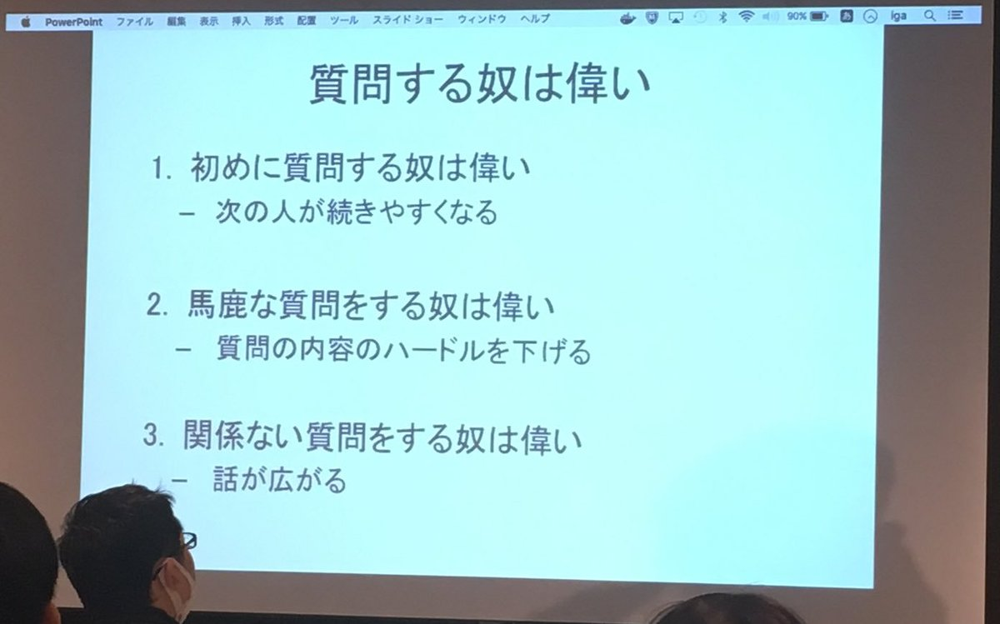

# エンジニアリング勉強会

---

## アジェンダ

TODO: 

1. 注意
2. はじめに
3. 全量紹介
4. 1冊づつ紹介
5. まとめ

---

# エンジニアリング
# 勉強会
# はーじーまーるーよー！

---

## はじめに

--

## Notion

https://www.notion.so/styz/093447f4a6e947778d122c884d045f86

--

## やりたいこと
- 頑張らずに
- 適当に
- 続ける

--

## 結果を目指さない
- 目的もあるがそれはそれ
- 気づいたらそういえば少しはいいことあったかも位を目指す
- 継続は力なり

--

## 楽しくやりましょう

---

## 楽しくやる

--

## 反応ないと寂しい

- → 見てるかわからない
- → つまらなかったかな
- → どうせ私なんて

--

## 実況スレッド

- ご意見ご感想質問は気軽に

--

## 反応しようぜ
- 「へー」とかも大事
- 「👏」とか「これ好き」でもOK
- 「なんもわからん」←これ大事
- 反応する奴はえらい

--

## 質問しようぜ

https://twitter.com/motcho_tw/status/870589211832795136

--

## 楽しく時間使いたい
- みんな忙しいのに時間使ってる
- ためになったよりも楽しかったでよい
- 楽しかったら続けられる

---

## まとめ

--

## まとめ

- 目的は意識する
- 楽しくやる
- 続ける

---

### ご清聴ありがとうございました
