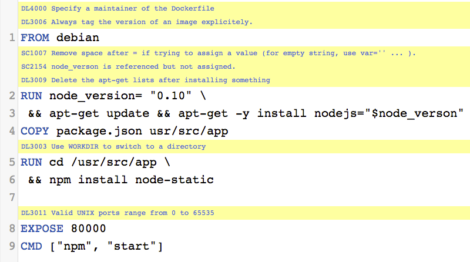
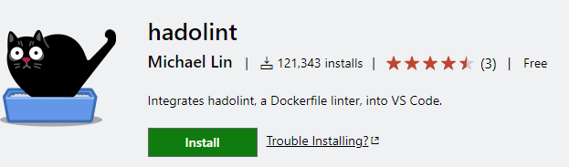
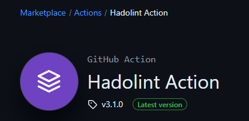
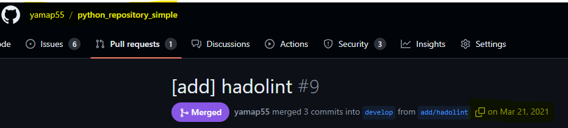
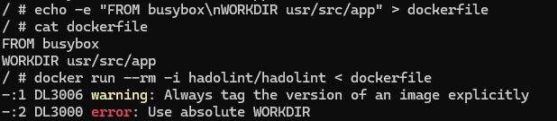
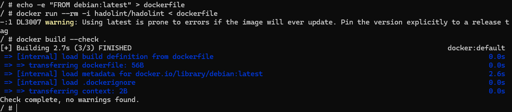
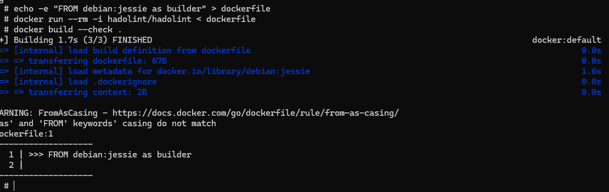

<style type="text/css">
  .reveal h1,
  .reveal h2,
  .reveal h3,
  .reveal h4,
  .reveal h5,
  .reveal h6 {
    text-transform: none;
  }
</style>

# Dockerfileのlintについて

---

## アジェンダ

1. はじめに
2. hadolint
3. 紹介の根拠
4. Docker Build Check
5. 試してみる
6. まとめ

---

# エンジニアリング
# 勉強会
# はーじーまーるーよー！

---

## はじめに

--

## 持論

- コンテナーとCIはコスパが良い
- 知ってる人が少ない
- ちょっとわかるだけで評価される

※CIは今日の本題ではないので以降は出てこない

--

## 本当にやりたいこと？

- コンテナー触りたいわけじゃない
- いい感じに環境を作りたい
- 細かいところは興味ない

--

## linterあるよ

- 細かいところは人がやらなくてよい
- ツールにやらせよう

---

## hadolint

--

## hadolint？

- https://github.com/hadolint/hadolint
- Haskell Dockerfile Linter
- Dockerfileの静的解析ツール
- [Building best practices](https://docs.docker.com/build/building/best-practices/)に乗っ取った形で指摘してくれる

--

## サンプル（公式）


--

## 設定も柔軟に可能

- 設定ファイルあり
- コメントで一時的に無視可能

--

## VS Code Extension


https://marketplace.visualstudio.com/items?itemName=exiasr.hadolint

--

## GitHub Actions


https://github.com/marketplace/actions/hadolint-action

私はreviewdog好きなので↓を使ってる
https://github.com/marketplace/actions/run-hadolint-with-reviewdog

--

## デモは後

---

## 紹介の根拠あるの？

--

## 2021年から使ってます💪



https://github.com/yamap55/python_repository_simple/pull/9

--

## 良かったこととか

- ドキュメントがしっかりしている
  - 全部[GitHub Wiki](https://github.com/hadolint/hadolint/wiki)にあるのでわかりやすい
- 軽くて早い
- shellやLinuxコマンドにも詳しくなれる

---

## Docker Build Check

--

## Docker Build Check？

- 2024/07/29に正式リリース
  - https://www.docker.com/ja-jp/blog/introducing-docker-build-checks/
- Publickeyの記事が話題
  - https://www.publickey1.jp/blog/24/dockerfiledocker_build.html

--

## 違いは？

- 渡された引数やイメージの評価もする
- ビルドを行うのでリンターより強力
- ビルドするよりは早い

※リンターの後工程みたいなイメージ？

--

## チェック内容

- 18項目しかないので発展途上？
  - https://docs.docker.com/reference/build-checks/
- 遅い
- 指摘にリンクが入ってるのは良い
- ドキュメントにサンプルがある

--

## hadolintとの関係は？

- hadolint側は意識して合わせるようにしている様子
  - https://github.com/hadolint/hadolint/issues/1026 とか
- 今の時点でもチェック内容は異なる

---

## 試してみる

--

## コンテナー内で試します

```bash
docker run --rm -it --privileged -v /var/run/docker.sock:/var/run/docker.sock docker sh
```

--

## dockerfile作る

```bash
echo -e "FROM busybox\nWORKDIR usr/src/app" > dockerfile
```

--

## hadolint実行

```bash
docker run --rm -i hadolint/hadolint < dockerfile
```



--

## Docker Build Check実行

```bash
docker build --check .
```


--

## sample（latest）




--

## sample（大文字小文字統一）



--

## チェック内容一覧

- https://github.com/hadolint/hadolint/wiki
- https://docs.docker.com/reference/build-checks/

---


## まとめ

--

## まとめ

- dockerfileにlinterかけよう！
- hadolintいいよ
- Docker Build Checkも併用すべき

---

### ご清聴ありがとうございました
