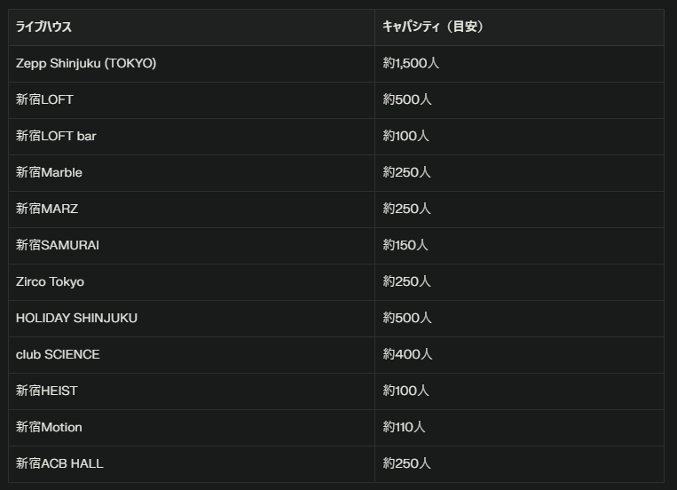

# 東京 CALLING 2025 に参加してきた

---

## アジェンダ

1. はじめに
2. 東京 CALLING 2025 って何？
3. 新宿エリアの特徴
4. 参加した 12 バンドのライブ
5. 感想とまとめ

---

## はじめに

- **開催日**: 2025 年 9 月 27 日（土）
- **私が参加したバンド数**: 12 バンド
  - 東京 CALLING 2025 全体で約 360 組
- **会場**: 新宿エリアの複数ライブハウス
- **感想**: 満喫しすぎて最高だった！

---

## 東京 CALLING 2025 って何？

- **正式名称**: 東京 CALLING 2025
- **公式サイト**: https://tokyo-calling.jp/
- **特徴**: 日本最大級のライブハウスサーキットフェス
- **開催日程**:
  - 9 月 23 日（火・祝）: 下北沢エリア
  - 9 月 27 日（土）: 新宿エリア ← 今回参加
  - 9 月 28 日（日）: 渋谷エリア
- **仕組み**: 複数のライブハウスで同時に多数のアーティストが出演

---

## ライブハウスサーキットフェスとは

### 基本コンセプト

- **同時開催**: 複数のライブハウスで同時にライブを開催
- **移動可能**: チケット 1 枚で複数の会場を自由に移動可能
- **多様性**: 様々なジャンルのアーティストが一堂に会する
- **発見**: 新しいアーティストとの出会いの場

--

### 東京 CALLING の特徴

- **歴史**: 長年続く老舗のサーキットフェス（10 周年）
- **規模**: 3 日間で約 360 組のアーティストが出演
- **会場**: 新宿エリアでは 12 会場を使用
- **時間**: 昼から夜まで長時間開催

--

## 新宿エリアの特徴

### 会場構成

- **主要会場**: Zepp Shinjuku、新宿 LOFT、新宿 Marble など
- **会場数**: 12 会場が同時開催
- **立地**: 新宿歌舞伎町周辺
- **規模**: 大規模会場から小規模なライブハウスまで多様

--

### 移動の利便性

- **距離**: 会場間の移動時間は徒歩 5-15 分程度
- **効率性**: 多くのライブを効率的に楽しめる
- **戦略**: 事前のスケジュール調整が重要
- **発見**: 移動中に新しい会場やアーティストを発見

--

### 会場キャパシティ

--

### 音楽の多様性

- **ジャンル**: ロック、パンク、ポップス、オルタナティブ、ビジュアル系、インディーズなど
- **世代**: ベテランから新人まで幅広い年代
  - 渋谷、下北沢よりも少し年齢層は高め
- **スタイル**: 様々な音楽スタイルが一堂に会する

---

**私が参加した 12 バンド**

1. 銀幕一楼と TIMECAFE
2. THE ラブ人間
3. 打首獄門同好会
4. MAYSON's PARTY
5. 忘れらんねえよ
6. かずき山盛り
7. 四星球
8. 真性包茎かぶってちゃん
9. バックドロップシンデレラ
10. 赤飯【BAND】
11. クリトリックリス
12. ガガガ SP

--

## 1. 銀幕一楼と TIMECAFE

※推しその 2

### バンド概要

- **ジャンル**: 昭和歌謡とロックの融合
- **特徴**: レトロな雰囲気と現代的なサウンド
- **ボーカル**: 情感豊かな歌声が魅力
- [公式 Web サイト](https://ginmakuichiro.bitfan.id/contents/menu/44640)

--

### ライブの感想

- **満足度**: 何度見ても最高のパフォーマンス！
- **時間感覚**: 30 分のセットがあっという間に感じられた
- **成長**: 曲も覚えてきて、メンバー一人一人の動きも見えるように
- **発見**: ライブの楽しみ方は無限大であることを実感

---

## 2. THE ラブ人間

- **ジャンル**: ロック・ポップス
- **特徴**: 情熱的な歌詞とキャッチーなメロディ
- **印象**: ノリが良くて親しみやすいサウンド
- **きっかけ**: SNS で話題になっていたので興味を持って参加
- **第一印象**: 最初の数曲が特に好みに合った
- **特徴**: リズムが分かりやすく、自然と体が動いてしまう

---

## 3. 打首獄門同好会

### バンド概要

- **ジャンル**: パンク・ロック
- **特徴**: 日常生活をテーマにしたユニークな楽曲
- **スタイル**: エネルギッシュでコミカルなパフォーマンス
- [公式 Web サイト](https://www.uchikubi.com/profile.html)

--

### ライブの感想

- **満足度**: とても楽しく、曲も動きも理解できてきた
- **技術面**: モニターがあるおかげで歌詞が分かりやすかった
- **リクエスト**: 「カンガルーはどこに行ったのか」をやってくれなかった（レア曲なのかも）

--

**印象に残った点**

- 盛り上がりやばい
- ティーシャツ見る率 No.1
- 観客も一緒に盛り上がれる雰囲気作りが上手
- うまい棒配る
- 魚が飛ぶ
- みんなでスクワット

---

## 4. MAYSON's PARTY

※推しその 3

### バンド概要

- **ジャンル**: スカ・パンク
  - スカ・パンク好きです
- **特徴**: 若手バンドらしいエネルギッシュなパフォーマンス
- [公式 Web サイト](https://maysonsparty.com/biography)

--

### ライブの感想

- **会場の熱気**: 会場の密度が高く、暑さも相まって最高の雰囲気
  - 打首の直後だったので急いで移動
  - 入場規制かかってたので急いで正解
- **満足度**: 非常に楽しく期待以上の内容
- **学び**: 翌日の予習にもなる貴重な体験
  - 次の日も子を連れてライブに参加（無料）

--

### 印象に残った点

- 観客も一緒になって盛り上がる一体感
- またライブに行きたくなるような魅力
- ノリがわかりやすくフリ？も簡単なのですぐ溶け込める

---

## 5. 忘れらんねえよ

- **ジャンル**: ロック
- **期待**: 前から見たかったバンドその 1
- **発見**: 配信で聞いていた音源とライブでは全く違う印象
- 配信とライブの違いを実感
  - 個人的にはイマイチ溶け込めず
  - 空気？世界観？がわかってなかったかなと反省
- 曲は好きなので次回は楽しむ！

---

## 6. かずき山盛り

- **ジャンル**: ロック・ポップス
- **期待**: 前から見たかったバンドその 2
- **準備不足**
  - 事前の予習が足りなかったと反省
  - もっと深く理解するためには予習が必要だと学んだ
- **印象の違い**: 想像していたのと少し違った
  - 何が違うのか具体的には分からないが、若さ？

---

## 7. 四星球

### バンド概要

- **ジャンル**: ロック・コメディ
- **期待**: 前から見たかったバンドその 3
- **特徴**: コミカルなパフォーマンスと確かな演奏力
- [公式 Web サイト](https://su-xing-cyu.com/)

--

### ライブの感想

- **満足度**: 非常に楽しく、期待以上だった
- **全体の流れ**: リハーサルから最後まで一貫して素晴らしかった
- **驚きの演出**: 「クラーク博士と僕」を中盤に持ってきた構成に驚いた
- **エンターテイメント**: ネタも面白く、観客も慣れている様子
- 観客が曲に自然にノれる、ノせる雰囲気
- コミカルさと音楽性のバランスが絶妙
  - 他のバンドのコスプレ、馬、UFO、宇宙人とか
- ライブハウスでの一体感を感じられる演出

---

## 8. 真性包茎かぶってちゃん

### バンド概要

- **特徴**
  - 過激なネーミングとユニークな楽曲
  - 他のバンドのボーカルとかで構成
- **印象**: 2025 年には珍しいタイプのバンド

--

### ライブの感想

- 低俗すぎる内容で、2025 年とは思えないダメさ
- ライブハウスに入った瞬間の熱気ヤバイ
- ダメな部分も含めて楽しめる魅力
- ほぼ（全部？）カバー曲だったので観客が一気に盛り上がる瞬間の迫力

---

## 9. バックドロップシンデレラ

※推しその 1

### バンド概要

- **ジャンル**: ウンザウンザ（パンク？）
- **特徴**: スカとパンク、民族的リズムを融合させた独自のサウンド
- **印象**: 最も推しているバンド
- [公式 Web サイト](http://backdropc.com/profile)

--

### ライブの感想

- 楽しすぎて涙出そうになった
- 人が飛ぶバンドなので前の方は避けてきたが、気づいたら前の方に移動している
  - 飛ぶ日は近いのかもしれない
- 楽しみ方が進化している。毎回楽しい
- 好きなように楽しむということがわかってきた
- やっぱりライブはいい
- 小さい箱、大きい箱それぞれ違うの楽み方、楽しさがある
  - 今回は Zepp 新宿だったので大きい箱

---

## 10. 赤飯【BAND】

- **特徴**: 力強いボーカルとバンドサウンド
- **期待**: 前から見たかったバンドその 4
- 感想
  - 1 曲しか聞くことができず
- 見えにくい位置だったのでよくわからず
- 次回に機会に期待

---

## 11. クリトリックリス

- **特徴**: 独特の世界観すぎる
- **印象**: 個性的なアーティスト
- 曲も何も分からないが楽しかった
- 会場の雰囲気が最高、完全なる一体感
- みんながみんなわかっていて楽しんでいる
- 会場が Bar であることから聞こえにくい
- 溶け込むためには予習が必要

---

## 12. ガガガ SP

- **ジャンル**: パンク・ロック
- **特徴**: 青春パンクの代表格として長年活躍
- 20 年前から聞いているバンド

--

### ライブの感想

- 始まってすぐの MC に完全に乗せられた
- 20 年前から聞いているので参加するしかない
- 最奥にいたが、気づいたら最前付近にいて、メガネが飛ばされたのを守っているうちに靴を踏まれて脱げた
- イメージするライブハウス！！という感じを楽しめた
- まだ続けてほしい、また参加したい

---

## 感想とまとめ

--

### 満喫

- 東京 CALLING いいぞー！フェスいいぞー！！
- やばいほど楽しく、充実した一日だった
- 新しいバンドとの出会いがたくさんあった
  - が、全く知らないバンドにはほぼ参加できず
  - 界隈がわかってきたとも言う
- 21000 歩
  - https://x.com/yamap_55/status/1971942030806077768

--

### 学び

- タイムテーブルで悩む経験できた
  - [作った](./image02.jpg)
- 各バンドの特徴や楽しみ方がわかってきた
- ライブの楽しみ方は無限大であることを実感
- 事前の予習がライブをより楽しむために重要（n 回目）
- ライブハウスでの楽しみ方が上達してきた

--

### 印象に残った体験

- 会場間の移動を効率的に行うことの重要性
  - 方向音痴なので事前の調査が必須
- 各ライブハウスの雰囲気の違いを感じられた
- 各会場で感じた観客の熱気と一体感

---

## 本題ではないこと

- AI にだいぶ下書きしてもらって作成
- 当日の様子を X（旧 Twitter）で呟いていた
- MCP を利用して ↑ を取得した
  - ※X は MCP ないので Twilog 経由（つまり自分の発言のみ）
  - https://twilog.togetter.com/yamap_55/date-250927
- 自分の情報を参照してまとめるのは中々新しい経験ができた

---

### ご清聴ありがとうございました
