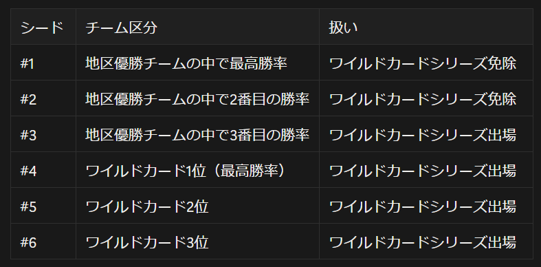

# メジャーリーグのシーズン構造

## 〜複雑だけど面白い！MLB の仕組みを理解しよう〜

---

## 今日の話

- メジャーリーグのシーズン構造について
- 「地区優勝」「リーグ優勝」「ワールドシリーズ優勝」の違い
- なぜこんなに複雑なのか？
- その複雑さの背景にある面白さ

--

## きっかけ

2025 年 10 月 18 日
**「大谷翔平がワールドシリーズ進出を決めた」**

でも…  
「前にも“優勝”って聞かなかった？」

この“複数の優勝”を整理してみよう！

---

## MLB 全体の構造

### 30 チーム構成

**アメリカンリーグ（AL）**

- 東地区：5 チーム
- 中地区：5 チーム
- 西地区：5 チーム

**ナショナルリーグ（NL）**

- 東地区：5 チーム
- 中地区：5 チーム
- 西地区：5 チーム

計 30 チーム（6 地区 × 各 5 チーム）

--

## 地区の例

**ナショナルリーグ西地区**

- ロサンゼルス・ドジャース
- サンディエゴ・パドレス
- サンフランシスコ・ジャイアンツ
- コロラド・ロッキーズ
- アリゾナ・ダイヤモンドバックス

※大谷翔平が所属するドジャースはこの地区

---

## シーズンは 2 部構成

### レギュラーシーズン

- 約 6 ヶ月・162 試合
- 地区 1 位を目指して戦う
- 成績に応じてポストシーズン進出が決定

### ポストシーズン

- 各リーグ上位 6 チームによるトーナメント
- リーグ優勝、そしてワールドシリーズへ

---

## ポストシーズンの全体像

各リーグ（AL/NL）ごとに 6 チームが進出

- 地区優勝チーム：3
- ワイルドカードチーム：3
  - 優勝を逃した中で勝率上位

※リーグごとに 6/15 チームがポストシーズンに進める  
※「地区」毎ではない

---

## シードと免除の考え方

---

## 各ステージの仕組み

### ワイルドカードシリーズ（WC）

- 対戦カード：
  - #3（地区優勝 3 番手） vs #6（WC3 位）
  - #4（WC1 位） vs #5（WC2 位）
- 3 試合制（best of 3）
- 上位シードの本拠地で開催（移動なし）
- 勝者がディビジョンシリーズへ

---

### ディビジョンシリーズ（DS）

- 対戦カード：
  - #1（免除チーム） vs (#4/#5 勝者)
  - #2（免除チーム） vs (#3/#6 勝者)
- 5 試合制（best of 5）
- 勝者がリーグチャンピオンシップへ

---

### リーグチャンピオンシップシリーズ（LCS）

- 各リーグの勝者同士が対戦
- 7 試合制（best of 7）
- 勝者が「リーグ優勝チーム」となる

---

### ワールドシリーズ（WS）

- アメリカンリーグ王者 vs ナショナルリーグ王者
- 7 試合制（best of 7）
- MLB 年間王者を決定

---

## なぜこんなに複雑なのか？

### 1. 消化試合を減らすため

- 優勝を逃してもポストシーズン進出の可能性がある  
  → 最後まで緊張感が続く

### 2. 公平性の確保

- 地区ごとの強弱に関係なく、勝率でチャンスが与えられる

### 3. 興行・エンタメの向上

- 短期決戦でドラマが生まれやすい
- 観客・視聴率の維持

---

## 戦略的な面白さ

### 地区優勝が決まっても油断できない

- 各リーグで「勝率上位 2 位以内」でないと免除されない
- つまり“早期優勝”しても最後まで勝ち続ける理由がある！

### チームの緊張感を維持する仕組み

- 消化試合を防ぎ、ファンも最後まで楽しめる設計

---

## 感想

### 調べてみて分かったこと

- 単純に「優勝」と言っても複数の意味がある
- 複雑に見えるルールにも合理的な理由がある
- 野球の奥深さを改めて実感

### 皆さんにも

- ニュースで聞く「優勝」の意味を理解できるように
- メジャーリーグの面白さを感じてもらえるように
- 複雑なものも調べてみると面白いことを知ってもらいたい

---

## ご清聴ありがとうございました
