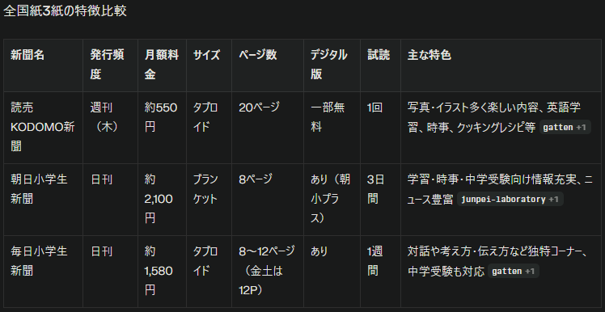

# 10 歳になった子と一緒にやって良かったこと

---

## はじめに

--

## 10 歳の子と一緒に

- いくつかのことを数年続けている
- それぞれ良いことがあった
- 振り返ってみると良いかもということで紹介してみる

---

## 1. 子ども新聞

※4,5 年？

--

## 子ども新聞

- 小学生向けに作られた新聞
- 時事問題を分かりやすく解説
- 親子で読める内容

--

## 比較

※山ｐ家は[朝日小学生新聞](https://www.asagaku.com/)

--

## 言いたいこと

- 小学 2 年生くらいからはじめた
- 毎日 10 分
- 全部読まなくても OK
- 漫画、小説、クイズとかもある
- 文字を読む習慣になれば良いかなと

--

## 付随効果

- 大人も楽しい
- 朝日は中学受験に向けてというウリなので問題が乗っていたりして頭の体操になる
  - 普通に難しい
- パーソナライズされない情報は逆に新しい

---

## 2. 毎日交換日記

※6,7 年？（No.31）

--

## 交換日記？

- 基本毎日何か書く
- 幼稚園くらいから
  - ひらがなうまく書けていなかった気がする

--

## 良かったこと

- コミュニケーション
- 学校や友達のことを教えてくれる（こともある）
- 文章書く練習？
- 漢字書く練習？

--

## そんなにうまくいかない

- 返事が 1 行
- 字が汚い
- やらない

※まぁ色々あるよね

--

## 続けることが大事

- 書いてなくても私は書く（大変）
  - 書いてないです悲しい 🥺
  - 明日は書いて欲しいな
- シールとハンコ

※毎日読んではくれるのでそのうち書いてくれる

---

## 3. やることリストをマグネットで作った

※1 年半？

--

## やることリストをマグネットで作った

- ダイソーで購入
  - 鉄板(B5 サイズ) \* 2
  - マグネット
- マグネットにマスキングテープ + ペン

※毎晩リセット

--

## 良かったこと

- 視覚的にわかりやすい
- やるべきことが明確になる
- 達成感を感じやすい

--

## うまくいく？

- うまくいかない
- やってくれない
- もっと小さい時からやると良いかも？
- タスクが見える化しているのは良いこと

---

## 4. Duolingo

※1 年弱

--

## 良かったこと

- 毎日少しずつ続けられる
- 親子で一緒に取り組める
- 語学学習の習慣が身につく

※やらないよりは良いかも

--

## イマイチ

- 数分では身に付いた感が薄い
- 子どもはフレンド、ランキング等の機能が使えない

---

## おまけ：良かったけどやめたこと

--

## [くもんのなぜなぜカレンダー](https://shop.kumonshuppan.com/view/item/000000003687)

--

## 良いところ

- 毎日「なぜ？」を考える習慣
- 単純に面白い
- 知識が増える
- 親子で話すきっかけになる

--

## やめた理由

- トイレが長くなる
- トイレから出てこない

---

## まとめ

--

## 10 歳の子とこんなことしてる

- 子ども新聞
- 毎日交換日記
- やることリスト（マグネット）
- Duolingo

--

## 色々あるよね

- すぐ結果がでることはない
- 習慣付けられれば良いかな
- のんびりやりましょう

---

## ご清聴ありがとうございました
