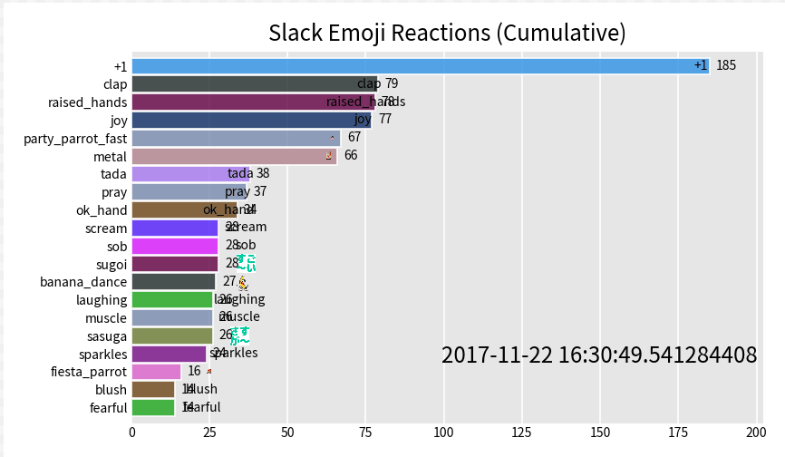
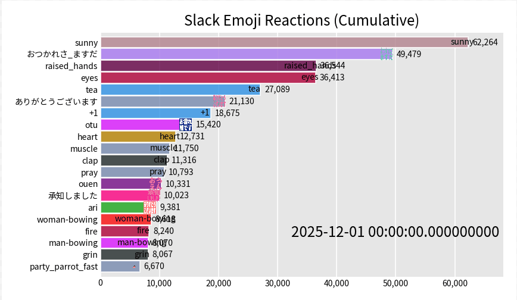
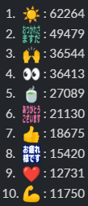

# Slack 絵文字レース

---

## 今日の話

- きっかけ
- 絵文字レースって何？
- クイズ
- レース開始
- 結果発表
- まとめ

---

## きっかけ

--

## きっかけ

- たまにインターネットでこういう集計が流行る
- 以前から集計したかった
- 重い腰をあげて今回集計してみた

---

## 絵文字レースって何？

--

## 絵文字レースとは

- Slack の絵文字使用回数を累計で集計
- 時系列で棒グラフ化
- レース形式の Gif 動画で可視化

--

## イメージ

--

## 集計期間

- Slack を使い始めてから 2025/12/15 頃まで
- 約 8 年分のデータ

※対象は全てのpublicのチャンネル

---

## クイズ

--

## 最終的に一番多かった絵文字は何でしょう？

予想してみてください

---

## レース開始

---

## 結果発表

--

## 結果

--

## 実際の絵文字にしてみた

※この辺が改良の余地あり

--

## 予想あたってた？

--

## 原因

- 恐らく上位の3つくらいはプログラムが押している
  - 皆様もtimesで挨拶すると某人が絵文字付けるでしょ？
- そして押されたものは皆も追加で推しがちなので上位に来ている

--

## 手動で押した数だと？

- 恐らく :eyes: が最多？ :tea: :ありがとうございます: :+1: と続く気がする

---

## 技術的な話

--

## 技術的な話

- 1日でサクッと作れると思った
- 思った以上にかなり難しかった
- 絵文字が一部出ていなかったり、見辛い点がある
- 2026年末の集計時に修正予定

--

## 詳細はブログで

詳しくは [Syncable Tech Blog](https://zenn.dev/p/syncable_tech) に書く予定

※興味のある方はどうぞ

---

## まとめ

--

## やったこと

- Slack を使い始めてから約 8 年分の絵文字使用回数を集計
- レース形式で可視化

--

## わかったこと

- 時代ごとの流行りが見えて面白い
- 結局人はプログラムには勝てない
- 手で押されているものはよくわからない

--

## 来年も楽しみにしていてね！！

---

## ご清聴ありがとうございました
