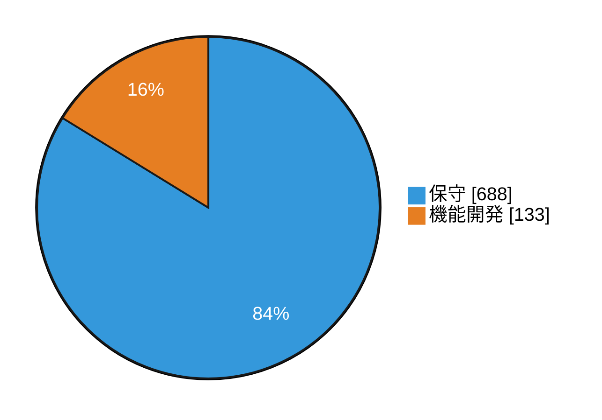
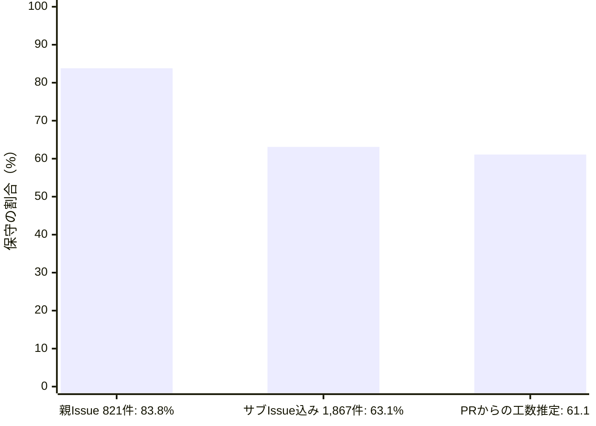
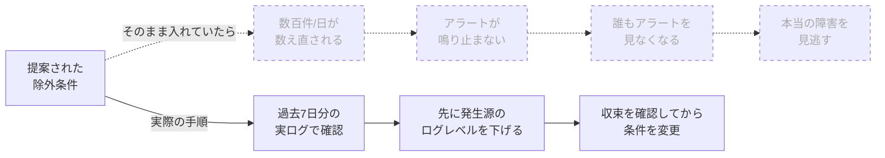
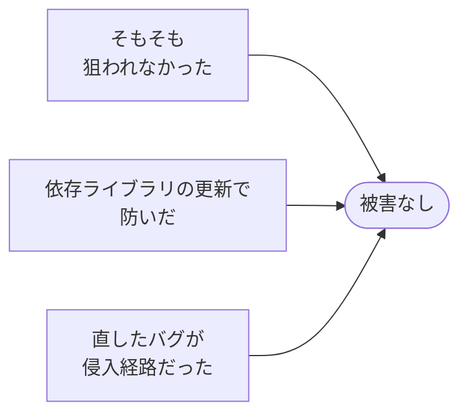
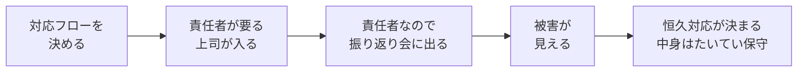
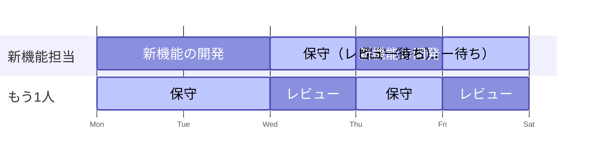

# 成功を証明できない保守の工数を、どう確保し続けているか

Syncable Tech #4 少人数開発のリアル

山ｐ

---

## アジェンダ

- 自己紹介とチーム
- 保守は起票の何割か
- 保守は成功すると見えない
- 保守工数を0から確保するまで
- 保守の根拠をどこから作るか
- 確保した工数を守る
- 日々の回し方
- それでも保守は増えている
- 解けていないこと

---

## 自己紹介とチーム

--

## 山ｐ

- STYZ 開発チームリーダー
- CS（カスタマーサポート）リーダーも兼任
- Syncable: 10年近く運用しているサービス

Note:
Syncableのサービス紹介を一言入れる（要記入）。

--

## チームは4名

- 1名は参画して日が浅い
- 私は他の業務もあるので、タスク消化にはなるべく関わらない

実質2名で回している。

Note:
人数を社外で出してよいかはpush前に確認する。

---

## 保守は起票の何割か

--

## 1年分のGitHub Issueを全件分類した

- 自社で運用している8リポジトリ
- 2025年8月末からの1年間
- 1,867件

--

## 新しい機能を作る以外の作業は、何割だと思いますか？

--

## 83.8%

サブタスクを除いた親Issue 821件での割合。

Note:
保守と呼んでいるのは、問い合わせを受けての調査、データ修正の依頼、依存ライブラリの更新、監視の手入れなど。機能開発以外をすべて保守として数えた。

--

## 数え方を変えると6割

手法の違う2つの数え方が、2ポイント差で一致した。

Note:
8割は件数の割合で、工数の割合ではない。66個のサブタスクに分けた機能開発と、5分で終わるデータ修正が同じ1件になっている。
工数の推定はCTOがPRデータから別に作ったもの。集計した人も期間も手法も違うのに近い値が出たので、実態は6割前後と見ている。

--

## しかも、これは下限

Issueにならない保守は数えていない。

- Slackで聞かれてその場で答えたもの
- ビルドが落ちたときの対応
- コードレビュー

---

## 保守は成功すると見えない

--

## うまくいっている間は、何も起きない

- 何も起きないので、報告する材料がない
- 報告されないので、外からは見えない

新機能が過大に評価されているというより、保守が観測されていない。

--

## 例: アラート用メトリクスの設定変更

- エラー件数のメトリクスから、あるサービスのリクエストログを除外する
- 提案された条件のまま入れると、1日あたり数百件のエラーログが数え直される
- 1件でも数えたら発報する設定なので、アラートが鳴り止まなくなる

過去7日分の実ログで影響を確かめ、順序を入れ替えて対応した。

--

## 起きなかったこと

点線は起きなかったこと。Issueのタイトルからは、設定を変えたことしか読み取れない。

--

## 成功したかどうかは、事後に判定できない

1年間、外部からの攻撃で被害がなかったとして

観測できる結果が同じなので、区別する方法がない。

--

## 帰属できるのは失敗だけ

- 侵入されれば、放置していた依存ライブラリを誰でも指させる
- 成功には、結びつける先が残らない

Note:
ここで言う「帰属できるのは失敗だけ」を、後半の「保守の根拠をどこから作るか」で回収する。

---

## 保守工数を0から確保するまで

--

## 保守工数は、ここ数年前まで0に近かった

歴史的経緯もあり、新機能の開発がほぼすべてだった。

--

## 経緯

| 時期 | 保守工数 |
| --- | --- |
| 数年前まで | ほぼ0 |
| バグ・障害が明らかに多かった時期 | 強引に確保 |
| 数値を出して伝え続けた | 半分（当時3名で1.5人月） |
| 現在 | 最低1人月が統一見解 |

Note:
バグや障害が多かった時期は、システムに詳しいかどうかに関係なく誰が見ても問題が多かったので、確保すること自体は反対されなかった。
「3名で1.5人月」を社外で出してよいかはpush前に確認する。

--

## 出してきた材料

- バグ件数
- 障害の詳細
- インシデントの詳細報告

歴代の上司・営業・企画に、口だけでなく数値と資料で伝え続けた。

--

## 理解されにくいのは、一定わかる

- 内部ライブラリを大きな工数でバージョンアップしても、画面の動きは変わらない
- ユーザー体験も、売上も、利益も変わらない

それでも、将来のリスクを減らしていることは言い続けるしかない。

Note:
上司やエンジニアリングチーム外の理解があるかどうかは、人に大きく依存する。ここは正直に言う。

---

## 保守の根拠をどこから作るか

--

## インシデントの対応フローを決めた

フローを決めること自体に、反対する人はまずいない。

--

## フローを決めると、上司が振り返りに出る

Note:
フローを決めると「誰が判断するのか」「責任者は誰か」が必ず出てくるので、当然上司が組み込まれる。
責任者なので振り返り会には必ず出てもらう。振り返りで大なり小なり被害が見え、恒久対応が決まる。その中身はたいてい保守。

--

## なぜやるのかは、インシデントが説明している

成功は帰属できないが、失敗には原因が残る。

その失敗を、保守をやる根拠につなげている。

Note:
前半の「帰属できるのは失敗だけ」の回収。
個別のインシデントの内容には触れない。

---

## 確保した工数を守る

--

## 削られそうになる場面

- 新機能のスケジュールが遅れたとき
- 新機能のリリースがなく、保守のリリースだけがあったとき

保守がうまくいって落ち着くほど、削られそうになる。

--

## どちらも削らない

- スケジュールが遅れても: 必要だから確保している
- 保守のリリースだけでも: 新機能を止めて保守をしているわけではない

--

## エンジニアリングチームからは、削減を提案しない

エンジニアリングチームの外は、削りたい。

だから、こちらからは絶対に言い出さない。

--

## 約束しているのは、期間で見た量

- 日単位では、新機能が0の日も保守が0の日もある
- 日々の配分はチームが決める
- 外から量そのものを減らす話には乗らない

Note:
次の「日々の回し方」で、新機能を2名でやることがあると話すので、矛盾して聞こえないようにここで先に言っておく。

---

## 日々の回し方

--

## 新機能担当を先に決める

1週間のイメージ（実際の記録ではない）。期限が厳しいときは2名で新機能をやる。担当はローテーション。

Note:
新機能担当の空いた時間は、レビュー待ち、営業・企画側の仕様確認中、受入テスト中など。
日単位で見ると、新機能が0の日も保守が0の日もある。
外向けには「1人が新機能、1人が保守」と言っているが、実体は1人分の工数という意味。

--

## 事業部に説明するもの、チームで決めるもの

事業部に説明する（期間・工数・範囲が大きい）

- DBのバージョンアップ
- Django、next.js などのバージョンアップ
- 決済まわりの大きな変更

それ以外は、チーム内のプランニングで決める。

--

## 毎日入ってくる依頼を減らす

- システム管理画面を整える
- BI（Metabase）を整える

依頼元が自分でできることを増やし、保守の時間を溜まっている作業に回す。

--

## 捨てる

- 旧nuxtと新next.jsの2つの画面が動いている
- 使用頻度の低い旧nuxt側のバージョンアップは諦めた
- 新しい画面が必要なときは next.js で作り、iframe で埋め込む

--

## 属人化させない

- 作業は手順書にする
- レビューは満遍なく依頼する
- なぜやっているのか（やっていないのか）分からない点は聞く

分からないと言える空気を作ることは徹底している。

---

## それでも保守は増えている

--

## コーディングエージェントで、脆い部分が見つかる

- 新機能でも保守でも、触るほど過去の脆い部分が見つかる
- 正直に言うと、溜まっている保守は増えている

Note:
具体例（どんな脆さが、どの作業中に見つかったか）は要準備。

--

## 1名増員した

徐々に減っていくと見込んでいる。

まだ結果は出ていない。

---

## 解けていないこと

--

## 評価は、見える部分に寄る

- レビューでの評価
- 保守の中でも、評価しやすいバグ調査が中心になる

アラートが鳴り止まなくならなかったことを、誰かの成果として切り出す方法はまだない。

--

## 目標に書けるのは、前の期との差分

「今期も障害を起こしませんでした」は、達成度で測りにくい。

Note:
ここで答えを出さずに終えて、インタビューに渡す。

---

## 出典・データについて

- 保守作業は起票の8割だった ─ 数えても成果が説明できない理由 
  https://zenn.dev/syncable_tech/articles/b3c9afe7243252
- 「機能を追加しました」以外の日は、何をしているのか（社内LT） 
  https://yamap55.github.io/Slide/index.html?slide=20260902/slide.md
- Issueの集計期間: 2025/08/29 〜 2026/08/29、GitHub から全件取得して分類
- 工数の推定: PRデータから推定（直近6ヶ月）

---

# ありがとうございました
